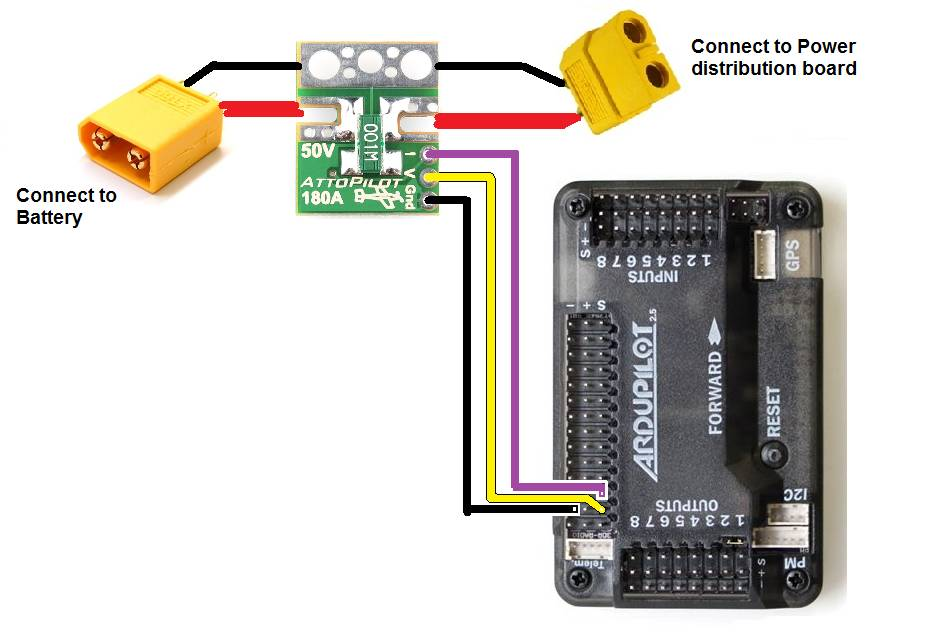

.. _common-using-a-current-sensor:

=========================================
Attopilot 180A Voltage and Current Sensor
=========================================

This article explains how to use the AttoPilot for measuring high
current and voltages.

Overview
========

In general it is best to power your Flight Controller with
the :ref:`Power Module <common-3dr-power-module>`\  because it provides
solid 5V power and also allows you to read current and voltage. But for
cases where you need to measure over 18V (i.e. over 4S batteries) or
current over 90A, you should use the 
`AttoPilot 180A current and voltage module <https://www.sparkfun.com/products/10644>`__ which can be
purchased from `Sparkfun <https://www.sparkfun.com/products/10644>`__.

Connection to Pixhawk
=====================

.. figure:: ../../../images/Pixhawk_AttoPilot_CurrentSensor.jpg
   :target: ../_images/Pixhawk_AttoPilot_CurrentSensor.jpg

   Pixhawk/ toAttopilot 180A Voltage/Current Sensor Wiring Diagram

Connecting the autopilot sensor to the Pixhawk requires modifying a
`DF13 6 position cable <http://store.jdrones.com/cable_df13_6pin_25cm_p/cbldf13p6c25.htm>`__
as shown in the photo above including connecting:

-  V pin (voltage) to the Pixhawk's 3rd pin from the left
-  I pin (current) to the Pixhawk's 4th pin from the left
-  GND pin (ground) to the 1st pin on the left

Connection to APM
=================

Connect the autopilot sensor to APM as shown in the photo above
including connecting:

-  V pin (voltage) to APM's A1's S pin
-  I pin (current) to APM's A2's S pin
-  GND pin (ground) to APM's A1 "-" pin

Setup in Mission Planner
========================

To configure the sensor go to the Mission Planner's INITIAL SETUP >
Optional Hardware > Battery Monitor page and set the "Monitor", "Sensor"
and "APM" fields as shown in the image below.  If a battery is then
connected you should see the "Battery voltage (Calced)" field become
populated with the voltage of the battery.

.. image:: ../../../images/MP_AttoPilot180ACurrentSensor.png
    :target: ../_images/MP_AttoPilot180ACurrentSensor.png

Note: Due to the voltage scaling of the sensor to 3.3V, the maximum
current you can measure with the 180Amp sensor described here is
actually 272Amps and for the smaller `AttoPilot 90A sensor <https://www.sparkfun.com/products/9028>`__ it is 136Amps.

..  youtube:: mDVIxqrmUmA
    :width: 100%

Calibrating the voltage sensor
==============================

You can calibrate the voltage sensor to match the voltage from a
hand-held volt meter by following the instructions on the power
module calibration page
:ref:`here <common-power-module-configuration-in-mission-planner>`.
