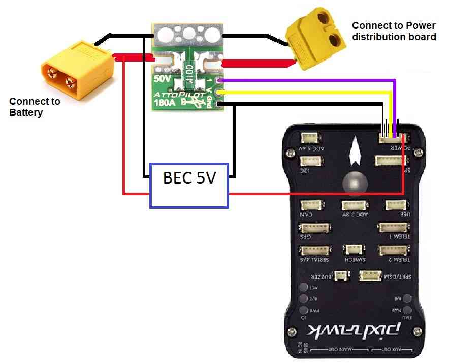

.. _common-using-a-current-sensor:

=========================================================
Archived Topic: Attopilot 180A Voltage and Current Sensor
=========================================================

In general it is best to use a power module specifically designed to work with autopilots but for cases where you need to measure over the voltage limit (i.e. > 18V) or current limit (i.e. > 90Amps) of the available power modules you may wish to use an `AttoPilot 180A current and voltage module <https://www.sparkfun.com/products/10644>`__ which can be purchased from `Sparkfun <https://www.sparkfun.com/products/10644>`__.

Connection to Pixhawk
=====================

   Pixhawk/ to Attopilot 180A Voltage/Current Sensor Wiring Diagram

Connecting the autopilot sensor to the Pixhawk requires modifying a
`DF13 6 position cable <http://store.jdrones.com/cable_df13_6pin_25cm_p/cbldf13p6c25.htm>`__
as shown in the photo above including connecting:

-  V pin (voltage) to the Pixhawk's 3rd pin from the left
-  I pin (current) to the Pixhawk's 4th pin from the left
-  GND pin (ground) to the 1st pin on the left

Setup in Mission Planner
========================

To configure the sensor go to the Mission Planner's INITIAL SETUP >
Optional Hardware > Battery Monitor page and set the "Monitor", "Sensor"
and "APM" fields as shown in the image below.  If a battery is then
connected you should see the "Battery voltage (Calced)" field become
populated with the voltage of the battery.

Note: Due to the voltage scaling of the sensor to 3.3V, the maximum
current you can measure with the 180Amp sensor described here is
actually 272Amps and for the smaller `AttoPilot 90A sensor <https://www.sparkfun.com/products/9028>`__ it is 136Amps.

..  youtube:: mDVIxqrmUmA
    :width: 100%

Calibrating the voltage sensor
==============================

You can calibrate the voltage sensor to match the voltage from a
hand-held volt meter by following the instructions on the power
module calibration page
:ref:`here <common-power-module-configuration-in-mission-planner>`.
