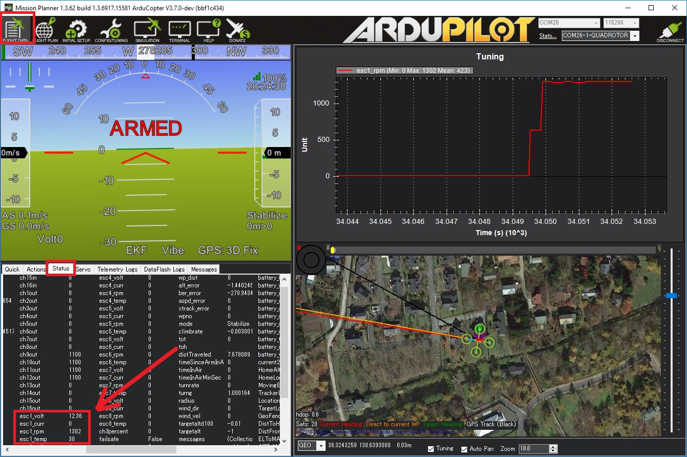

.. _common-velocity-can-escs:

=================
Velocity CAN ESCs
=================

The `Velocity range of ESCs <https://www.currawongeng.com/servos-escs/esc-velocity/>`__ provide motor control for the aerospace sector, with a high degree of reliability.

Designed for driving extremely large motors for heavy-lift applications, the Velocity range of ESCs is available in power levels above 20kW

- Up to 18S (75V) battery packs
- Sustained currents above 300A
- Compact design
- Fully isolated communication interface
- Designed and manufactured in Australia

The Velocity ESC provies a CAN communication interface for commands and telemetry. A traditional digital PWM interface is also supported.

Additionally, the Velocity ESC provides an optional hardware interlock for increased operator safety.

Where to Buy
------------

Contact `Currawong Engineering <https://www.currawongeng.com/about-us/contact-us/>`__ for purchasing details.

Connection and Configuration
----------------------------

.. note::

    The Velocity ESC uses the PiccoloCAN protocol. Originally developed for the Piccolo autopilot, the protocol is now natively supported by Ardupilot 

To enable communication with the Velocity ESCs using PiccoloCAN, the following parameters must be set.

- Set :ref:`CAN_D1_PROTOCOL <CAN_D1_PROTOCOL>` = 4 (PiccoloCAN)
- Set :ref:`CAN_P1_DRIVER <CAN_P1_DRIVER>` = 1 (First driver) to specify that the ESCs are connected to the CAN1 port
[site wiki="copter,rover"]
- Set :ref:`MOT_PWM_MIN <MOT_PWM_MIN>` = 1000 and :ref:`MOT_PWM_MAX <MOT_PWM_MAX>` = 2000 so ArduPilot uses an output range that matches the ESCs input range
[/site]
[site wiki="copter"]
- Set :ref:`MOT_SPIN_ARM <MOT_SPIN_ARM>` = 0.03 meaning the motors will spin at 3% of full thrust when armed
- Set :ref:`MOT_SPIN_MIN <MOT_SPIN_MIN>` = 0.05 meaning the motors will spin at no less than 5% of full thrust when flying
[/site]
[site wiki="plane"]
- Set ``SERVOx_MIN`` = 1000 and ``SERVOx_MAX`` = 2000 for each ESC connected (``x`` corresponds to the ESC number) so ArduPilot uses an output range that matches the ESCs input range
[/site]

The following advanced configuration parameters allow adjustment of the Velocity ESC operation.

By default, all configured motor channels are used to send control commands to Velocity ESCs. These control messages are transmitted by the autopilot at 50Hz.

- The :ref:`CAN_D1_PC_ESC_BM <CAN_D1_PC_ESC_BM>` parameter is a bitmask that determines which ESC (motor) channels are transmitted over CAN
- The :ref:`CAN_D1_PC_ESC_RT <CAN_D1_PC_ESC_RT>` parameter determines the rate (Hz) at which commands are sent out to the connected Velocity ESCs

Logging and Reporting
---------------------

Velocity ESCs provide comprehensive telemetry information back to the autopilot which is recorded in the autopilot's onboard log, and can be viewed in any :ref:`ArduPilot compatible log viewer <common-logs>`.  This information includes:

- RPM
- Voltage
- ESC Temperature
- Motor current
- Motor Temperature (when used with an external sensor)

This information (except the motor temperature) can also be viewed in real-time using a ground station.  If using the Mission Planner go to the Flight Data screen's status tab and look for (e.g.) esc1_rpm.

.. note::

   Sending ESC data to the GCS requires using MAVLink2.  Please check the appropriate SERIALx_PROTOCOL parameter is 2 (where "x" is the serial port number used for the telemetry connection).
