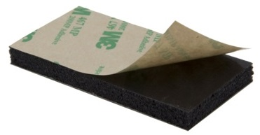
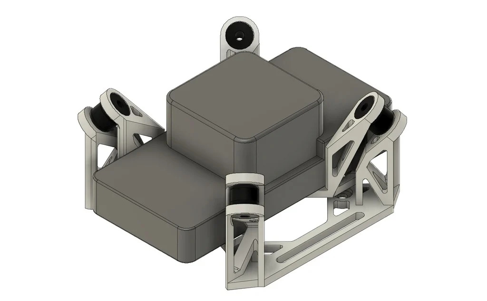
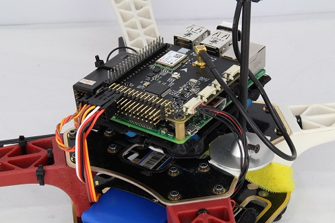
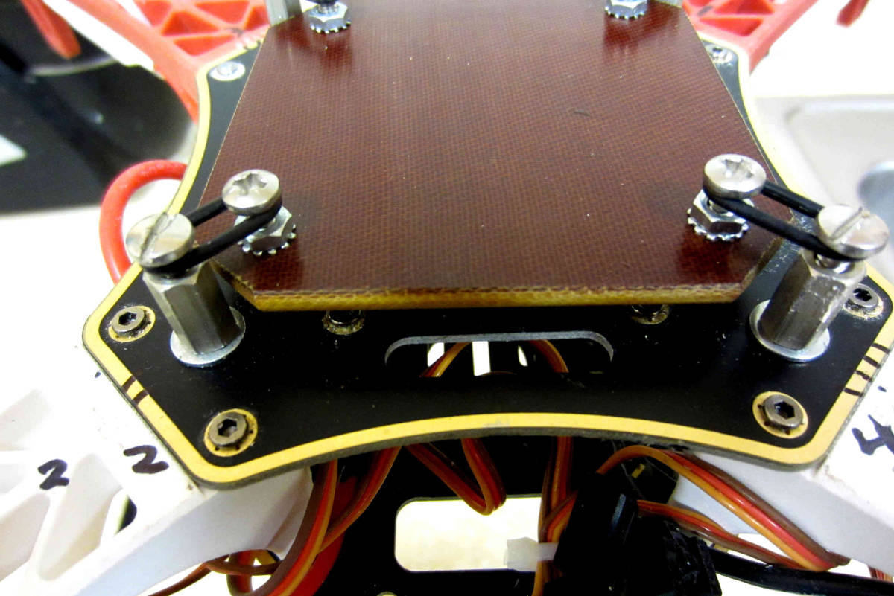

.. _common-vibration-damping:

=================
Vibration Damping
=================

Autopilots have accelerometers that are sensitive to vibrations.
These accelerometer values are combined with barometer and
GPS data to estimate the vehicle's position. With excessive
vibrations, the estimate can be thrown off and lead to very bad
performance in modes that rely on accurate positioning (e.g. on Copter:
AltHold, Loiter, RTL, Guided, Position and Auto flight modes).

Please refer to the :ref:`Measuring Vibration <common-measuring-vibration>` page for details of
how to measure your vehicle's vibration levels and confirm they are within the acceptable range

The goal of vibration damping is to reduce high and medium frequency
vibrations while still allowing low frequency actual board movement to
take place in concert with the airframe.

Double sided foam tape or Velcro has traditionally been used to attach
the autopilot to the frame. In many cases foam tape or Velcro
does not provide adequate vibration isolation because the mass of the
autopilot is so small.

.. note::

   The examples and images in this article refer to Copter, but the
   information is also largely applicable to Plane and Rover.

3M, Du-Bro or HobbyKing Foam
----------------------------

One of the following three types of foam should be cut into small 1cm ~ 2cm cubes and attached to each of the four corners of the autopilot as described on the :ref:`Mounting the Autopilot wiki page <common-mounting-the-flight-controller>`:

- `3M foam sold by mRobotics <https://store.mrobotics.io/product-p/mro-pxfoams-mr.htm>`__ is sticky on both sides and comes pre-cut so that individual cubes can be easily attached to the autopilot
- `Du-Bro 1/4" R/C foam <https://www.dubro.com/products/r-c-protective-foam-rubber>`__
- `HobbyKing orange foam <https://hobbyking.com/en_us/anti-vibration-foam-orange-latex-190mm-x-140mm-x-6mm.html?___store=en_us>`__ (discontinued)

For the last two options "carpet fixing tape" will be required to attach the foam to the autopilot and vehicle frame

For vehicles with :ref:`internal combustion engines <common-ice>`, the autopilot should be mounted on an intermediate plate with `self adhesive lead weights <https://www.amazon.com/Great-Planes-Segmented-Weights-6-Ounce/dp/B0015KLJE0>`__ added to increase its mass

Gel pads
--------

#. Cut one of the recommended gels into 1cm ~ 2cm cubes and attach to each corner of the autopilot.  Possible gels include:

   -  `Kyosho Zeal Gel Tape <https://www.amainhobbies.com/kyosho-zeal-vibration-absorption-gyro-reciever-mounting-gel-1-sheet-kyoz8006/p19713>`__ performs best and is available from Amazon, E-Bay and A-Main Hobbies
   -  `United States Silicone Gel Tape and Pads (V10Z62MGT5 tape recommended) <http://www.vibrationmounts.com/RFQ/VM08010.htm>`__
   -  `United Kingdom Silicone Gel Tape, Pads <https://gelmec.co.uk/family.php?page=58&ty=9&gr=9>`__ and
      `grommets <https://gelmec.co.uk/family.php?page=64&ty=19&gr=19>`__
   -  `Moon Gel Pads <https://www.amazon.com/RTOM-Moongel-Damper-Pads-Original/dp/B00F2PKRJW/>`__
      (also available in music stores). Caution: Moon Gel has been shown
      to fail in heat above 100 degrees Fahrenheit so it should be used
      cautiously.

#. Secure the autopilot to the frame with 1cm) wide velcro retaining
   strap or a rubber band. Be careful the strap does not hold down the
   controller so securely that it interferes with the damping of the
   pads. Consider putting a layer of soft foam between the strap and the
   autopilot.

   .. figure:: ../../../images/Flamewheel330PX4onZeal2.jpg
      :target: ../_images/Flamewheel330PX4onZeal2.jpg
      :width: 450px

      FlameWheel F330 with PX4FMU Mounted on Intermediate platform

The blog `Testing simple anti-vibration solutions for GoPro on an Arducopter <https://diydrones.com/profiles/blogs/testing-simple-anti-vibration-solutions-for-gopro-on-an>`__
has a video demonstrating vibration isolation using Moon Gel on a Go-Pro camera.

3D Printed Anti-Vibration Platform
----------------------------------

`GuyMcCaldin's <https://diydrones.com/profiles/profile/show?id=GuyMcCaldin&>`__ 3D Printed vibration mount (available from `Shapeways <https://www.shapeways.com/product/45H92T5RS/omnimac-apm-mount-v1-5>`__ and `Thingiverse <https://www.thingiverse.com/thing:160655>`__) using `these Hobbyking dampers <https://hobbyking.com/en_us/general-purpose-anti-vibration-rubber-w-m3-x-11mm-screw-and-m3-nylock-nut-4pcs-set.html?___store=en_us>`__

The mount can be installed using double sided tape, or M3 screws spaced at 45mm x 45mm.

3D Printed Anti-Vibration Platform for NAVIO2
---------------------------------------------

Anti-vibration for NAVIO2 can be easily 3D printed. 
It significantly simplifies mounting and eliminates vibrations. 
You can find STL files `here <https://docs.emlid.com/navio2/ardupilot/hardware-setup/#anti-vibration-mount>`__.

Anti-vibration with Navio2 mounted on frame:

O-ring Suspension Mount
-----------------------

#. Create a platform upon which to mount your autopilot with
   holes or screws on the four corners. Mount your autopilot on
   this board with double sided foam tape.
#. Mount 4 standoffs on the top of your frame spaced 1/10" to 1/8"
   further apart than the width of the platform upon which the control
   board has been mounted.
#. Insert 1/16" nylon O-rings through each corner of the autopilot and the standoffs so that the autopilot has no hard
   connections to the frame. 
   Link `(Here!) <http://www.oringwarehouse.com/>`__

   -  The overall O-ring diameter should be chosen to firmly retain the
      board while providing for light to moderate initial but rapidly
      snubbed movement of the board (generally 1/2" to 3/4" OD) and
      Silicone O-rings should generally damp better than Buna-N O-rings
      (Sizes 15 - 21) if you can acquire them.

   FlameWheel F450 O-Ring Suspension Platform Mount

Vibrations are short coupled, so all that leaving excess corner
clearance does is to require higher initial O-ring tension which reduces
vibration damping responsiveness and allows the board to physically tilt
more (which is undesirable as it throws the sensor to airframe
relationship off).

The disadvantage to O-ring suspension versus Gel pads is that it is
mechanically more complex and it requires tuning of both of O-ring
diameter and cross section.

You can combine O-ring and gel pad design by using an intermediate plate
and benefit from dual rate damping.

Ear Plug Mount
--------------

#. Purchase slow response silicon or urethane foam or PVC foam earplugs
   such as `these from 3M <https://www.3m.com/3M/en_US/company-us/all-3m-products/~/3M-E-A-R-Classic-Earplugs-390-1000-Uncorded-Value-Pack-2000-Pair-Case/?N=5002385+3294755285&rt=rud>`__
#. Create a platform upon which to mount your autopilot with
   holes at the four corners. The holes should be large enough to allow
   the ear plugs to be inserted into them but not so loose that the
   board comes loose during hard landings. Ensure the holes are smooth
   so they do not cut into the ear plugs. Also keep the holes near the
   corners of your electronic module plate as possible to minimize
   unnecessary module movement.
#. Mount your autopilot on this board with double sided foam
   tape. Extra mass added to the board may improve vibration damping.
#. Squeeze the earplugs through existing holes in the frame (or cut new
   holes) and the holes in the board upon which the autopilot is
   mounted. "Tuning" is possible by varying the amount of earplug left
   exposed in the middle.

.. figure:: ../../../images/EarPlugVibrationMount.jpg
   :target: ../_images/EarPlugVibrationMount.jpg
   :width: 450px

   Ear Plug Vibration Mount

Bulb Damper + Ear Plug Vibration Mount
--------------------------------------

#. Mounting plate with a 100g soft rubber bulb type
   "gimbal" damper at each corner and a half a urethane foam earplug
   placed inside each one.
#. Gimbal bulb type dampers themselves can work in tension or
   compression.
#. The earplugs provide an additional damping medium with a different
   frequency damping range than the bulb dampers by themselves.
#. The ear plugs also stiffen the bulb mounts up a bit preventing
   excessive free motion being caused by normal flight maneuvers.
#. This was successful at damping a Flamewheel clone with flexible arms
   and over size 12" propellers into the .05 G range.

   .. image:: ../../../images/vibration_flamewheel_clone_closeup.jpg
       :target: ../_images/vibration_flamewheel_clone_closeup.jpg
       :width: 450px

#. The autopilot is also mounted on anti-vibration grommets available from `McMaster Carr <https://www.mcmaster.com/vibration-damping-grommets>`__ (package of 25 each part #9311K64 recommended).
#. The 100G bulb type gimbal vibration dampers can be ordered direct
   from a variety of vendors: \ `copter-rc.com <http://copter-rc.com/en/accessories/36-100g-av-ball-tension-damper.html>`__

Advice for reducing vibrations
==============================

For copters the largest source of vibration is normally the blades passing over the arms but other sources of vibration also exist and may be reduced by following this advice:

-  Frame flex especially arm flex is a big cause of asynchronous
   vibration, Frame arms should be as rigid as possible.

   -  Original DJI Flamewheel copters have sufficiently rigid injection molded arms, the many clones do not
   -  Aluminum or carbon fibre arms twist and best less which reduces vibrations
   -  Copters with injection molded exoskeletons or arms like the Iris are sufficiently rigid
   -  Cheap, light frames tend to flex more than high quality stronger ones and the heavier you load the copter the more flex it gets (not good)

-  Motor to frame arm and frame arm to central hub mounts need to be secure and flex free (sometimes a problem for carbon tube arms)
-  Motors need to run smoothly (bearings not worn-out or "screeching")
-  Prop adapters connecting the propellers to the motors need to be concentric and very straight
-  Propellers should be fully balanced using a good manual prop balancer
-  Motor balancing (or really well factory balanced motors like T-Motor) can have a major effect
-  Propellers that are not well matched to the frame and weight or do  not have the same flex for CCW and CW are very problematic
-  Good propellers vibrate less
-  Carbon fiber props are rigid and vibrate less which reduces vibration but are very sharp which is a major safety hazard

Summary of the vibrations that should be damped
===============================================

#. The vibration frequency and amplitude we primarily need to reduce is
   a characteristic of the motor / prop units turning at flight speed.
#. That is, it is a fairly high frequency with fairly low amplitude.
#. This requires that we provide a short coupled damping and isolation range.
#. The board itself does not need to have nor benefit from a range of
   motion that exceeds the amplitude of the vibration.
#. Because the board does not apply any force to the airframe, the only
   thing we need to be concerned with Damping / Isolating is the weight
   (mass) of the board itself plus the forces applied to it by
   airframe's normal flight maneuvering.
#. Since excellent broad frequency range, high damping materials are
   available our biggest concern will be to use the proper amount of
   them to optimally damp our autopilot (too much is just as
   bad as too little).
#. Combining the autopilot and receiver onto a separate
   vibration damped electronics module "plate" or enclosure can increase
   the mass of the module making it easier to damp effectively as well
   as reducing the interconnecting wiring and making the whole system
   more modular.

Additional Vibration Reduction Considerations
=============================================

#. `Hard Disk Drive Anti-Vibration Grommets <http://www.frozencpu.com/products/8869/scr-138/Hard_Disk_Drive_Anti-Vibration_Screw_Shoulder_Screw_Type.html?tl=g33c113&id=gdASxUFI>`__
   can provide sufficient or supplemental vibration reduction
#. Significant gains in vibration isolation can also be realized by
   using a high flex wire and strain relief approach to all wires
   connected to the autopilot (and using the minimum number
   of wires necessary as well.)
#. Some frames have lower than normal vibration characteristics due to
   frame stiffness / flex and isolated centralized mass can greatly
   influence motor/prop vibration transfer to the central fight
   controller.
#. Isolation and damping can be improved somewhat by sandwiching the
   autopilot / enclosure between damping pads on both sides
   in about twenty percent compression. 30 durometer Sorbothane is
   actually specified at 15 to 20 percent compression for optimal
   damping.
#. Although 30 durometer Sorbothane seems an excellent candidate,
   experience indicates that it becomes permanently compressed
   and is not as effective at vibration reduction as the Gel solutions.
#. A link to a Blog about the first APM anti-vibration mounting system
   to achieve 0.05 G damping (2/20/2013 improved to 0.02 G), a dual zone
   isolation system, combining O-ring suspension and silicone pad is
   `(Here!) <https://diydrones.com/profiles/blogs/very-good-anti-vibration-results-with-following-apm2-5-mount-quad>`__
#. Motor balancing can also reduce vibration and especially so for
   cheaper or larger motors. Balancing involves:

   -  Tightly fasten a small tie wrap around a motor (WITH NO PROP),
      trim off the extended tab and spin it up.
   -  Try multiple times, each time turning the tie wrap on the motor
      housing a bit until the vibration reduces or goes away.
   -  A small piece of Scotch tape can be re-positioned instead of the
      tie wrap if desired or for smaller motors.
   -  When you locate the spot where there is the least vibration (and
      you should be able to hear it), mark the spot directly under the
      clasp of the tie-wrap with a felt pen.
   -  Add a small dot of hot glue gun glue where the Tie-Wrap clasp was
      and increase the glue a bit at a time till the vibration is
      minimized.
   -  If you put too much glue on it can be removed with an X-acto knife.

#. Vibration damping motor mounts like
   `this <http://store.jdrones.com/Anti_Vibration_MultiMount_for_Multicopters_p/mmset02.htm>`__
   may or may not reduce vibration.
#. Camera Mounts also need to be effectively isolated and damped from
   vibration, but they already have a number of "soft" mounting
   solutions.
#. The camera servos need to be vibration isolated as well, either in
   the isolated camera mount itself or with their own vibration
   reduction solution.
#. You should use high quality ball joints on your camera servo arms and
   adequate bearings or bushings in the mount itself with zero free play
   to prevent inertial slop.
#. Quality servos without free play are also a must for precision camera
   work.
#. At this point in time it seems that the more rigid the frame the
   better because frame flex introduces undesirable mechanical delay
   (hysteresis) in translating motor induced actions to the centrally
   located autopilot. (Do NOT shock mount the motor Arms).
#. The amount and type of damping medium needs to be carefully matched
   to the weight (mass) of the item we are trying to isolate as well as
   the frequency and amplitude of the vibrations we are seeking to
   damp. We are trying to isolate a autopilot that weighs
   less than 2 ounces and this is a very small mass.
#. Virtually all off the shelf solutions (either pad or stud type) are
   designed for an isolated mass that would weigh at least 5 to 10 times
   what an average autopilot weighs for optimal effectiveness. This
   includes all pre-made Sorbothane, Alpha gel, EAR, memory foam or
   other silicone or urethane gel or foam mounts as well as Lord Micro
   mounts.
#. A threaded stud or sleeve type mount gel mount properly designed for
   the mass of our autopilot or electronics module undergoing
   the stress's of normal flight would be a much better long term
   solution.

Terminology
===========

The methods used will typically incorporate both damping and isolation:

-  *Isolation* is simple undamped (spring or rubber band support) which
   allows the movement of the isolated object largely separate from the
   containing object (Automobile spring for instance).
-  *Damping* is the conversion of vibration into heat energy by a shock
   absorbing medium (automobile shock absorber for instance).

Links to related discussions
============================

- `RC Groups page on Vibration Effects relating to a camera mounts <https://www.rcgroups.com/forums/showpost.php?p=16315017&postcount=16338>`__
- `DIYDrones discussion related to Vibration Control <https://diydrones.com/forum/topics/vibration-isolation-and-dampening-of-apm-px4-for-version-2-9>`__
- `Gary McCray's DIYDrones BLOG re Vibration Control <https://diydrones.com/profiles/blogs/vibration-control-wiki-section-started-for-better-or-worse>`__

