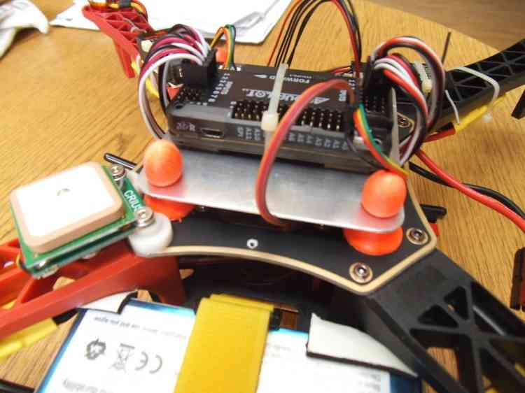

.. _common-vibration-damping:

=================
Vibration Damping
=================

This article provides a number of tips and methods for vibration damping
and isolating the Flight Control Boards.

.. warning::

   The vibration damping methods described in this article may not
   be as simple and effective as the :ref:`recommended method <common-mounting-the-flight-controller>` (mounting the the
   flight controller using four cubes of vibration damping foam).

Overview
========

Flight Control boards have accelerometers
built into the board that are sensitive to vibrations. ArduPilot (the
firmware) combines the data from these accelerometers with barometer and
GPS data to calculate an estimate of its position. With excessive
vibrations, the estimate can be thrown off and lead to very bad
performance in modes that rely on accurate positioning (e.g. on Copter:
AltHold, Loiter, RTL, Guided, Position and AUTO flight modes).

The goal of vibration damping is to reduce high and medium frequency
vibrations while still allowing low frequency actual board movement to
take place in concert with the airframe. This article provides a number
of community-contributed approaches for reducing vibrations, along with
additional theory.

.. note::

   The examples and images in this article refer to Copter, but the
   information is also largely applicable to Plane and Rover.

Measuring your vibration levels
===============================

-  Vibration needs to be less than 0.3 G in the X and Y axes and less
   than 0.5 G in the Z axis.
-  You should strive to get in the region of + and - 1/10 G in all axes,
   the information provided here will generally achieve that.
-  Please refer to the :ref:`Measuring Vibration <common-measuring-vibration>` wiki page for details of
   how to measure whether your vehicle's levels are within the
   acceptable range.

Isolate the Pixhawk/autopilot from the frame
============================================

Double sided foam tape or Velcro has traditionally been used to attach
the flight controller to the frame. In many cases foam tape or Velcro
does not provide adequate vibration isolation because the mass of the
flight control board is so small.

The following sections describe a number of alternatives that have been
tested and shown to perform better:

3M foam
-------

This `foam sold by mRobotics <https://store.mrobotics.io/product-p/mro-pxfoams-mr.htm>`__ comes is sticky on both sides and comes pre-cut so that
individual cubes can be easily attached to each of the four corners of
the flight controller as described on the :ref:`Mounting the Flight Controller wiki page <common-mounting-the-flight-controller>`.

.. image:: ../../../images/Vibration_3MFoam.jpg
    :target: ../_images/Vibration_3MFoam.jpg

HobbyKing Orange Foam
---------------------

#. `foam <http://www.hobbyking.com/hobbyking/store/__26457__anti_vibration_foam_orange_latex_190mm_x_140mm_x_6mm.html>`__
   should be cut into small 1cm ~ 2cm cubes
#. attach to the edges of the flight controller using double sided or
   "carpet fixing tape"

Gel pads
--------

#. Put off-the-shelf vibration damping gel pads of 1/2" ~ 1" (1cm ~ 2cm)
   on each corner of the flight control board.  Possible gels include:

   -  `Kyosho Zeal Gel Tape <http://www.amainhobbies.com/rc-cars-trucks/kyosho-zeal-vibration-absorption-gyro-reciever-mounting-gel-1-sheet-kyoz8006/p19713>`__ Probably
      the single best solution, now in stock at Amazon, E-Bay and A-Main
      Hobbies.
   -  `United States Silicone Gel Tape and Pads (V10Z62MGT5 tape recommended) <http://www.vibrationmounts.com/RFQ/VM08010.htm>`__
   -  `United Kingdom Silicone Gel Tape, Pads <http://www.gelmec.co.uk/family.php?page=58&ty=9&gr=9>`__ and
      `grommets <http://www.gelmec.co.uk/family.php?page=64&ty=19&gr=19>`__
   -  `Moon Gel Pads <http://www.amazon.com/RTOM-Moongel-Damper-Pads-Original/dp/B00F2PKRJW/>`__
      (also available in music stores). Caution: Moon Gel has been shown
      to fail in heat above 100 degrees Fahrenheit so it should be used
      cautiously.

#. Secure the board with a 1/4" ~ 1/2" (~1cm) wide velcro retaining
   strap or a rubber band. Be careful the strap does not hold down the
   controller so securely that it interferes with the damping of the
   pads. Consider putting a layer of soft foam between the strap and the
   flight controller.

   .. figure:: ../../../images/FlameWheel330ZealPads.jpg
      :target: ../_images/FlameWheel330ZealPads.jpg

      FlameWheel F330 with Kyosho Zeal Pads

   .. figure:: ../../../images/Flamewheel330PX4onZeal2.jpg
      :target: ../_images/Flamewheel330PX4onZeal2.jpg

      FlameWheel F330 With PX4FMU/PX4IO Mounted on Intermediate platform

   .. figure:: ../../../images/Flamewheel330PX4Hardtop.jpg
      :target: ../_images/Flamewheel330PX4Hardtop.jpg

      FlameWheel F330 With PX4FMU/PX4IO on Zeal Pads with Protective Hard Top

   .. figure:: ../../../images/PX4F330accels_5_9_13.jpg
      :target: ../_images/PX4F330accels_5_9_13.jpg

      The Zeal Mounted FlameWheel has Plus and Minus one vibration all axes = 1/10 G

The blog `Testing simple anti-vibration solutions for GoPro on an Arducopter <http://diydrones.com/profiles/blogs/testing-simple-anti-vibration-solutions-for-gopro-on-an>`__
has a video demonstrating vibration isolation using Moon Gel on a Go-Pro
camera.

O-ring Suspension Mount
-----------------------

#. Create a platform upon which to mount your flight control board with
   holes or screws on the four corners. Mount your flight controller on
   this board with double sided foam tape.
#. Mount 4 standoffs on the top of your frame spaced 1/10" to 1/8"
   further apart than the width of the platform upon which the control
   board has been mounted.
#. Insert 1/16" nylon O-rings through each corner of the flight control
   board and the standoffs so that the flight controller has no hard
   connections to the frame. Link
   `(Here!) <http://www.oringwarehouse.com/#selector>`__

   -  The overall O-ring diameter should be chosen to firmly retain the
      board while providing for light to moderate initial but rapidly
      snubbed movement of the board (generally 1/2" to 3/4" OD) and
      Silicone O-rings should generally damp better than Buna-N O-rings
      (Sizes 15 - 21) if you can acquire them.

.. figure:: ../../../images/330FOringSuspPlate45.jpg
   :target: ../_images/330FOringSuspPlate45.jpg

   FlameWheel F450 O-Ring Suspension Platform Mount

.. figure:: ../../../images/Flamewheel330SuspMount.jpg
   :target: ../_images/Flamewheel330SuspMount.jpg

   FlameWheel O-RingSuspension Mount: Graph of vibration levels shows they are under 0.1G onall axis

.. warning::

   If you are mounting your flight control board to the power
   distribution board it might be better to mount the standoffs for the
   Flight control board to a separate piece of fiberglass cut to size that
   can subsequently be bolted through existing holes in the power
   distribution board. Only drill through the power distribution board for
   mounting the standoffs if you are completely certain you will not cause
   a short and use threaded nylon machine screws or standoff
   studs.

Vibrations are short coupled, so all that leaving excess corner
clearance does is to require higher initial O-ring tension which reduces
vibration damping responsiveness and allows the board to physically tilt
more (which is undesirable as it throws the sensor to airframe
relationship off).

The disadvantage to O-ring suspension versus Gel pads is that it is
mechanically more complex and it requires tuning of both of O-ring
diameter and cross section.

You can combine O-ring and gel pad design by using an intermediate plate
and benefit from dual rate damping.

Ear Plug Mount
--------------

#. Purchase slow response silicon or urethane foam or PVC foam earplugs
   such as `these from
   3M <http://solutions.3m.com/wps/portal/3M/en_EU/OccSafety/Home/Products/ProductCatalogue/?PC_7_RJH9U5230GE3E02LECFTDQKKT1000000_nid=D4H3DJ5WP9beN8MT32R3VMgl>`__
#. Create a platform upon which to mount your flight control board with
   holes at the four corners. The holes should be large enough to allow
   the ear plugs to be inserted into them but not so loose that the
   board comes loose during hard landings. Ensure the holes are smooth
   so they do not cut into the ear plugs. Also keep the holes near the
   corners of your electronic module plate as possible to minimize
   unnecessary module movement.
#. Mount your flight controller on this board with double sided foam
   tape. Extra mass added to the board may improve vibration damping.
#. Squeeze the earplugs through existing holes in the frame (or cut new
   holes) and the holes in the board upon which the flight controller is
   mounted. "Tuning" is possible by varying the amount of earplug left
   exposed in the middle.

.. image:: ../../../images/Vibration_EarPlug.jpg
    :target: ../_images/Vibration_EarPlug.jpg

   Ear Plug Vibration Mount

Bulb Damper + Ear Plug .05G Ultra Low Vibration Mount
-----------------------------------------------------

#. Robert Lefebvre developed this extremely high performance mount which
   actually performed way better than expectations.
#. It consists of a mounting plate with a 100g soft rubber bulb type
   "gimbal" damper at each corner and a half a urethane foam earplug
   placed inside each one.
#. Gimbal bulb type dampers themselves can work in tension or
   compression.
#. The earplugs provide an additional damping medium with a different
   frequency damping range than the bulb dampers by themselves.
#. The ear plugs also stiffen the bulb mounts up a bit preventing
   excessive free motion being caused by normal flight maneuvers.
#. This was successful at damping a Flamewheel clone with flexible arms
   and over size 12" propellers into the .05 G range.

   .. image:: ../../../images/vibration_flamewheel_clone_closeup.jpg
       :target: ../_images/vibration_flamewheel_clone_closeup.jpg
       
#. The APM flight controller is also mounted on anti-vibration grommets
   available from `McMaster Carr <http://www.mcmaster.com/#vibration-damping-grommets/>`__ package
   of 25 each part #9311K64 recommended.
#. This was successful at damping a FlameWheel clone with flexible arms
   and over size 12" propellers into the .05 G range.

   .. image:: ../../../images/F450-Quad-Vibes-1.png
       :target: ../_images/F450-Quad-Vibes-1.png
       
#. Note that the X & Y vibrations are less than + and - 0.05G, the Z
   vibrations are a bit higher due to Flamewheel clone arm flex, high
   vibration motors and the inordinately large 12" propellers.
#. Robert describes this Copter as a real "paint shaker" due to the
   inadequacies listed above making the results achieved even more
   remarkable.

   .. image:: ../../../images/vibration_flamewheel_copter_clone.jpg
       :target: ../_images/vibration_flamewheel_copter_clone.jpg
       
#. The 100G bulb type gimbal vibration dampers can be ordered direct
   from a variety of
   vendors: \ `copter-rc.com <http://copter-rc.com/en/accessories/36-100g-av-ball-tension-damper.html>`__
#. This can be considered to be an excellent solution for many types of
   airframes as it seems to have a very wide dynamic range.
#. Clearly some fine tuning would be possible by varying the type and
   size of the earplug section in the dampers.
#. There are also 200G and 300G dampers but those would be best used on
   higher mass modules perhaps including a battery.

An Excellent 3D Printed Anti-Vibration Platform
-----------------------------------------------

By \ `GuyMcCaldin <http://diydrones.com/profile/GuyMcCaldin>`__ (original
Blog article: 3D Printed Anti Vibration Mount (no longer available)).

.. image:: http://i.imgur.com/minON7K.jpg
    :target:  http://i.imgur.com/minON7K.jpg

Over the last few weeks, I've been prototyping different anti vibration
mount designs using an Up Mini 3D printer. I wanted something that
performed well, using affordable and readily available components.

.. image:: http://i.imgur.com/bgzBepz.jpg
    :target:  http://i.imgur.com/bgzBepz.jpg

The first design started with anti vibration dampeners in a simple
vertical configuration. This suffered from too much play in the
horizontal plane, which might have caused instability in quick
accelerations. The next design rotated the dampeners 45°, which resulted
in much more even resistance across the horizontal and vertical planes.

The large rubber dampeners provide outstanding isolation. Too much in
fact. The ideal anti vibration mount isolates the controller from high
frequency vibrations, but conducts lower frequency vibrations that might
represent small changes in attitude. For the next design, I moved to
smaller and slightly stiffer dampeners available from Hobby King.

.. image:: http://i.imgur.com/pJsUheM.jpg
    :target:  http://i.imgur.com/pJsUheM.jpg

I've been testing them on a Turnigy Talon tricopter, using an APM 2.5.
The GPS is mounted to the top of the APM to increase the moving weight,
which assists slightly in reducing higher frequency vibrations.

The results so far suggest that it's working very well:

.. image:: http://i.imgur.com/7TksoQI.png?width=640
    :target:  http://i.imgur.com/7TksoQI.png

The above graph is taken from a two minute hover in loiter mode. All
axes are below ±1g, which exceeds the specifications set out in Copter
guidelines.

Using a tool that \ `Forrest Frantz <http://www.diydrones.com/profile/ForrestFrantz>`__ developed, we
can see these results from another perspective:

.. image:: http://i.imgur.com/9wFdgV0.png?width=640
    :target:  http://i.imgur.com/9wFdgV0.png

The Acceleration results are still excellent, but the pitch and roll
stability shows a bit of oscillation. I'm using default PID values which
would definitely benefit from tuning, and flying in slightly windy
conditions. I'm also new to rotary wing flight, so I'm still honing my
flying skills. I'm able to keep the tricopter in a 1m x 1m x 1m cube,
but it slowly drifts around if there is a change in wind.

These are the most likely causes, but in the interests of full
disclosure, I wanted to mention that it could be caused by the APM not
responding to small changes in attitude if the mount is creating too
much isolation. It certainly doesn't appear to be affecting flying
performance, the tricopter is impressively stable in loiter mode. I
won't know if it's an issue or not until more people try Forrest's tool
out, so I have more data to compare my results to (you can find the
forum
thread \ `(Here!) <http://diydrones.com/forum/topics/vibration-isolation-and-dampening-of-apm-px4-for-version-2-9?xg_source=activity&id=705844%3ATopic%3A1102762&page=21#comments>`__

If you have access to a 3D printer, you can download the STL files
here: \ `Omnimac APM Mount v1.5.stl <https://www.dropbox.com/s/69zrbzy1lz53xnc/Omnimac%20APM%20Mount%20v1.5.stl>`__

Alternatively, I've uploaded the design to
`Shapeways <http://www.shapeways.com/product/45H92T5RS/omnimac-apm-mount-v1-5?li=aeTabs>`__.

You can purchase it starting from $22.92 depending on material:

I've include a 30% margin in the price (~$5) that will go towards a trip
to Africa in November, where I'll be donating time and resources using
3DR powered UAS in wildlife research and conservation.

To complete the mount, you'll need these
`Dampers <http://www.hobbyking.com/hobbyking/store/__37447__General_Purpose_Anti_Vibration_Rubber_w_M3_x_11mm_Screw_and_M3_Nylock_Nut_4pcs_set.html>`__ which
cost $1.20 from Hobby King.

The mount can be installed using double sided tape, or M3 screws spaced
at 45mm x 45mm. If you'd like me to modify the file to suit the mounting
options of your airframe, just let me know.

The log file that was used to produce the results shown above can be
downloaded from here: \ `Turnigy Talon 2min Loiter (default PIDs) <https://www.dropbox.com/s/qju3b33a82wbh3v/2013-10-03%2009-55%2010.log>`__

3D Printed Anti-Vibration Platform for NAVIO2
---------------------------------------------

Anti-vibration for NAVIO2 can be easily 3D printed. It significantly simplifies mounting and eliminates vibrations. You can find STL files `here <https://docs.emlid.com/navio2/Navio-APM/hardware-setup/#anti-vibration-mount>`__.

Anti-vibration with Navio2 mounted on frame:

.. figure:: ../../../images/anti-vibration-mount.jpg
   :target: ../_images/anti-vibration-mount.jpg

Check frame motors, props and prop adapters
===========================================

For copters vibration comes mostly from frame flex and motors and
propellers and often you can reduce vibration significantly:

-  Frame flex especially arm flex is a big cause of asynchronous
   vibration, Frame arms should be as rigid as possible.

   -  The real DJI Flamewheel copters have sufficiently rigid injection
      molded arms, the many off brand clones do not.
   -  Generally carbon fiber armed copters have sufficient anti twist
      and anti-bend characteristics.
   -  Heavier aluminum armed copters like the Copter are flex free,
      cheaper Chinese ones often not.
   -  Most purpose designed commercial copters with injection molded
      exoskeletons or arms like the Iris or Phantom are sufficiently
      rigid.
   -  Cheap, light frames tend to flex more than high quality stronger
      ones and the heavier you load the copter the more "Flexi" it gets.

-  Motor to frame arm and frame arm to central hub mounts need to be
   secure and flex free (sometimes a problem for carbon tube arms).
-  Motors need to run smoothly (bearings not worn-out or "screeching").
-  Prop adapters connecting the propellers to the motors need to be
   concentric and very straight.
-  Propellers should be fully balanced using a good manual prop balancer
-  Motor balancing (or really well factory balanced motors like T-Motor)
   can have a major effect.
-  Propellers that are not well matched to the frame and weight or do
   not have the same flex for CCW and CW are very problematic.
-  Get Good propellers.
-  Carbon fiber props are expensive, rigid strong and as sharp as a
   razor so they are a major safety hazard.
-  Large slow propellers will definitely induce more vibration than
   small fast ones, but the big slow props are a lot more efficient.
-  And large slow propellers will also make frame flex a lot worse as
   the motor units will twist around the props axis from unbalanced
   lift.
-  If you really optimize all of the above characteristics, your flight
   controller will likely need only a bit of Gel or foam for vibration
   isolation.

A Summary of the particular vibration characteristics we need to damp
=====================================================================

#. The vibration frequency and amplitude we primarily need to reduce is
   a characteristic of the motor / prop units turning at flight speed.
#. That is, it is a fairly high frequency with fairly low amplitude.
#. This requires that we provide a short coupled damping and isolation
   range.
#. The board itself does not need to have nor benefit from a range of
   motion that exceeds the amplitude of the vibration.
#. Because the board does not apply any force to the airframe, the only
   thing we need to be concerned with Damping / Isolating is the weight
   (mass) of the board itself plus the forces applied to it by
   airframe's normal flight maneuvering.
#. Since excellent broad frequency range, high damping materials are
   available our biggest concern will be to use the proper amount of
   them to optimally damp our flight control board (too much is just as
   bad as too little).
#. Combining the Flight control board and receiver onto a separate
   vibration damped electronics module "plate" or enclosure can increase
   the mass of the module making it easier to damp effectively as well
   as reducing the interconnecting wiring and making the whole system
   more modular.

Additional Vibration Reduction Considerations
=============================================

#. `Hard Disk Drive Anti-Vibration Grommets <http://www.frozencpu.com/products/8869/scr-138/Hard_Disk_Drive_Anti-Vibration_Screw_Shoulder_Screw_Type.html?tl=g33c113&id=gdASxUFI>`__
   can provide sufficient or supplemental vibration reduction
#. Significant gains in vibration isolation can also be realized by
   using a high flex wire and strain relief approach to all wires
   connected to the Flight control board (and using the minimum number
   of wires necessary as well.)
#. Some frames have lower than normal vibration characteristics due to
   frame stiffness / flex and isolated centralized mass can greatly
   influence motor/prop vibration transfer to the central fight
   controller.
#. Isolation and damping can be improved somewhat by sandwiching the
   flight control board / enclosure between damping pads on both sides
   in about twenty percent compression. 30 durometer Sorbothane is
   actually specified at 15 to 20 percent compression for optimal
   damping.
#. Although 30 durometer Sorbothane seems an excellent candidate,
   personal experience indicates that it becomes permanently compressed
   and is not as effective at vibration reduction as the Gel solutions.
#. A link to a Blog about the first APM anti-vibration mounting system
   to achieve 0.05 G damping (2/20/2013 improved to 0.02 G), a dual zone
   isolation system, combining Oring suspension and silicone pad is
   `(Here!) <http://diydrones.com/profiles/blogs/very-good-anti-vibration-results-with-following-apm2-5-mount-quad>`__
#. Motor balancing can also reduce vibration and especially so for
   cheaper or larger motors. Balancing involves:

   -  Tightly fasten a small tie wrap around a motor (WITH NO PROP),
      trim off the extended tab and spin it up.
   -  Try multiple times, each time turning the tie wrap on the motor
      housing a bit until the vibration reduces or goes away.
   -  A small piece of Scotch tape can be re-positioned instead of the
      tie wrap if desired or for smaller motors.
   -  When you locate the spot where there is the least vibration (and
      you should be able to hear it), mark the spot directly under the
      clasp of the tie-wrap with a felt pen.
   -  Add a small dot of hot glue gun glue where the Tie-Wrap clasp was
      and increase the glue a bit at a time till the vibration is
      minimized.
   -  If you put too much glue on it can be removed with an X-acto
      knife.

#. Vibration damping motor mounts like
   `this <http://store.jdrones.com/Anti_Vibration_MultiMount_for_Multicopters_p/mmset02.htm>`__
   may or may not reduce vibration.
#. Camera Mounts also need to be effectively isolated and damped from
   vibration, but they already have a number of "soft" mounting
   solutions.
#. The camera servos need to be vibration isolated as well, either in
   the isolated camera mount itself or with their own vibration
   reduction solution.
#. You should use high quality ball joints on your camera servo arms and
   adequate bearings or bushings in the mount itself with zero free play
   to prevent inertial slop.
#. Quality servos without free play are also a must for precision camera
   work.
#. At this point in time it seems that the more rigid the frame the
   better because frame flex introduces undesirable mechanical delay
   (hysteresis) in translating motor induced actions to the centrally
   located flight control board. (Do NOT shock mount the motor Arms).
#. The amount and type of damping medium needs to be carefully matched
   to the weight (mass) of the item we are trying to isolate as well as
   the frequency and amplitude of the vibrations we are seeking to
   damp. We are trying to isolate a flight control board that weighs
   less than 2 ounces and this is a very small mass.
#. Virtually all off the shelf solutions (either pad or stud type) are
   designed for an isolated mass that would weigh at least 5 to 10 times
   what an APM2.x or PX4FMU/PX4IO board weighs for optimal effectiveness. This
   includes all pre-made Sorbothane, Alpha gel, EAR, memory foam or
   other silicone or urethane gel or foam mounts as well as Lord Micro
   mounts.
#. A threaded stud or sleeve type mount gel mount properly designed for
   the mass of our flight control board or electronics module undergoing
   the stress's of normal flight would be a much better long term
   solution.

Terminology
===========

The methods used will typically incorporate both damping and isolation:

-  *Isolation* is simple undamped (spring or rubber band support) which
   allows the movement of the isolated object largely separate from the
   containing object (Automobile spring for instance).
-  *Damping* is the conversion of vibration into heat energy by a shock
   absorbing medium (automobile shock absorber for instance).

Links to related discussions
============================

-  `RC Groups page on Vibration Effects relating to a camera mounts <http://www.rcgroups.com/forums/showpost.php?p=16315017&postcount=16338>`__
-  `DIYDrones discussion related to Vibration Control <http://diydrones.com/forum/topics/vibration-isolation-and-dampening-of-apm-px4-for-version-2-9>`__
-  `Gary McCray's DIYDrones BLOG re Vibration Control <http://diydrones.com/profiles/blogs/vibration-control-wiki-section-started-for-better-or-worse>`__

