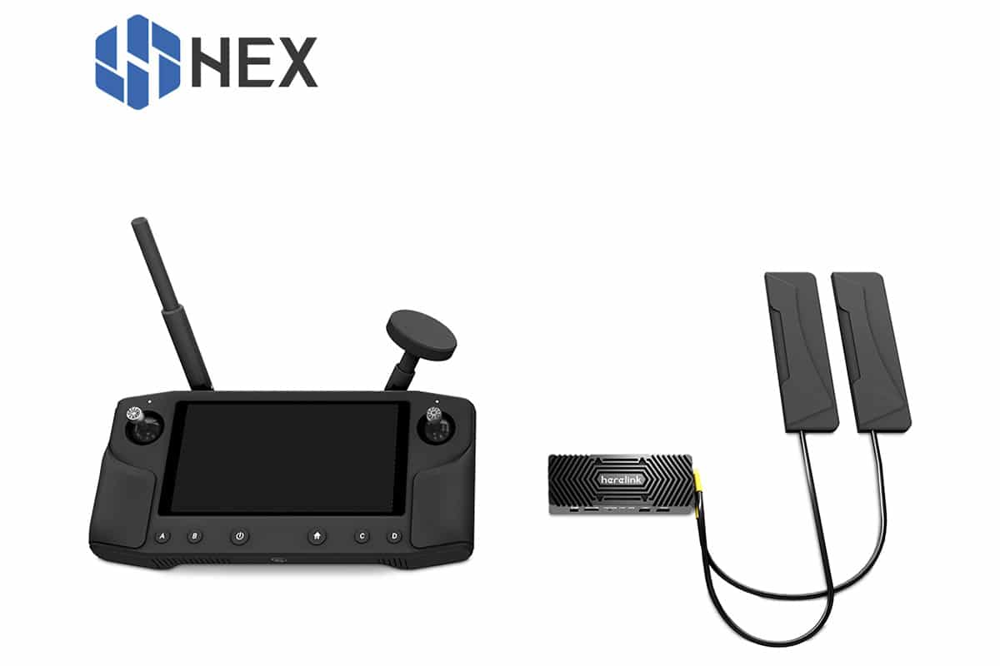
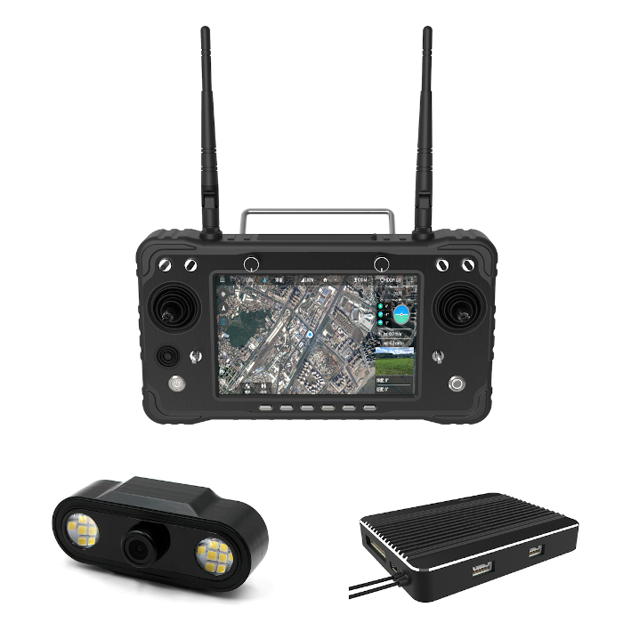
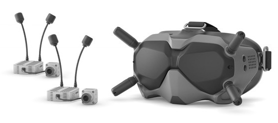
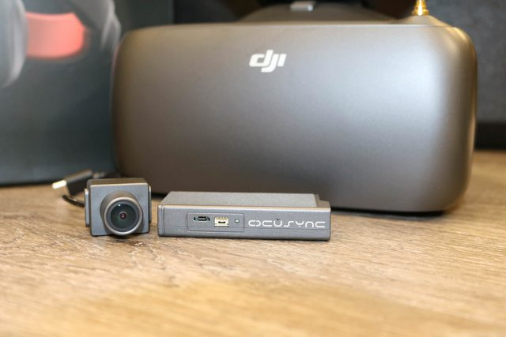
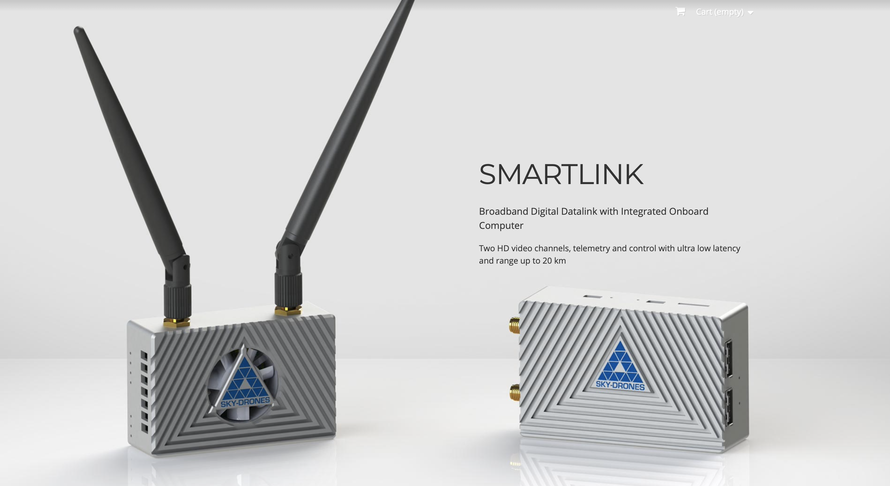
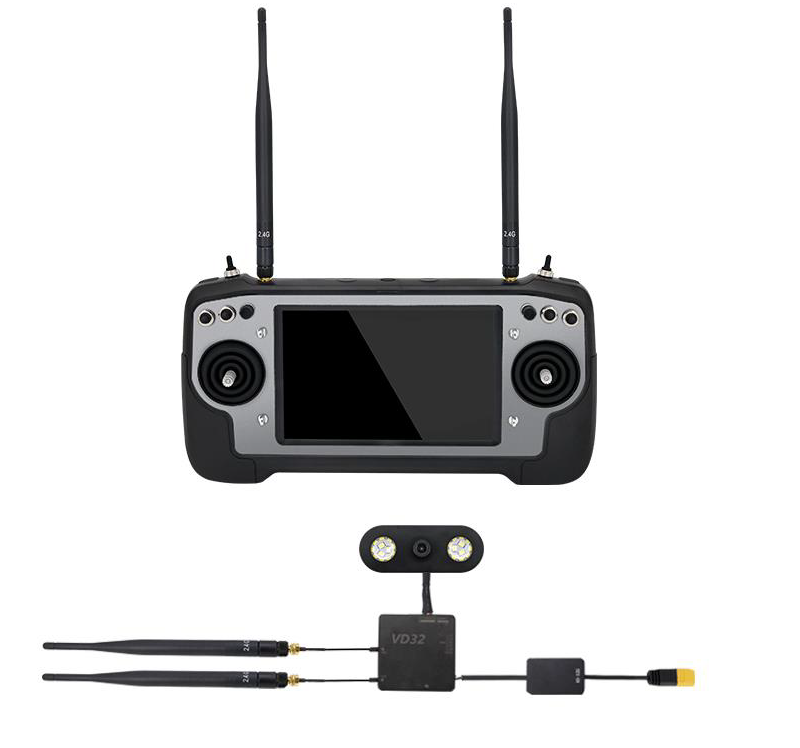

.. _common-video-landingpage:

======================================
High Definition Live Video FPV Systems 
======================================

This sections covers live video systems which can provide a high definition first-person video (FPV) from the vehicle back to either a ground station or FPV goggles. For other FPV systems, see :ref:`common-fpv-first-person-view` section.

Herelink HD Video Transmission System
=====================================

Overview
--------

Herelink is an integrated remote controller, ground station and wireless digital transmission system designed to be used with the Cube and other autopilots, using ArduPilot or PX4 firmware.  

Herelink allows RC control, HD video and telemetry data to be transmitted upto 20km between the ground station and air unit, the Herelink remote controller features custom Solex TX and QGC applications and both air unit and ground station feature an integrated 8 core SOC for custom application development.

Features
--------
* Android based smart device with 5.46 inch 1080P capacitive touch screen.
* Integrated digital transmission system simultaneously transmitting video, telemetry and control. 
* Custom Solex TX and QGC ground station software with MAVLink support for ArduPilot and PX4.
* Dual hall effect self centering gimbals with removable sticks. 
* 1080P HD video with dual digital video inputs. 
* Dual S.bus signal output for simultaneous control of autopilot and pan/tilt cameras.
* 6 customizable MAVLink buttons and Mavlink/Sbus hardware wheel. 
* RC gimbal control on dedicated service independent from Solex TX / QGC. 
* Tether and share video and telemetry via wifi ground station such as Mission Planner. 
* Onboard Arm Cortex A53 & Cortex A53 SOC in both air and ground units for custom applications. 

More Info on Herelink can be found on 

-   `Cubepilot <https://docs.cubepilot.org/user-guides/herelink/herelink-overview>`_
-   `Hex HereLink Website <http://www.proficnc.com/all-products/211-gps-module.html>`_
-   `Cubepilot Support Forum <https://discuss.cubepilot.org>`_

CUAV H16 series HD Video Transmission and remote control system
===============================================================

     
Overview
--------

The H16 Smart Remote Control is a UAV communication link that integrates remote control, data transmission, and HD video transmission. It runs the Android operating system and supports mainstream ground stations such as QGC; Like an Android phone, you can install other Android applications as desired .

Features
--------

* Runs Android OS 
* 7-inch color LCD screen.
* Integrated digital transmission system that can transmit high-definition video, drone data, and radio control signals at the same time.
* It can run the QGC (QGround Control)ground station, and any version of QGC can be installed, without waiting for release of a customized ground control station.
* Four, three-position switches and two knobs better suits the needs of industrial applications; you can control auxiliary equipment on the UAV easily.
* 1080P HD video
* 2000 nt (nit) brightness high-definition display, allowing data displayed to be clearly visible in the sun.
* Telemetry and video sharing to other devices via WIFI.
* Similar to a smart phone; you can install a large number of Android applications.
* You can connect an MIPI camera and an HDMI camera at the same time.
* 30km, ultra long-distance transmission.

For more information, please click the link below:

- `CUAV docs <doc.cuav.com>`_
- `CUAV store <https://store.cuav.net/index.php?id_product=125&rewrite=cuav-h16-pro-hd-video-transmission-system&controller=product>`_

DJI Digital FPV System
======================

   
.. note:: This system is not directly compatible with Mavlink. However, there is an MSP to MAVLink Arduino converter maintained by D3NGIT that allows it to provide telemetry data via the custom OSD. See https://github.com/d3ngit/djihdfpv_mavlink_to_msp_V2.

ukmook has put together a set of instructions on how to set this up here https://github.com/ukmook/qUark/tree/master/Mav-To-MSP#quark-flight-electronics

Overview
--------

The DJI Digital FPV System was designed for the drone racing industry. It consists of the DJI FPV Air Unit Module, DJI FPV Camera, DJI FPV Goggles, and DJI FPV Remote Controller.

Features
--------
- MSP Telemetary Input
- 5 GHz 8 Channels
- Low Latency Mode 720p/120fps: <28 ms
- High-Quality Mode 720p/60fps: <40 ms
- Max transmission range: Up to 4 km

More Info on at `DJI <www.DJI.com>`_

DJI Ocusync Air System 
======================

The DJI OcuSync Air System is an integrated high-resolution video transmission solution consisting of a camera, Air Unit module, three antennas, and other connectors. Working with DJI Goggles RE, the OcuSync Air System supports wireless transmission of video, images, and flight controller information. 

The Air Unit can be attached to racing drones, model airplanes, RC cars, or unmanned enterprise vehicles used for rescue operations and inspections and supports both MSP and MAVLink telemetry input from firmware V01.05.00 and later.

Features
--------
- MAVLink & MSP Telemetry Input 
- 2.4 GHz/5.8 GHz dual-frequency transmission
- FHSS and up to 19 fixed channels
- High-resolution video transmission up to 1280×960 at 50 fps
- Minimum latency: As low as 50 ms (at 480p at 50 fps)
- Max transmission range: Up to 7 km (2.4 GHz, FCC compliance, unobstructed)

More Info at `DJI <www.DJI.com>`_

 
Sky-Drones Smartlink 
=====================

Smartlink is a broadband digital datalink with integrated onboard computer that supports up to Two HD video channels, MAVLink telemetry and control with ultra low latency and range up to 20 km. 

Features
--------
- MAVLink compatible 
- 2.4 GHz / up to 1000 mW configurable
- 2 HDMI, full HD up to 1080p / 60fps 
- Transmission range: 20 km FCC / 10 km
- LTE connectivity as an option
- Satellite connectivity as an option

More info on Sky-Drones `website <https://sky-drones.com/smartlink>`_

Unboxing video `here <https://www.youtube.com/watch?v=2qtE4nuTXKU>`_ 

Purchase `online <https://sky-drones.com/telemetry/smartlink-set.html>`_ 

SIYI AK28
=========

A 2.4Ghz HD video/radio control/telemetry system based on Android OS, allowing many Android applications to be loaded and used in addition to the normal ground control station programs, such as QGC.

In addition to normal RC control, the system can also control additional equipment on the vehicle with provide auxiliary control paths.

For more information, including manuals, see `SIYI site <http://en.siyi.biz/en/ak28/overview>`__

Where to buy
------------

`RC Hobby Japan <https://www.rchobby-jp.com/index.php?main_page=product_info&cPath=67&products_id=4455>`__

`Holybro <http://www.holybro.com/product/siyi-ak28-android-smart-remote-controller/>`_

Unboxing video
--------------

.. youtube:: DPHKe86SiqI

Other Systems
=============

-    `SkyViper video <https://discuss.arduPilot.org/t/using-the-skyviper-sonix-board-with-any-pixhawk/23932>`_
-    `Wifi Broadcast <https://github.com/bortek/EZ-WifiBroadcast/wiki>`_

