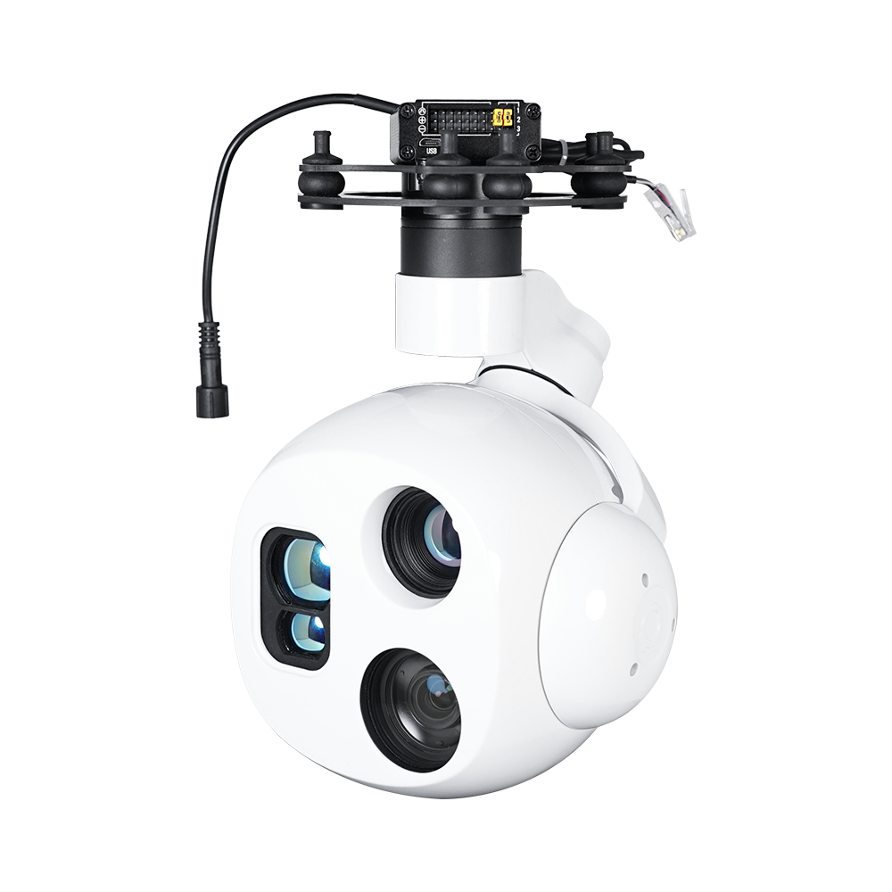
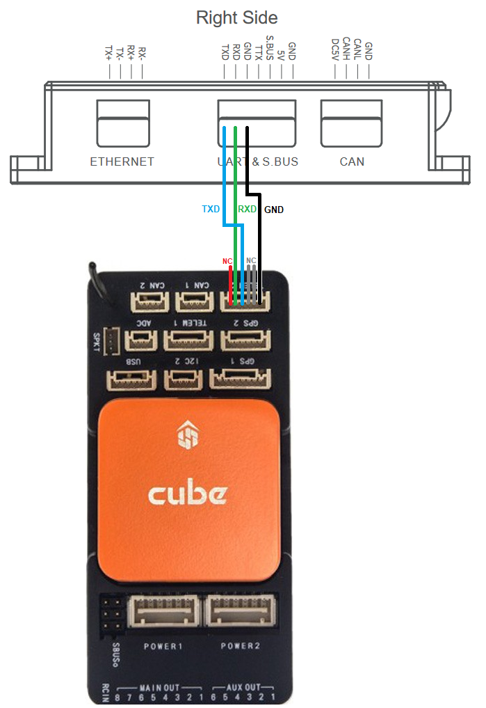
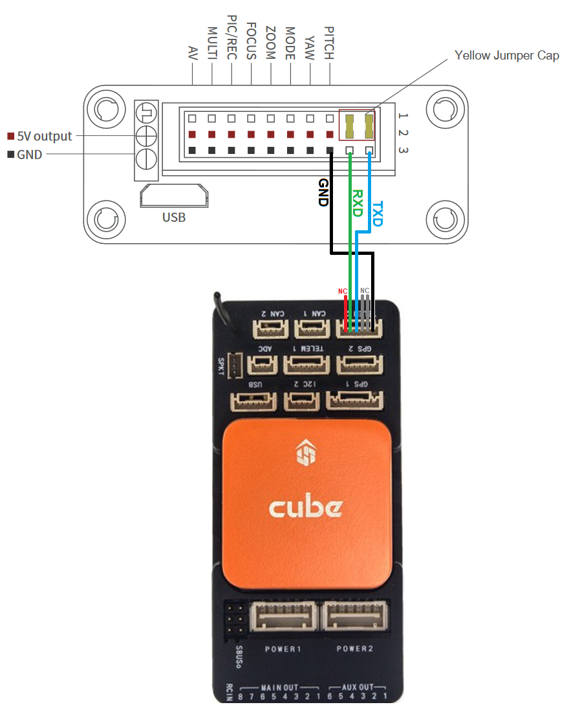

.. _common-viewpro-gimbal:

[copywiki destination="copter,plane,rover"]

===============
ViewPro Gimbals
===============

ArduPilot 4.4 (and higher) support the `ViewPro <http://www.viewprotech.com/index.php?ac=article&at=list&tid=127>`__ gimbals using a :ref:`Lua script <common-lua-scripts>` that understands ViewPro's custom serial protocol.

Connection and Configuration
============================

Connect one of the autopilot's serial ports to the gimbal as shown below.  The first image if for users with a "viewport" connection.

If using 4.5.x (or higher):

- Set :ref:`SERIAL2_PROTOCOL <SERIAL2_PROTOCOL>` = 8 (Gimbal).  This assumes the gimbal is attached to the autopilot's Serial2 port but any serial port can be used.
- Set :ref:`SERIAL2_BAUD <SERIAL2_BAUD>` = 115
- Set :ref:`MNT1_TYPE <MNT1_TYPE>` = 11 (Viewpro)
- Set :ref:`CAM1_TYPE<CAM1_TYPE>` = 4 (Mount) to enable the camera control using the mount driver
- :ref:`RC6_OPTION <RC6_OPTION>` = 213 ("Mount Pitch") to control the gimbal's pitch angle with RC channel 6
- :ref:`RC7_OPTION <RC7_OPTION>` = 214 ("Mount Yaw") to control the gimbal's yaw angle with RC channel 7

- Optionally these auxiliary functions are also available

  - :ref:`RC9_OPTION <RC9_OPTION>` = 166 ("Camera Record Video") to start/stop recording of video
  - :ref:`RC9_OPTION <RC9_OPTION>` = 168 ("Camera Manual Focus") to adjust focus in and out
  - :ref:`RC9_OPTION <RC9_OPTION>` = 169 ("Camera Auto Focus") to trigger auto focus
  - :ref:`RC9_OPTION <RC9_OPTION>` = 174 ("Camera Image Tracking") to track what is in the center of the image
  - :ref:`RC9_OPTION <RC9_OPTION>` = 175 ("Camera Lens") to select which video stream is sent to the GCS

If using 4.4.x:

- Set :ref:`SERIAL2_PROTOCOL <SERIAL2_PROTOCOL>` = 28 (Scripting).  This assumes the gimbal is attached to the autopilot's Serial2 port but any serial port can be used.
- Set :ref:`SCR_ENABLE <SCR_ENABLE>` = 1 to enable scripting and reboot the autopilot
- Set :ref:`MNT1_TYPE <MNT1_TYPE>` = 9 (Scripting) to enable the mount/gimbal scripting driver
- Set :ref:`CAM1_TYPE<CAM1_TYPE>` = 4 (Mount) to enable the camera1 instance control using the mount driver
- `Download mount-viewpro-driver.lua from here <https://github.com/ArduPilot/ardupilot/tree/Copter-4.4/libraries/AP_Scripting/drivers>`__ and copy it to the autopilot's SD card in the APM/scripts directory and reboot the autopilot
- Optionally for gimbals with multiple cameras, an auxiliary switch can control the active camera by doing the following

  - Set :ref:`RC9_OPTION <RC9_OPTION>` = 300 (Scripting1) to allow selecting the active camera with RC9.  Note that any auxiliary switch may be used.
  - When the driver script is run, it creates three new parameters : VIEP_CAM_SWLOW, VIEP_CAM_SWMID, and VIEP_CAM_SWHIGH. These control the active camera when the aux switch is the low, medium and high position respectively.  Possible values are

      - 0: No change in camera selection
      - 1: EO1
      - 2: IR thermal
      - 3: EO1 + IR Picture-in-picture
      - 4: IR + EO1 Picture-in-picture
      - 5: Fusion
      - 6: IR1 13mm
      - 7: IR2 52mm

- Set VIEP_ZOOM_SPEED parameter created by the driver script to control the speed of zoom (value between 0 and 7)

Control and Testing
-------------------

See :ref:`Gimbal / Mount Controls <common-mount-targeting>` and :ref:`Camera Controls <common-camera-controls>` for details on how to control the gimbal using RC, GCS or Auto mode mission commands

Testing Video Streaming
=======================

To test video streaming works using a Windows PC, connect the camera's ethernet cable to your local router.

- Download and install `VLC media player <https://www.videolan.org/>`__
- On the PC, open Settings, Network & Internet, Ethernet
- Find the "IP assignment" section, click the "Edit" button and select "Manual"

    - Move the IPv4 slider to On
    - IP address: 192.168.2.118
    - Subnet mask: 255.255.255.0
    - Gateway: 192.168.2.1
    - Preferred DNS: 10.10.0.101
    - Press "Save" (note you will likely lose your internet connection)

- Open VLC media player, Select Media, Open Network Stream, Network and enter "rtsp://192.168.2.119:554"
- Once completed testing, restore your internet by reverting the PC's "IP assignment" to "Automatic (DHCP)"

Downloading Images and Videos
=============================

If the gimbal is connected using Ethernet, images and videos stored on the SD card may be downloaded manually using the built-in webserver.  Using your favourite browser open http://192.168.2.119:8554/download (assuming the gimbal is using the default IP address).

`wget <https://www.gnu.org/software/wget/>`__ can also be used to download all images and videos with a single command

- On Windows, ``wget.exe -r -l 10 --convert-links http://192.168.2.119:8554/download/``
- On Linux/Ubuntu ``wget -r -l 10 --convert-links http://192.168.2.119:8554/download/``
