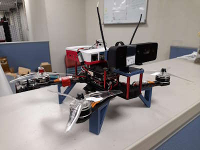
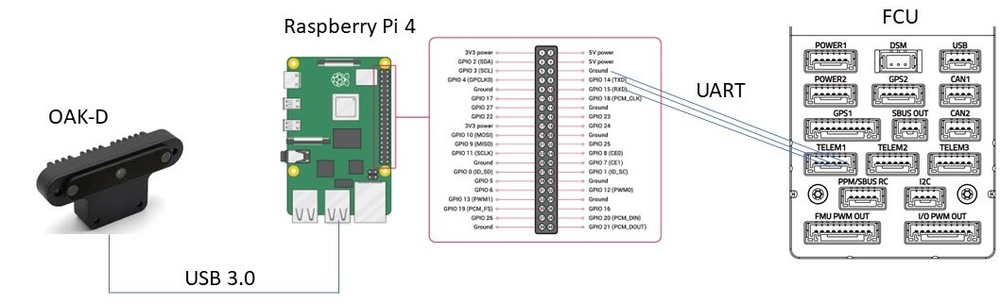

.. _common-vio-oak-d:

=============
Luxonis OAK-D
=============

[copywiki destination="copter,rover,blimp"]

.. youtube:: Xxh8CUwEE1M

This article explains how to setup a Luxonis OAK-D camera for use with ArduPilot as a substitude for a GPS allowing position control modes like Loiter, PosHold, RTL, Auto to work. This solution is based on HKUST Aerial Robotics Group's VINS-Fusion and Sara Lucia Contreras Ojeda’s thesis "Robot pose calculation based on Visual Odometry using Optical flow and Depth map"

What to Buy
-----------

- Luxonis `OAK-D <https://shop.luxonis.com/collections/oak-cameras-1/products/oak-d>`__ or `OAK-D Pro <https://shop.luxonis.com/collections/oak-cameras-1/products/oak-d-pro>`__. `OAK-D S2 <https://shop.luxonis.com/collections/oak-cameras-1/products/oak-d-s2>`__ should work but not be tested yet
- `Raspberry Pi 4 <https://www.raspberrypi.org/products/raspberry-pi-4-model-b/>`__ or `Raspberry Pi 5 <https://www.raspberrypi.com/products/raspberry-pi-5/>`__

Hardware Setup
--------------

- Connect the OAK-D to one of the RPI’s blue USB3 ports
- Connect the RPI's UART port to autopilot’s Telem1

Software Setup
--------------

On RPI's terminal

.. code-block:: bash

    git clone https://github.com/chobitsfan/VINS-Fusion.git
    git checkout -t origin/apm_wiki
    #follow instructions in README.md to build
   
    git clone https://github.com/chobitsfan/oak_d_vins_cpp.git
    git checkout -t origin/apm_wiki
    #follow instructions in README.md to build
    
    git clone https://github.com/chobitsfan/mavlink-udp-proxy.git
    git checkout -t origin/apm_wiki
    #follow instructions in README.md to build

Configure ArduPilot
-------------------

- :ref:`SERIAL1_PROTOCOL <SERIAL1_PROTOCOL>` = 2 (MAVLink2).
- :ref:`SERIAL1_BAUD <SERIAL1_BAUD>` = 1500 (1500000 baud)
- :ref:`VISO_TYPE <VISO_TYPE>` = 1
- :ref:`VISO_DELAY_MS <VISO_DELAY_MS>` = 50
- :ref:`EK3_SRC1_POSXY <EK3_SRC1_POSXY>` = 6 (ExternalNav)
- :ref:`EK3_SRC1_VELXY <EK3_SRC1_VELXY>` = 6 (ExternalNav)
- :ref:`EK3_SRC1_POSZ <EK3_SRC1_POSZ>` = 1 (Baro which is safer)
- :ref:`EK3_SRC1_VELZ <EK3_SRC1_VELZ>` = 0 (you can set it to 6 if 1st flight test looks good)
- :ref:`EK3_SRC1_YAW <EK3_SRC1_YAW>` = 6 (ExternalNav)
- :ref:`COMPASS_USE <COMPASS_USE>` = 0, :ref:`COMPASS_USE2 <COMPASS_USE2>` = 0, :ref:`COMPASS_USE3<COMPASS_USE3>` = 0 to disable all compasses

How to run
----------

Open 3 terminals on RPI
On 1st terminal

.. code-block:: bash

	cd oak_d_vins_cpp
	./feature_tracker
	
On 2nd terminal

.. code-block:: bash

	cd VINS-Fusion/vins_estimator
	./vins_fusion oak_d.yaml
	
On 3rd terminal

.. code-block:: bash

	cd mavlink-udp-proxy
	./mavlink_udp
	
[Optional]Verify pose estimation
--------------------------------
On a PC with `ROS Noetic <http://wiki.ros.org/noetic>`__ installed (WSL will do)

.. code-block:: bash

	git clone https://github.com/chobitsfan/my_udp_ros.git
	#follow instructions in README.md to build & run
	
.. youtube:: 6QpYq17_L9I

red = front, green = left and blue = up 

Flight Test
-----------

For your first flight:

- Takeoff in Stabilize or Alt-Hold, check that the vehicle is stable.

- Move the vehicle around and observe the position on Mission Planner to see if tracking is stable.

- Switch to Loiter, but always ready to switch back to Stabilize/Alt-Hold if anything goes awry.

- Otherwise, the vehicle should hover stably and able to keep its position.

- Move the vehicle around (translate, rotate) at varying speed, always ready to switch back to Stabilize/Alt-Hold.

If everything works as expected, next time you can arm and takeoff in Loiter mode.

