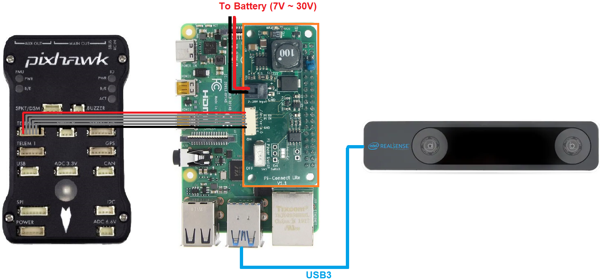
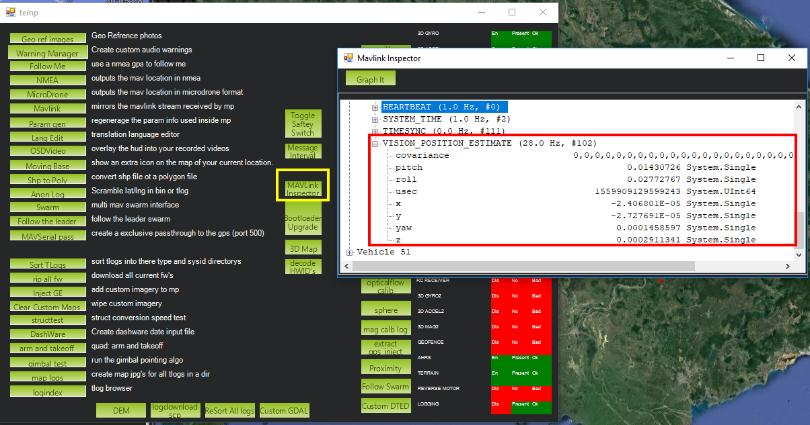

.. _common-vio-tracking-camera:

====================
Intel RealSense T265
====================

[copywiki destination="copter,rover"]

..  youtube:: HCyTt0xK8CQ
    :width: 100%

This article explains how to setup an `Intel Realsense T265 <https://store.intelrealsense.com/buy-intel-realsense-tracking-camera-t265.html?_ga=2.225595998.511560227.1566178471-459370638.1562639781>`__ for use with ArduPilot as a substitude for a GPS allowing position control modes like Loiter, PosHold, RTL, Auto to work. This method uses a python script running on an RPI companion computer to send position information to ArduPilot without the use of `ROS <https://www.ros.org/>`__.  The `setup using ROS is here <https://ardupilot.org/dev/docs/ros-vio-tracking-camera.html>`__.

What to Buy
-----------

- `Intel RealSense Tracking Camera T265 <https://www.intelrealsense.com/tracking-camera-t265/>`__
- `Raspberry Pi 4 <https://www.raspberrypi.org/products/raspberry-pi-4-model-b/>`__ (2GB or 4GB recommended, 8GB has issues) or `Raspberry Pi 3 <https://www.raspberrypi.org/products/raspberry-pi-3-model-b/>`__
- 16GB (or larger) SD card
- `PiConnectLite <https://www.rpanion.com/product/pi-connect-lite/>`__ to connect the RPI to the autopilot (optional)

.. note::

    The RPI4 supports USB3 which allows both **pose** + **image** data to be captured from the camera.  The slower RPI3 only has USB2 meaning only **pose** data can be captured although this is sufficient for most users.

Hardware Setup
--------------

- Download the latest APSync Ubuntu image (`found here <https://firmware.ardupilot.org/Companion/apsync/apsync-rpi-ubuntu-t265-latest.img.xz>`__) to your PC and then flash it to the 16GB (or larger) SD card using a tool such as `Etcher <https://www.balena.io/etcher/>`__ or `Win32DiskImager <https://sourceforge.net/projects/win32diskimager/>`__ and then insert it into the RPI's SD Card slot
- Mount the Intel RealSense T265 on the vehicle facing forward (see below for information other orientations) using thick double sided tape to better isolate the camera from vibrations
- Connect the Intel RealSense T265's USB cable to one of the RPI4's blue USB3 ports
- Connect the PiConnectLite's power cable to the battery (7V to 30V)
- Connect the PiConnectLite's serial cable to one of the autopilot's telemetry ports (i.e. Telem1, Telem2). The only signals used in this cable are TX, RX and GND. The other signals are NC.

Configure ArduPilot
-------------------

Connect to the autopilot with a ground station (i.e. Mission Planner) and check that the following parameters are set:

- :ref:`SERIAL2_PROTOCOL <SERIAL2_PROTOCOL>` = 2 (MAVLink2).  Note this assumes the RPI4 is connected to AutoPilot "Telem2" port.
- :ref:`SERIAL2_BAUD <SERIAL2_BAUD>` = 921 (921600 baud)

For ArduPilot-4.0 (and earlier):

- :ref:`AHRS_EKF_TYPE <AHRS_EKF_TYPE>` = 2 (the default) to use EKF2
- :ref:`EK2_ENABLE<EK2_ENABLE>` = 1 (the default)
- :ref:`EK3_ENABLE<EK3_ENABLE>` = 0 (the default)
- :ref:`EK2_GPS_TYPE<EK2_GPS_TYPE>`  = 3 to disable the EKF’s use of the GPS
- :ref:`EK2_POSNE_M_NSE<EK2_POSNE_M_NSE>`  = 0.1
- :ref:`EK2_VELD_M_NSE<EK2_VELD_M_NSE>`  = 0.1
- :ref:`EK2_VELNE_M_NSE<EK2_VELNE_M_NSE>`  = 0.1
- :ref:`GPS_TYPE<GPS_TYPE>`  = 0 to disable the GPS
- :ref:`COMPASS_USE<COMPASS_USE>` = 0,  :ref:`COMPASS_USE2<COMPASS_USE2>`  = 0, :ref:`COMPASS_USE3<COMPASS_USE3>`  = 0 to disable the EKF’s use of the compass and instead rely on the heading from external navigation data

After the parameters are modified, reboot the autopilot.  After about 1 minute the vehicle should appear on the ground station map in central Africa.

For ArduPilot-4.1 (and later):

- :ref:`AHRS_EKF_TYPE <AHRS_EKF_TYPE>` = 3 (EKF3)
- :ref:`EK2_ENABLE <EK2_ENABLE>` = 0 (disabled)
- :ref:`EK3_ENABLE <EK3_ENABLE>` = 1 (enabled)
- :ref:`EK3_SRC1_POSXY <EK3_SRC1_POSXY>` = 6 (ExternalNav)
- :ref:`EK3_SRC1_VELXY <EK3_SRC1_VELXY>` = 6 (ExternalNav)
- :ref:`EK3_SRC1_POSZ <EK3_SRC1_POSZ>` = 1 (Baro which is safer because of the camera's weakness to high vibrations)
- :ref:`EK3_SRC1_VELZ <EK3_SRC1_VELZ>` = 6 (ExternalNav)
- :ref:`GPS_TYPE <GPS_TYPE>`  = 0 to disable the GPS
- :ref:`VISO_TYPE <VISO_TYPE>` = 2 (IntelT265)

If you wish to use the camera's heading:

- :ref:`COMPASS_USE <COMPASS_USE>` = 0, :ref:`COMPASS_USE2 <COMPASS_USE2>` = 0, :ref:`COMPASS_USE3<COMPASS_USE3>` = 0 to disable all compasses
- :ref:`EK3_SRC1_YAW <EK3_SRC1_YAW>` = 6 (ExternalNav)

If you wish to use the autopilot's compass for heading:

- :ref:`COMPASS_USE <COMPASS_USE>` = 1 (the default)
- :ref:`EK3_SRC1_YAW <EK3_SRC1_YAW>` = 1 (Compass)
- :ref:`RC7_OPTION <RC7_OPTION>` = 80 (Viso Align) to allow the pilot to re-align the camera's yaw with the AHRS/EKF yaw before flight with auxiliary switch 7.  Re-aligning yaw before takeoff is a good idea or loss of position control (aka "toilet bowling") may occur.

After the parameters are modified, reboot the autopilot.  Connect with the ground station and (if using Mission Planner) right-mouse-button-click on the map, select "Set Home Here", "Set EKF Origin Here" to tell ArduPilot where the vehicle is and it should instantly appear on the map.

If you wish to switch between GPS and T265 see the :ref:`GPS/Non-GPS Transitions <common-non-gps-to-gps>` wiki page

System Overview
===============

.. image:: ../../../dev/source/images/ros-vio-connection.png
    :target: ../_images/ros-vio-connection.png

In a nutshell, the 6-DOF pose data (**position** and **orientation**) and **confidence level** obtained from the Realsense T265 will be processed by our python script and send to ArduPilot through MAVLink. Overall, the script will do the following tasks:

- Obtain 6-DOF pose data and tracking confidence level data using relevant APIs from ``pyrealsense2``, which is the Python wrapper for ``librealsense``.
- Perform necessary matrix transformation to align the frames of the Realsense T265 and NED frame as well as other processing steps.
- Pack pose data into MAVLink message `VISION_POSITION_ESTIMATE <https://mavlink.io/en/messages/common.html#VISION_POSITION_ESTIMATE>`__ and confidence level data into a dummy message, then send them to ArduPilot at a predetermined frequency so as to not `flood` the Autopilot with incoming data.
- Automatically set EKF home for simple setup and flying.

.. note::

   The choice of Python is optional, and you can use any `other wrappers supported by librealsense <https://github.com/IntelRealSense/librealsense/tree/master/wrappers#wrappers-for-intel-realsense-technology>`__.
   ROS users can find the equivalent article :ref:`here <ros-vio-tracking-camera>`.

.. note::

    For the sake of brevity, explanation of the system will be kept short. More in-depth discussion can be found in the following blog posts: `part 4 <https://discuss.ardupilot.org/t/integration-of-ardupilot-and-vio-tracking-camera-part-4-non-ros-bridge-to-mavlink-in-python/44001>`__, `part 5 <https://discuss.ardupilot.org/t/integration-of-ardupilot-and-vio-tracking-camera-part-5-camera-position-offsets-compensation-scale-calibration-and-compass-north-alignment-beta/44984>`__.

Install ``librealsense`` and ``pyrealsense2``
---------------------------------------------

The Realsense T265 is supported via `librealsense <https://github.com/IntelRealSense/librealsense>`__ on Windows and Linux. Installation process varies widely for different systems, hence refer to `the official github page <https://github.com/IntelRealSense/librealsense>`__ for instructions for your specific system:

- `Ubuntu <https://github.com/IntelRealSense/librealsense/blob/master/doc/installation.md>`__
- `Jetson <https://github.com/IntelRealSense/librealsense/blob/master/wrappers/python/readme.md>`__ (Compiling from source is needed to get the Python wrapper ``pyrealsense2``)
- `Odroid <https://github.com/IntelRealSense/librealsense/blob/master/doc/installation_odroid.md>`__
- `Windows <https://github.com/IntelRealSense/librealsense/blob/master/doc/installation_windows.md>`__
- `Raspbian <https://github.com/IntelRealSense/librealsense/blob/master/doc/installation_raspbian.md>`__

For RPi running Ubuntu, the installation process for ``librealsense`` has been detailed in :ref:`this wiki <ros-vio-tracking-camera>`. Follow the instructions to install ``librealsense`` and ``pyrealsense2``. Since we are **not** using ROS, ``realsense-ros`` is not required.

Python Packages Installation
============================

- Establish serial connection: :ref:`Connect RPi to ArduPilot with MAVLink <raspberry-pi-via-mavlink>`.

  - If the connection between RPi-ArduPilot is established via the UART serial port, also `change the setting in /boot/config.txt <https://discuss.ardupilot.org/t/communicating-with-raspberry-pi-3b/39269/8>`__.

- `Install Python3 <https://realpython.com/installing-python/#ubuntu>`__. 

  - You should be able to run the examples provided by Intel can be found in the folder ``~/librealsense/wrappers/python/example`` with Python3 command.

.. code-block:: bash

    # Update the PYTHONPATH environment variable to add the path to the pyrealsense2 library
    export PYTHONPATH=$PYTHONPATH:/usr/local/lib

    cd ~/librealsense/wrappers/python/example

    # You should see a stream of data coming from the T265.
    python3 t265_example.py

- `Install pip for Python3 (pip3) <https://linuxize.com/post/how-to-install-pip-on-ubuntu-18.04/#installing-pip-for-python-3>`__.

- Install Python packages:

.. code-block:: bash

    # pip install may require sudo, so proceed accordingly
    pip install pyrealsense2
    pip3 install transformations
    pip3 install dronekit
    pip3 install apscheduler

    # Install serial packages for serial connection
    sudo pip3 install pyserial

- Download the script `t265_to_mavlink.py <https://github.com/thien94/vision_to_mavros/blob/master/scripts/t265_to_mavlink.py>`__. In case you have downloaded the `vision_to_mavros <https://github.com/thien94/vision_to_mavros>`__ package, it can be found in the script folder.

.. code-block:: bash

    # Navigate to the location of the scripts
    cd ~/path/to/the/script/

    # Download the script if you haven’t already:
    wget https://raw.githubusercontent.com/thien94/vision_to_mavros/master/scripts/t265_to_mavlink.py

    chmod +x t265_to_mavlink.py

How to run
==========

- Before the script can be run, the ``PYTHONPATH`` environment variable needs to be added with the path to the ``pyrealsense2`` library. Alternatively, copy the build output (``librealsense2.so`` and ``pyrealsense2.so`` in ``~/librealsense/build/``) next to the script. First, run the test script ``t265_test_streams.py`` to verify installation of ``pyrealsense2`` and the T265 is connected.

.. code-block:: bash

    # Update the PYTHONPATH environment variable to add the path to the pyrealsense2 library
    export PYTHONPATH=$PYTHONPATH:/usr/local/lib

    # Navigate to the location of the scripts
    cd ~/path/to/the/script/

    # Download and run a test script, you should see a short stream of pose data coming from the T265 on the terminal
    wget https://raw.githubusercontent.com/thien94/vision_to_mavros/master/scripts/t265_test_streams.py
    chmod +x t265_test_streams.py
    python3 t265_test_streams.py

- Modify parameters in the ``t265_to_mavlink.py`` script for your system configuration. Most importantly, find and change the following parameters in the script:

.. code-block:: bash

    # Default configurations for connection to the FCU
    connection_string_default = '/dev/ttyUSB0'
    connection_baudrate_default = 921600

    # Default frequency for pose and confidence messages
    vision_msg_hz_default = 30
    confidence_msg_hz_default = 1

    # Transformation to convert different camera orientations to NED convention. Replace camera_orientation_default for your configuration.
    #   0: Forward, USB port to the right
    #   1: Downfacing, USB port to the right 
    camera_orientation_default = 0

- The parameters can also be passed as input arguments from the command line. Now let's run the main script:

.. code-block:: bash

    # For serial connection: set udev.rules in order to get the USB available; allow permission to serial
    sudo chmod 666 /dev/ttyUSB0

    # When everything is working and all defaults are set:
    python3 t265_to_mavlink.py

.. tip::
    View all available input arguments: ``python3 t265_to_mavlink.py --help``

Verification before testing
===========================

- To verify that ArduPilot is receiving ``VISION_POSITION_ESTIMATE`` messages, on Mission Planner: press ``Ctrl+F`` and click on “Mavlink Inspector”, you should be able to see data coming in. The confidence level can be viewed in message ``VISION_POSITION_DELTA``, field ``confidence``.

- Changes in value of the tracking confidence level can also be notified on Mission Planner’s message panel, HUD and by speech. These notifications will pop up when the system starts and when confidence level changes to a new state, for example from ``Medium`` to ``High``.

  - To enable speech in Mission Planner: Tab Config/Tuning > Planner > Speech > tick on "Enable speech".
  - If there are some messages constantly displayed on the HUD, you might not be able to see / hear the confidence level notification.
  - If telemetry is slow, notification might be dropped. You can still see the latest message in MAVLink Inspector, message ``STATUSTEXT``.

Ground Test
===========

- After power on, ssh into the companion computer, navigate to the script and run: ``python3 t265_to_mavlink.py``.

- Wait until the quadcopter icon appears on the map of Mission Planner.

- Pick-up the vehicle and walk it around, check that the vehicle’s position movements are shown on the map. The trajectory of the vehicle on the map should reflect the real movements without too much distortion or overshoot. Below is an example of walking in a 2m x 2m square.

.. image:: ../../../dev/source/images/ros-vio-ground-test.png
    :target: ../../../dev/source/images/ros-vio-ground-test.png

- During the test, view the confidence level and verify tracking performance. For most applications you should trust the full 6dof pose only in **high** confidence. If you only need the rotation (3dof), lower confidence poses can be used.

- If the external navigation data is lost for any reason (tracking lost, script is interrupted etc.), reboot the Autopilot.

.. tip::

    If you are flying in a confined environment, it might be best to go around the safety perimeter of flying, view the trajectory on the map, then remember not to fly/setup mission beyond that perimeter.

Flight Test
===========

For your first flight:

- Takeoff in Stabilize or Alt-Hold, check that the vehicle is stable.

- Move the vehicle around and observe the position on Mission Planner to see if tracking is stable.

- Switch to Loiter, but always ready to switch back to Stabilize/Alt-Hold if anything goes awry.

- Otherwise, the vehicle should hover stably and able to keep its position.

- Move the vehicle around (translate, rotate) at varying speed, always ready to switch back to Stabilize/Alt-Hold.

If everything works as expected, next time you can arm and takeoff in Loiter mode.

.. tip::

   Always confirm that position feedback is running ok before switching to Loiter mode. Also look out for the safety boundary in your environment, i.e. where tracking might get lost due to lack of features, fast or rotation movement. 

Indoor and Outdoor Experiments
==============================

..  youtube:: lQbVqNtuA0s
    :width: 100%

..  youtube:: KOF9GndtruA
    :width: 100%

DataFlash logging
=================

- The visual odometry information will appear in the ``VISO`` dataflash log messages.
- EKF's visual odometry information will appear in XKFD messages

Autorun at boot
===============

The script can be run automatically at boot time.

- Download or create a shell file ``t265.sh``, modify the path to `t265_to_mavlink.py` script in this shell file, then make it executable:

.. code-block:: bash

    wget https://raw.githubusercontent.com/thien94/vision_to_mavros/master/scripts/t265.sh

    nano t265.sh

    # In t265.sh, change the path to t265_to_mavlink.py, in my case:
    # /home/ubuntu/catkin_ws/src/vision_to_mavros/scripts/t265_to_mavlink.py

    chmod +x /path/to/t265.sh

    # Run test the shell. The script t265_to_mavlink.py should run as normal
    ./t265.sh

- Depends on your system, use `any method <https://blog.frd.mn/how-to-set-up-proper-startstop-services-ubuntu-debian-mac-windows/>`__ to make the script autorun at boot. In the steps below, we will use ``systemd`` to turn it into a service.

- Let’s create a file ``/etc/systemd/system/t265.service`` with the following content. Set your actual username after ``User=`` and set the proper path to your ``t265.sh`` in ``ExecStart=``.

.. code-block:: bash

    [Unit]
    Description=Realsense T265 Service
    After==multi-user.target
    StartLimitIntervalSec=0
    Conflicts=

    [Service]
    User=ubuntu
    EnvironmentFile=
    ExecStartPre=
    ExecStart=/home/ubuntu/catkin_ws/src/vision_to_mavros/scripts/t265.sh

    Restart=on-failure
    RestartSec=1

    [Install]
    WantedBy=multi-user.target

- That’s it. We can now start the service and automatically get it to start on boot:

.. code-block:: bash

    systemctl start t265

    systemctl enable t265
