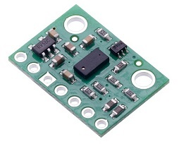
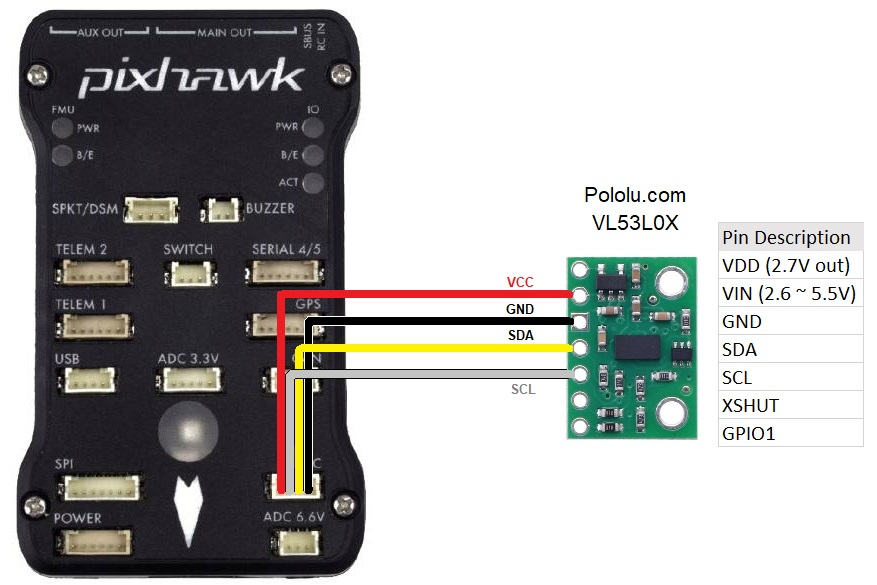

.. _common-vl53l0x-lidar:

==========================
ST VL53L0X / VL53L0X Lidar
==========================

The `VL53L0X <http://www.st.com/en/imaging-and-photonics-solutions/vl53l0x.html>`__ lidar is a very small, affordable but relatively short range (2m range) time-of-flight lidar

*images courtesy of Pololu.com*

.. note::

   Support for this lidar was first made available in available in Copter-3.6, Rover-3.3, and Plane-3.9.
   ArduPilot does not yet support the 4m `ST VL53L1X <http://www.st.com/en/imaging-and-photonics-solutions/vl53l1x.html>`__.

Where to Buy
------------

- `Pololu <https://www.pololu.com/product/2490>`__ (VL53L0X, 2m)
- `Adafruit <https://www.adafruit.com/product/3317>`__ (VL53L0X, 2m)

Connecting to the Flight Controller
-----------------------------------

Connect the VCC, GND, SDA ans SCL lines of the lidar to the I2C port on the flight controller as shown below.

Please set the rangefinder parameters as shown below (this can be done using the *Mission Planner* **Config/Tuning \| Full Parameter List** page):

-  :ref:`RNGFND_TYPE <RNGFND_TYPE>` = 16 (VL53L0X)
-  :ref:`RNGFND_ADDR <RNGFND_ADDR>` = 41 (I2C Address of lidar in decimal).  *The sensor's default I2C address is 0x29 hexademical which is 41 in decimal.*
-  :ref:`RNGFND_SCALING <RNGFND_SCALING>` = 1
-  :ref:`RNGFND_MIN_CM <RNGFND_MIN_CM>` = 5
-  :ref:`RNGFND_MAX_CM <RNGFND_MAX_CM>` = **120**.  *This is the distance in cm that the rangefinder can reliably read.*
-  :ref:`RNGFND_GNDCLEAR <RNGFND_GNDCLEAR>` = 10 *or more accurately the distance in cm from the range finder to the ground when the vehicle is landed.  This value depends on how you have mounted the rangefinder.*

Testing the sensor
==================

Distances read by the sensor can be seen in the Mission Planner's Flight
Data screen's Status tab. Look closely for "sonarrange".

.. image:: ../../../images/mp_rangefinder_lidarlite_testing.jpg
    :target: ../_images/mp_rangefinder_lidarlite_testing.jpg
