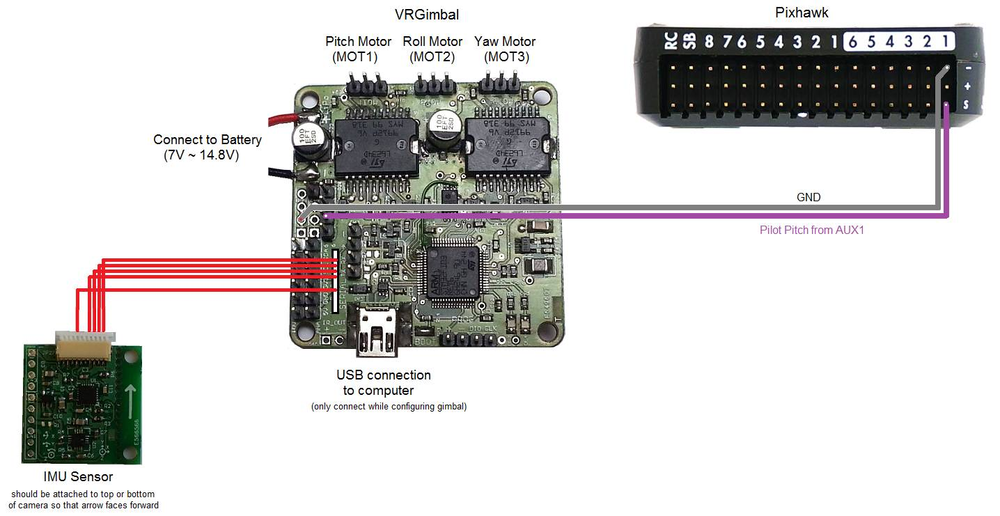
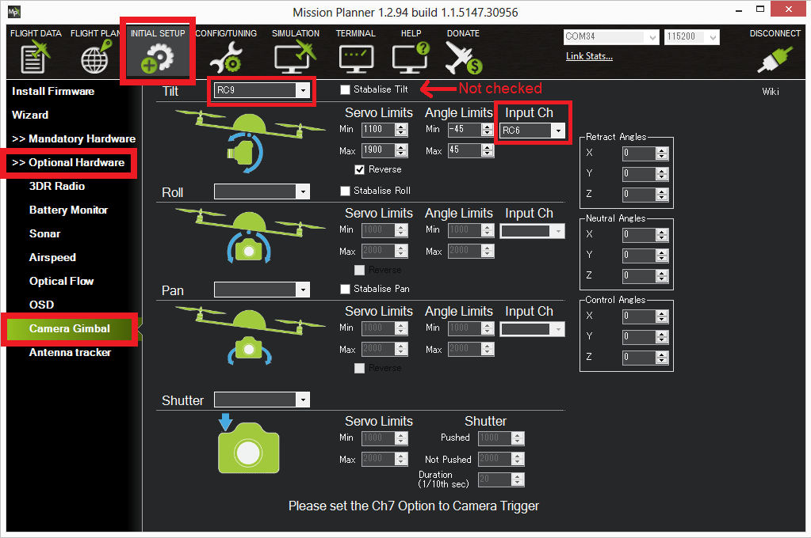

.. _common-vrgimbal:

==================================================
Archived:VR Gimbal Controller (3-Axis Open Source)
==================================================

.. warning::

    **ARCHIVED**

This article explains how to set up and configure the VR Gimbal 3 Axes
Brushless Gimbal Controller for use with ArduPilot.

Overview
========

The `VRGimbal <https://vrgimbal.wordpress.com/>`__
(`2-axis <http://www.virtualrobotix.it/index.php/en/shop/gimbal-control-board/vrgimbal-2-axis-detail>`__
and
`3-axis <http://www.virtualrobotix.it/index.php/en/shop/gimbal-control-board/vrgimbal-3-axis-detail>`__
available) began as a fork of the open source `Martinez 2-axis brushless gimbal controller <https://sourceforge.net/projects/brushless-gimbal-brugi/>`__
to support the more powerful STM32 CPUs but since then has been mostly
rewritten and includes significant enhancements including 3-axis support
and MAVLink for serial communication with the autopilot or
ground station.

-  `Official quick start guide can be found here <https://vrgimbal.wordpress.com/quick-start-guide/>`__
-  `Code can be found here <https://code.google.com/archive/p/vrgimbal/source>`__
-  Hardware schematics coming soon

..  youtube:: KIqWXnAuKPo#t=25
    :width: 100%

.. note::

   We do not yet have an recommended affordable 3-axis gimbal for use
   with the VRGimbal.  Testing by the ArduPilot dev team has so far been
   limited to using a Tarot 2-axis gimbal.

Connecting the VRGimbal to the Pixhawk
======================================

The IMU Sensor should be attached to the top or bottom of the camera so
that the white arrow points forward.

The Gimbal controller's red and black power wires should be connected
directly to a 3S or 4S battery.

The Pitch, Roll and Yaw (if present) gimbal motors should be connected
to MOT1, MOT2 and MOT3 respectively.

The "RC2" pin (label on the underside of the board) should be connected
to the Pixhawk's AUX OUT 1 signal pin (see image above).

The gound pin which is on the edge of the board near "RC2" should be
connected to the Pixhawk's AUX OUT 1 "-" pin (see image above).

Operation
=========

Upon powering the gimbal, the green power light (bottom right in the
image above) should turn on immediately.  The gimbal should not be
touched within the first 10seconds after start-up as it will be
performing an IMU calibration.  Once the calibration is done the red LED
(immediately left of the green LED) will come on and the controller will
attempt to stabilize the cmaera.

**LED meanings**

Solid Green LED = power on

Solid Red LED = calibration complete, stabilizing camera

Configuring the gimbal
======================

Use a mini USB cable to connect the Gimbal board to your computer
(Windows only?). If this is the first time you have plugged in the
dongle you will see a USB device installation window but it will likely
fail (see "BAD" device driver screen shot below).

#. To update the Maple driver:

   -  Download the latest driver from
      `here <http://www.radionav.it/virtualrobotix/fwtools/maple_usb_serial_win.zip>`__
      and unzip it to somewhere convenient on your computer
   -  In the device manager, right-mouse-button-click on the the Maple
      driver and select "Update Driver Software", then "Browse my
      computer for driver software" and select the folder where you
      unzipped the driver.  Windows 8 machines may complain because the
      driver is not signed, instructions are
      `here <https://www.makeuseof.com/tag/how-can-i-install-hardware-with-unsigned-drivers-in-windows-8/>`__
      on how to get around this.
   -  After the driver is installed, if the Maple device appears as COM9
      or higher you will not be able to connect.  The Control Panel's
      Device Manager can be used to reassign the comport to the COM1 ~
      COM8 range.

   .. image:: ../../../images/VRGimbal_DeviceManager.png
       :target: ../_images/VRGimbal_DeviceManager.png
   
#. Download and run the latest VRGimbal UI installation .msi file by
   going to the `VRGimbal wordpress site and select the top item from the Downloads menu <https://vrgimbal.wordpress.com/download/>`__.  At
   the time this wiki page was written it was `version 1.13 <https://vrgimbal.wordpress.com/download/vrgimbal-1-13-2/>`__. 
   After installation the "VRGimbal GUI" should appear in your start
   menu.
#. Start the VRGimbal GUI from the start menu.

   .. image:: ../../../images/VRGimbalGUI_PitchAbsolute.png
       :target: ../_images/VRGimbalGUI_PitchAbsolute.png
   
#. Connect the gimbal to your computer with the mini USB cable
#. On the VRGimbalGUI select the COM port and press the **Open** button
#. Click on the *Pitch* tab, click the **Absolute** checkbox, press
   **Send Config** and **Save to Flash** buttons.

Set-up through the mission planner
==================================

The channel 6 tuning knob's output can be used to control the pitch
angle of the gimbal by:

-  Connect the Pixhawk to the mission planner
-  Open the **Initial Setup \| Optional Hardware \| Camera Gimbal**
   screen set:

   -  Tilt drop-down to RC9 (equivalent to AUX OUT1)
   -  Input Ch drop-down to RC6
   -  The "Stabilize Tilt" checkbox should not be checked

Updating the gimbal software
============================

Please see the `VRGimbal firmware upgrade wordpress site <https://vrgimbal.wordpress.com/quick-start-guide/firmware-upgrade/>`__
for details.

Common Problems
===============

-  Camera is not level.  Perform the accelerometer calibration as
   described at the bottom of `this page <https://vrgimbal.wordpress.com/quick-start-guide/configuration-and-calibration/>`__.
-  Small gimbal motors emit a high pitches squeal.  Connect with the
   VRGimbalGui, Go to the Advanced tab and set the "PWM frequency" to
   High.  Press **Send Config** and **Save to Flash** buttons.

Other Open Source Alternatives
==============================

`Martinez 2-axis gimbal controllers <https://sourceforge.net/projects/brushless-gimbal-brugi/>`__
using the original AVR328 chip can be found at retailers including
`hobbyking <https://hobbyking.com/en_us/2-axis-brushless-camera-gimbal-stabilization-control-board-w-imu.html?___store=en_us>`__.

`OlliW's STorM3 BGC 3-Axis STM32 based brushless gimbal controller <http://www.olliw.eu/2013/storm32bgc/?en>`__ is open source
hardware, closed source (but free) gimbal firmware and open source
windows configuration UI.

Questions about the VRGimbal? Post to the `VRGimbal User group <http://www.virtualrobotix.com/group/vr-gimbal-user-group>`__ (not
directly associated with the DIYDrones or 3dRobotics)
