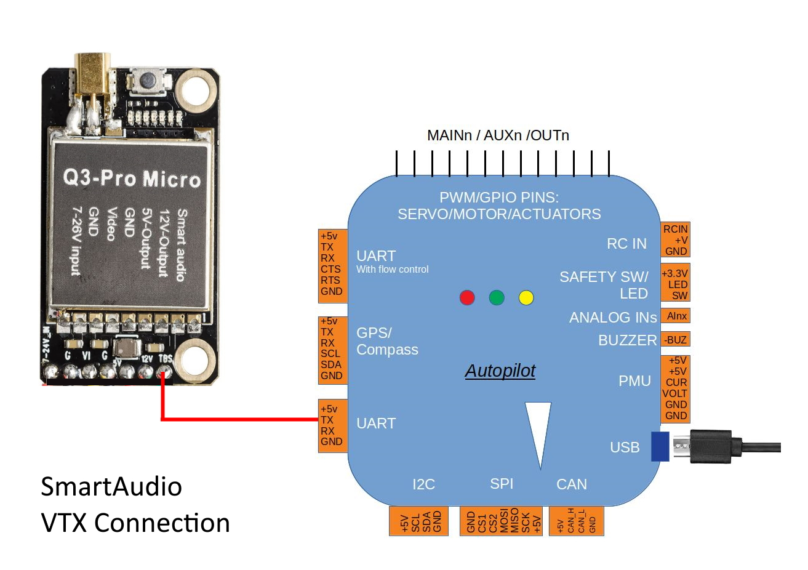
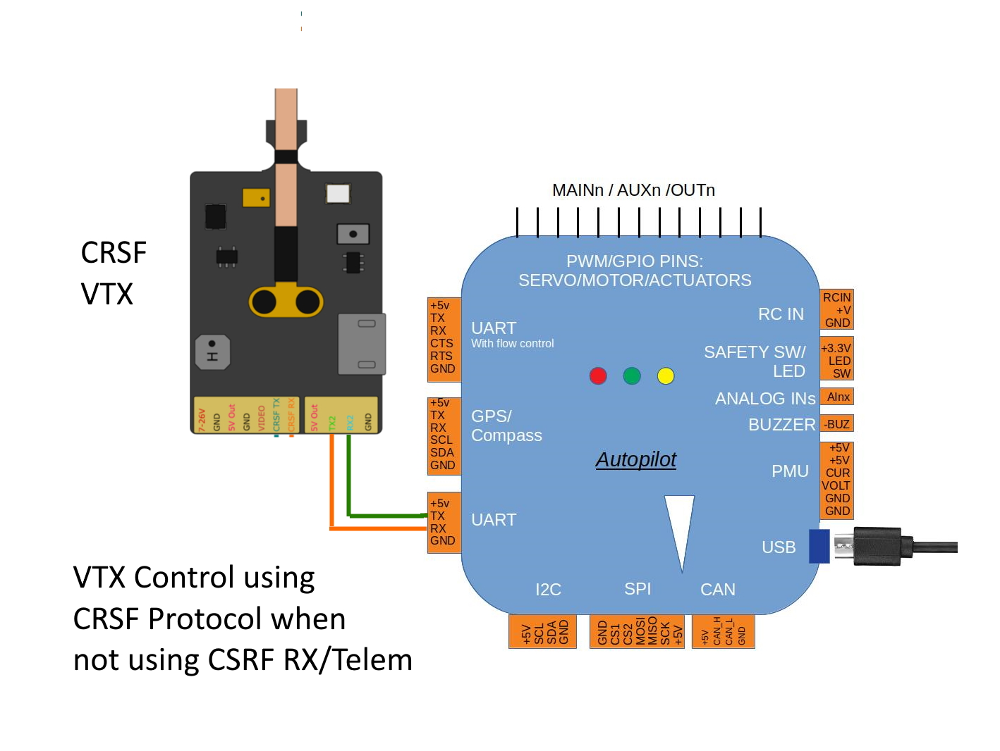
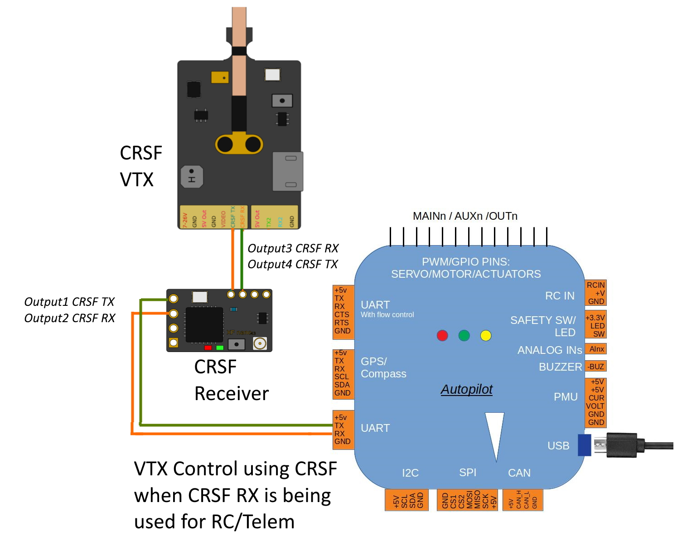

.. _common-vtx:

=========================
Video Transmitter Support
=========================

Video transmitter (VTX) support allows the autopilot to control an attached video transmitter. Depending on the VTX and protocol used, components that can be controlled include video band, video channel, transmitter power and pit mode. Supported protocols are SmartAudio, IRC Tramp, and TBS Crossfire (CRSF).

.. note:: Not all video transmitters claiming SmartAudio support fully support the specification and some functions may not be provided in that transmitter, or implemented in a non-standard way. Consult the manufacturer's documentation if questions arise.

How to setup video transmitter support
======================================

To enable video transmitter support you need to set the following parameters and reboot your autopilot:

- Set :ref:`VTX_ENABLE <VTX_ENABLE>` to 1 to enable video transmitter support. Although this enables support it will not achieve anything without an appropriate video transmitter protocol enabled, as described below.

SmartAudio
----------

SmartAudio is a one-wire protocol so you will need to connect the SmartAudio pin of your VTX to the TX pin of the serial port you want to use. You will also need to make sure your VTX is configured for SmartAudio control. For example if attached to SERIAL port 5:

- Set :ref:`SERIAL5_PROTOCOL <SERIAL5_PROTOCOL>` to 37 to enable SmartAudio.
- Set :ref:`SERIAL5_OPTIONS <SERIAL5_OPTIONS>` to 4 to enable half-duplex which SmartAudio requires. Depending on your video transmitter it might be required to enable the TX_PullDown option, so 68 would be the correct value.
- Set :ref:`SERIAL5_BAUD <SERIAL5_BAUD>` to 4800 to set the SmartAudio baud rate

CRSF (Crossfire)
----------------

CRSF is a bi-directional protocol that requires both TX and RX of a serial port to be connected. Follow the instructions for CRSF telemetry to setup CRSF support (See :ref:`common-tbs-rc`). If you only wish to use CRSF for VTX support, then (again using SERIAL5 as an example) :ref:`SERIAL5_PROTOCOL <SERIAL5_PROTOCOL>` should be set to 29 rather than 23. You will also need to make sure your VTX is configured for CRSF control.

When using CRSF for both RC/Telem and VTX control it is important to disable "my VTX" support on Open TX transmitters. Follow your transmitters' instructions. In this scenario, you must connect your autopilot's UART to your CRSF receiver, and then connect your CRSF receiver to the VTX to forward CRSF commands, you cannot connect to the FC using CRSF directly for both the Receiver and VTX using two UARTs.

Reboot your autopilot and power your video transmitter. At startup you should see a video message indicating the current video settings. All the video settings are stored in the ``VTX_x`` parameters and by default these will be changed to reflect the currently configured VTX settings. Once booted you can modify these settings and they will be reflected in the VTX configuration.

ImmersionRC Tramp
-----------------

- Connect the telemtry pin of the video transmitter to the TX pin of the autopilot's UART used to control it.
- Set :ref:`SERIAL5_PROTOCOL <SERIAL5_PROTOCOL>` = 44 if using SERIAL5 for connection to VTX

Video transmitter settings
--------------------------

- Set :ref:`VTX_BAND <VTX_BAND>` to modify the VTX band.
- Set :ref:`VTX_CHANNEL <VTX_CHANNEL>` to modify the VTX channel.
- Set :ref:`VTX_FREQ <VTX_FREQ>` to modify the VTX frequency. Band/channel and frequency are mutually exclusive, if you set band and/or channel then the frequency will be automatically updated. If you set the frequency then the band/channel will be automatically updated. Not all frequencies, channels and bands are supported unless the transmitter is unlocked. Please consult local regulations before doing this. If you select an unsupported frequency then the current frequency will not be changed.
- Set :ref:`VTX_POWER <VTX_POWER>` to modify the VTX power in mw. Not all transmitters support all power values. In particular in Europe only 25mw is allowed by default. To allow other values the transmitter must be unlocked. If you select a power level that is unsupported by the transmitter then the actual power value will not be changed.
- Set :ref:`VTX_MAX_POWER <VTX_MAX_POWER>` to set the maximum VTX power allowed in mw. This is used by ``RCx_OPTION`` = 94 which allows the VTX power to be changed via a switch or dial.
- Set :ref:`VTX_OPTIONS <VTX_OPTIONS>` to set options on the VTX. The most common option is setting bit 0 which puts the VTX into pit mode, if supported. Other options can be used to reset pitmode upon arming and/or set it upon disarming (bits 1 and 2). The option bits and their actions are shown below:

===================================    ==============
:ref:`VTX_OPTIONS<VTX_OPTIONS>` bit    Function
===================================    ==============
0                                      Directly sets VTX into PIT MODE, if available
1                                      Resets bit 0 above upon arming
2                                      Sets bit 0 above upon disarming
3                                      Unlock: unlocks frequencies and bands on some transmitters
4                                      Add leading zero byte to requests (needed on some transmitters)     
5                                      Use 1 stop bit. Needed for some transmitters using non-compliant(iNAV) messaging
6                                      Ignore CRC checks. Needed for some transmitters using non-compliant messaging
7                                      Future (not presently working)
===================================    ==============

.. note:: "unlocking" can be done differently, depending on transmitter brand. Also, using unlocked frequencies/power levels may violate local laws and restrictions. 

Setting video transmitter settings
----------------------------------

Video transmitter settings can be changed in multiple ways but always go via the ``VTX_x`` parameters. So any option which advertises VTX control will be setting a ``VTX_x`` parameter which in turn will interface with the protocol backends. Here are the current ways that video transmitter settings can be modified:

- Parameter modification through your ground station
- Transmitter power via RC switch (``RCx_OPTION`` = 94). With this setting, the RC channel is interpreted as a 6-position switch (dividing the PWM range 1200 to 1800), and then this is assigned to power values based on the ``VTX_MAX_POWER``. For example if max power is 200-499mW, switch positions 0 results in 0mw (pit mode), 1 and 2 result in 25mw, 3 and 4 result in 100mw, and 5 results in 200mw.
- Parameter modification via the OSD (See :ref:`common-paramosd`)
- Parameter modification via CRSF OpenTX lua scripts (or OpenTX AgentX lua scripts) - CRSF only
- Spektrum VTX support. VTX settings on your Spektrum transmitter will be translated by either the DSMX or SRXL2 drivers and the appropriate VTX settings updated
