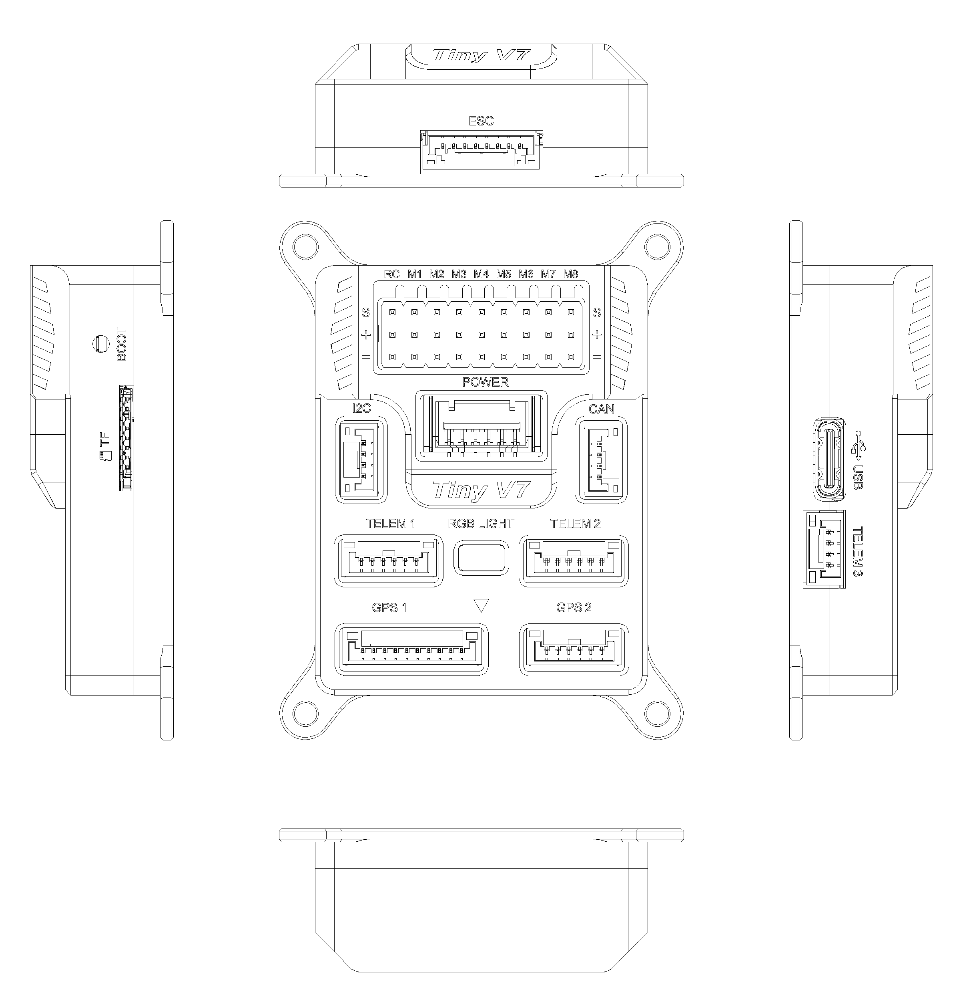

.. _common-vuav-tinyv7:

[copywiki destination="plane,copter,rover,blimp,sub"]

===============================
VUAV-TinyV7 Flight Controller
===============================

The VUAV-TinyV7 flight controller is manufactured by `V-UAV <http://www.v-uav.com/>`__.
This page summarizes the board support currently in ArduPilot for the "VUAV-TinyV7" target.

Features
========

* STM32H743 microcontroller
* 2MB flash
* Dual IMUs: ICM45686 and BMI088
* On-board barometer
* On-board compass support
* FRAM for parameter storage
* microSD card slot
* RGB status LED
* Safety switch support
* IMU heater support
* 5 UARTs plus USB
* 12 PWM outputs, with bi-directional DShot support on outputs 1 to 8
* I2C support
* 1 CAN bus

Pinout
======

.. image:: ../../../images/VUAV-TinyV7-Pinouts.png
    :target: ../_images/VUAV-TinyV7-Pinouts.png

UART Mapping
============

The default serial port mapping is:

* SERIAL0 -> USB (MAVLink2)
* SERIAL1 -> USART2 (MAVLink2, Telem1, DMA-enabled)
* SERIAL2 -> UART5 (MAVLink2, Telem2, DMA-enabled)
* SERIAL3 -> USART1 (GPS1, DMA-enabled)
* SERIAL4 -> USART3 (GPS2, DMA-enabled)
* SERIAL5 -> UART7 (USER, Telem3, DMA-enabled)
* SERIAL6 -> USB OTG2 (SLCAN)

The TELEM1 port includes RTS/CTS. The other exposed UARTs do not.

RC Input
========

The dedicated RC input is on the RCIN pin and supports all unidirectional RC protocols.
For bi-directional protocols such as CRSF/ELRS, any suitable serial port can be configured with ``SERIALn_PROTOCOL = 23`` and the receiver connected to that port's TX/RX pins.
See `RC control systems <https://ardupilot.org/rover/docs/common-rc-systems.html>`__ for protocol-specific setup details.

PWM Output
==========

The VUAV-TinyV7 supports up to 12 PWM outputs.
Outputs 1 to 8 support bi-directional DShot.

The outputs are grouped as follows:

* PWM 1 to 4 in group 1
* PWM 5 to 8 in group 2
* PWM 9 to 10 in group 3
* PWM 11 to 12 in group 4

Channels within the same group must use the same output rate.
If any channel in a group uses DShot, then all channels in that group must use DShot.

GPIOs
=====

All PWM outputs can also be used as GPIOs for relays, RPM sensors, buttons, and similar functions.

The GPIO numbers for the PWM outputs are:

==============  ===
PWM Output      GPIO
==============  ===
PWM1             50
PWM2             51
PWM3             52
PWM4             53
PWM5             54
PWM6             55
PWM7             56
PWM8             57
PWM9             58
PWM10            59
PWM11            60
PWM12            61
==============  ===

Analog Inputs
=============

The board exposes several ADC inputs, including:

* Primary battery voltage
* Primary battery current
* Secondary battery voltage
* Two spare ADC inputs
* 5V rail sensing
* Servo rail voltage sensing

Battery Monitoring
==================

The board includes built-in battery monitor defaults for the primary power input:

- :ref:`BATT_MONITOR<BATT_MONITOR>` = 4
- :ref:`BATT_VOLT_PIN<BATT_VOLT_PIN__AP_BattMonitor_Analog>` 4
- :ref:`BATT_CURR_PIN<BATT_CURR_PIN__AP_BattMonitor_Analog>` 8
- :ref:`BATT_VOLT_MULT<BATT_VOLT_MULT__AP_BattMonitor_Analog>` 20.0
- :ref:`BATT_AMP_PERVLT<BATT_AMP_PERVLT__AP_BattMonitor_Analog>` 24.0

A secondary voltage-only monitor can also be enabled for the ESC power input:

- :ref:`BATT2_MONITOR<BATT2_MONITOR>` = 3    to enable

Preset defaults:

- :ref:`BATT2_VOLT_PIN<BATT2_VOLT_PIN__AP_BattMonitor_Analog>` = 10
- :ref:`BATT2_VOLT_MULT<BATT2_VOLT_MULT__AP_BattMonitor_Analog>` = 10.09

Compass
=======

The hardware definition includes on-board compass support.
As with most compact autopilots, users operating near high-current wiring or power electronics may still get better magnetic performance from an external compass mounted away from the flight controller, while disabling the internal compass.

Loading Firmware
================

Firmware for the board can be found on the `ArduPilot Firmware Server <https://firmware.ardupilot.org>`__ in the folders named "VUAV-TinyV7" for each vehicle type.

The board includes an ArduPilot-compatible bootloader, so firmware can be loaded with any compatible ground station using the "\.apj" files.

Where to Buy
============

`V-UAV <http://www.v-uav.com/>`__
