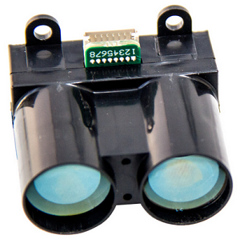
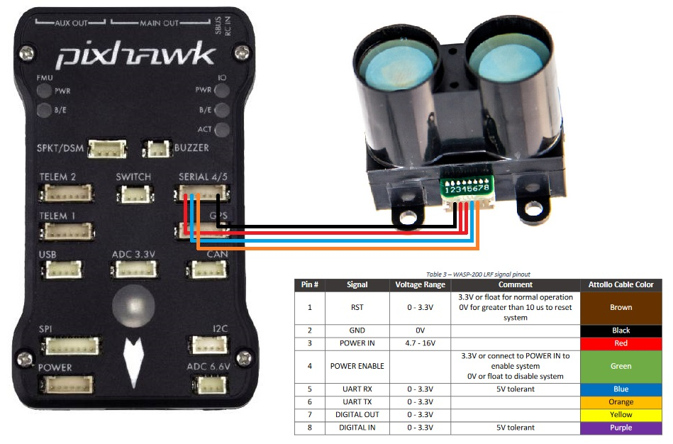

.. _common-wasp200-lidar:

=================================
Attollo Engineering Wasp200 Lidar
=================================

The `Wasp200 <https://www.attolloengineering.com/wasp-200-lrf.html>`__ has a range of up to 250m and an update rate from 56hz to 10kHz.  More specifications can be found `here <http://www.attolloengineering.com/uploads/5/7/5/1/57512457/xm000001-01_user_manual_wasp-200_lrf.pdf>`__.

.. note::

   Support for this sensor is available in Plane-3.9 (and higher), Copter-3.6 (and higher) and Rover-3.4 (and higher)

Where to Buy
------------

- The `Attollo Engineering online store <https://www.attolloengineering.com/store/p14/WASP-200_Laser_Rangefinder.html>`__ sells the lidar directly

Connecting to the Autopilot
-----------------------------------

For a serial connection you can use any spare Serial/UART port.  The diagram below shows how to connect to SERIAL4.

If the SERIAL4 port on a Pixhawk is being used then the following parameters should be set for the first rangefinder:

-  :ref:`SERIAL4_PROTOCOL <SERIAL4_PROTOCOL>` = 9 (Lidar)
-  :ref:`RNGFND1_TYPE <RNGFND1_TYPE>` = 18 (Wasp200)
-  :ref:`RNGFND1_MIN_CM <RNGFND1_MIN_CM>` = 200
-  :ref:`RNGFND1_MAX_CM <RNGFND1_MAX_CM>` = 20000.  *This is the distance in centimeters that the rangefinder can reliably read.*
-  :ref:`RNGFND1_GNDCLEAR <RNGFND1_GNDCLEAR>` = 10 *or more accurately the distance in centimetres from the range finder to the ground when the vehicle is landed.  This value depends on how you have mounted the rangefinder.*

If instead the Telem2 port was used then the serial parameters listed above should instead be:

-  :ref:`SERIAL2_PROTOCOL <SERIAL2_PROTOCOL>` = 9

Testing the sensor
==================

Distances read by the sensor can be seen in the Mission Planner's Flight
Data screen's Status tab. Look closely for "sonarrange".

.. image:: ../../../images/mp_rangefinder_lidarlite_testing.jpg
    :target: ../_images/mp_rangefinder_lidarlite_testing.jpg
