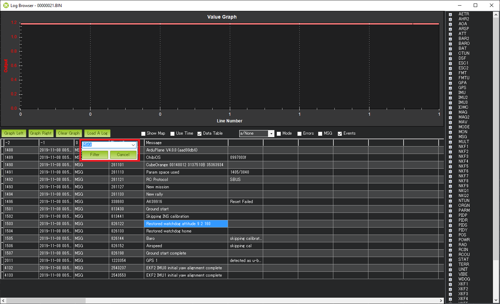

.. _common-watchdog:

====================
Independent Watchdog
====================

In ArduPilot 4.0 and later firmware revisions, the autopilot cpu's internal independent watchdog has been enabled. It can be disabled by setting :ref:`BRD_OPTIONS<BRD_OPTIONS>` = 0. The cpu will be reset if a peripheral or code "hangs" the cpu, and will restart the cpu. This may or may not save the vehicle if in flight or motion.

.. youtube:: ZGuTIPLI_e0

Determining that a Watchdog Reset Occurred
==========================================

One way is by looking at the dataflash logs. If the log is filtered to show only the "MSG" messages it can be seen that some include the word, "watchdog". This is a clear indication that the previous log or flight ended with a watchdog reset.

A WDOG log message should also appear with the following columns that may be useful for developers investigating the cause of the watchdog

- Task: The scheduler task number OR

   - -1 if the main loop just received the next IMU sample
   - -2 if the fast loop had started
   - -3 if the main loop was waiting for the next IMU sample

- IErr : Mask of Internal Errors
- IErrCnt : Internal Error Count
- MavMsg : MAVLink message id of last processed message
- MavCmd : MAVLink COMMAND_LONG or COMMAND_LONG_INT message's command field from last processed message
- SemLine : Source code line number if program is waiting for a semaphore or 0 if not waiting
- FL : Fault Line, the source code line number where the fault occurred.  Note this does not specify the filename but it can still be useful
- FT : Fault Type (see `FaultType enum in AP_HAL_ChibiOS/system.cpp <https://github.com/ardupilot/ardupilot/blob/master/libraries/AP_HAL_ChibiOS/system.cpp#L39>`__)

   - 1 = Reset
   - 2 = Non-Maskable Interrupt (aka NMI)
   - 3 = Hard Fault (the most common)
   - 4 = Memory Management Fault
   - 5 = Bus Fault
   - 6 = Usage Fault

- FA : Fault Address (in memory).  For example this would be 0 in case an attempt was made to read a byte using a nullptr
- FP : Thread Priority (see list of priorities starting with APM_MONITOR_PRIORITY in `AP_HAL_ChibiOS/Scheduler.h <https://github.com/ardupilot/ardupilot/blob/master/libraries/AP_HAL_ChibiOS/Scheduler.h#L25>`__)
- ICSR : Interrupt Control and State Register (see "ICSR bit assignments" in ST datasheets)
