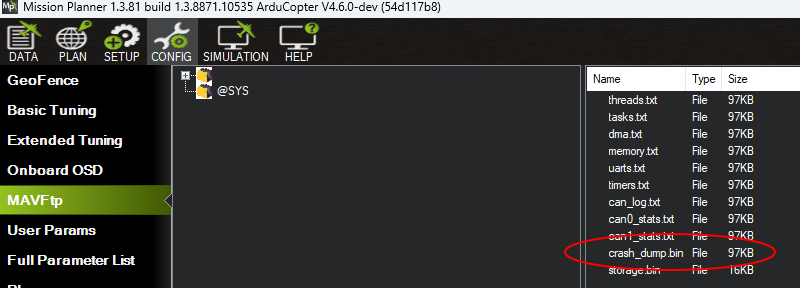
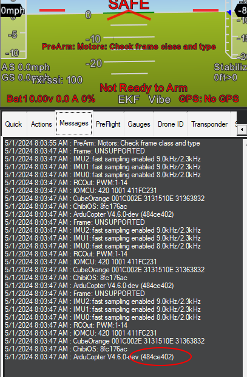

.. _common-watchdog:

===================================
Independent Watchdog and Crash Dump
===================================

ArduPilot enables the autopilot CPU's internal independent watchdog which causes the CPU to be reset and restarted if a peripheral or some piece of code takes too long to complete or "hangs" the CPU.  This may or may not save the vehicle if in flight or motion.

While not recommended, this feature can be disabled by setting :ref:`BRD_OPTIONS<BRD_OPTIONS>` = 0.

In the case of a "HARD FAULT" (e.g an illegal instruction, out of bounds memory access, etc.) before resetting, the watchdog handler code will log a "WDG" message to the onboard log, send a "WDG" text message to the GCS and attempt to write a crash_dump.bin file to the "@SYS" flash area.  This crash_dump.bin file contains the cpu state and registers for later analysis (See section below for more details). A "HARD FAULT" is extremely serious and should be reported to ArduPilot. The vehicle is probably not safe to fly until the cause is resolved.

In ArduPilot-4.5.1 (and higher), if a crash_dump.bin file has been created, a pre-arm failure will warn the user and prevent arming.  The crash_dump.bin file can be erased by re-flashing the ArduPilot firmware to the autopilot or it can be ignored by setting the :ref:`ARMING_CRSDP_IGN<ARMING_CRSDP_IGN>` param to 1 (not recommended).

.. youtube:: ZGuTIPLI_e0

.. _crash_dump:

Reporting a Watchdog / Crash Dump
=================================

Use Mission Planner or another GCS to download the crash_dump.bin file from the "@SYS" flash area.

Download the dataflash log from the flight or operation that caused the crash dump to be created.  Information on downloading logs can be found :ref:`here <common-downloading-and-analyzing-data-logs-in-mission-planner>`.

If the dataflash log cannot be found, find the git-hash of the firmware.  This appears in the GCS's messages tab soon after startup.

Open `ArduPilot's support forum <https://discuss.ardupilot.org/>`__, find the category for your vehicle and software version (e.g. `Copter-4.6 <https://discuss.ardupilot.org/c/arducopter/copter-46/179>`__, `Plane-4.6 <https://discuss.ardupilot.org/c/arduplane/plane-4-6/182>`__, `Rover-4.6 <https://discuss.ardupilot.org/c/ardurover/rover-46/180>`__),
create a "New Topic", include "watchdog" in the title and attach the crash_dump.bin file, log file and/or git-hash as described above.  If the files cannot be uploaded directly, please include a link to where they can be downloaded from.

Determining that a Watchdog Reset Occurred
==========================================

One way is by looking at the dataflash logs. If the log is filtered to show only the "MSG" messages it can be seen that some include the word, "watchdog". This is a clear indication that the previous log or flight ended with a watchdog reset.

.. image:: ../../../images/watchdog.png
     :target: ../_images/watchdog.png

A WDOG log message should also appear with the following columns that may be useful for developers investigating the cause of the watchdog

- Task: The scheduler task number OR

   - -1 if the main loop just received the next IMU sample
   - -2 if the fast loop had started
   - -3 if the main loop was waiting for the next IMU sample

- IErr : Mask of Internal Errors
- IErrCnt : Internal Error Count
- MavMsg : MAVLink message id of last processed message
- MavCmd : MAVLink COMMAND_LONG or COMMAND_LONG_INT message's command field from last processed message
- SemLine : Source code line number if program is waiting for a semaphore or 0 if not waiting
- FL : Fault Line, the source code line number where the fault occurred.  Note this does not specify the filename but it can still be useful
- FT : Fault Type (see `FaultType enum in AP_HAL_ChibiOS/system.cpp <https://github.com/ArduPilot/ardupilot/blob/master/libraries/AP_HAL_ChibiOS/hwdef/common/stm32_util.h#L144-L151>`__)

   - 1 = Reset
   - 2 = Non-Maskable Interrupt (aka NMI)
   - 3 = Hard Fault (the most common)
   - 4 = Memory Management Fault
   - 5 = Bus Fault
   - 6 = Usage Fault

- FA : Fault Address (in memory).  For example this would be 0 in case an attempt was made to read a byte using a nullptr
- FP : Thread Priority (see list of priorities starting with APM_MONITOR_PRIORITY in `AP_HAL_ChibiOS/Scheduler.h <https://github.com/ardupilot/ardupilot/blob/master/libraries/AP_HAL_ChibiOS/Scheduler.h#L25>`__)
- ICSR : Interrupt Control and State Register (see "ICSR bit assignments" in ST datasheets)
