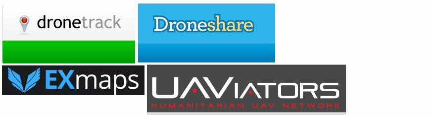

.. _common-web-apps:

========
Web Apps
========

There are several web applications which can be used with
Copter/Plane/Rover to allowing sharing flight data, videos or even
allowing web based control.  Below is the list of known applications (in
alphabetical order).

`DroneDeploy.com <https://www.dronedeploy.com/>`__ - Simple workflows to
get stuff done with drones.  Create high-precision surveys, agricultural
maps, and point clouds with just a few clicks.  Long distance missions
without the equipment.  Fast connections to your drone with LTE for
untethered control over 80% of the US.

`dronetrack.org <http://www.dronetrack.org/>`__ - Real-Time tracking and
sharing of flight paths

`UAViators.org <http://uaviators.org/>`__ - video sharing site to aid
humanitarian organizations and disaster affected communities with
greater situation awareness.

If you know of more, or are the owner of one of the above and would like
to correct the description please email drones-discuss@googlegroups.com.
