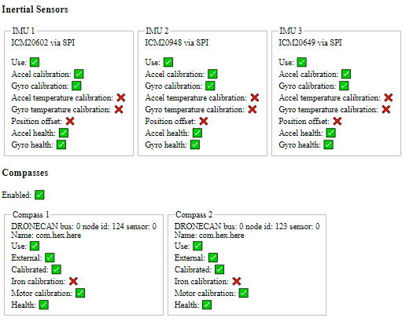

.. _common-webtools:

=======================================================================
`ArduPilot WebTools <https://firmware.ardupilot.org/Tools/WebTools/>`__
=======================================================================

This is a collection of log analysis tools that are web-based.

:ref:`UAV Log Viewer <common-uavlogviewer>`
===========================================
For plotting log file data versus time, 3D earth track of flight,access to parameters,etc.

`Hardware Report <https://firmware.ardupilot.org/Tools/WebTools/HardwareReport/>`__
===================================================================================
Provides a overview of connected hardware from a parameter file or log. If a log is used, more information can be provided, such as sensor health status and exact firmware version. A range of options are available to extract mission, lua scripts used, and parameters from logs: all, only changed, or minimal removing calibration parameters. Includes visualization for sensor position offsets.

`MAGFit <https://firmware.ardupilot.org/Tools/WebTools/MAGFit/>`__
==================================================================
Used to calibrate or fine tune calibration of compass from flight log. This tool fits the logged magnetometer data to the world magnetic model providing offsets, iron correction, scale, motor compensation and checks for proper orientation.

`Filter Review <https://firmware.ardupilot.org/Tools/WebTools/FilterReview/>`__
===============================================================================
Gyro noise and filter configuration tool. Uses raw or batch IMU logs to show the vehicle's noise profile. Filters can be applied to logged pre-filter data to see the effect without the need to fly again. Advanced user tool, more instructions on use coming.

`Filter Tool <https://firmware.ardupilot.org/Tools/WebTools/FilterTool/>`__
===========================================================================
Bode plot tool to give insight into gyro low pass and notch filter setup. This tool visualizes the attenuation and phase lag of a filter setup loaded from a parameter file. For filter setup the FilterReview tool it is recommended it provides the same bode plot feedback. This filter tool allows the attenuation and phase lag of each filter to be plotted individually, something which the filter review tool cannot do. This tool also provides a estimated response for the rate PID gains. Advance user tool.

`PID Review <https://firmware.ardupilot.org/Tools/WebTools/PIDReview/>`__
=========================================================================
Review PID tune in the frequency domain. Step response estimate is generated. Results are split based on parameter changes. Advance user tool.

.. toctree::
    :hidden:

    UAV LogViewer <common-uavlogviewer>

[copywiki destination="copter,plane,rover,dev,antennatracker,planner"]