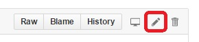

.. _common-editor-information-resource:
.. _common_wiki_editing_guide:

==================
Wiki Editing Guide
==================

All members of the community are welcome to join and contribute to this
wiki! Any help you can offer is appreciated — from creating new articles
and re-validating older articles, through to fixing broken links and
spelling/grammatical errors.

We've made that very easy - all you need for access is a 
`Github account <https://github.com/join>`__. 

This provides everything you need to help the wiki grow!

Making a quick edit
===================

Once you've got your `Github account <https://github.com/join>`__ you can edit
project source pages directly on Github. 

For small changes (e.g. fixing typographic errors) just click the **Edit on GitHub**
link at the top of the wiki page to be taken to it's source. 

Then select the **Edit** icon and follow Github's simple prompts to fork the repository, make
the changes, and open a pull request. 

    Select the **Edit** icon to start making your changes. 

For more information see the Github Help topic: 
`Editing files in another user's repository <https://help.github.com/articles/editing-files-in-another-user-s-repository/>`__

.. note::

    Wiki home pages (named "index.html") do not have the **Edit on GitHub** link. You can still edit them
    by manually navigating to the desired page on Github.

.. _common_wiki_editing_guide_big_edit:

Making a big edit
=================

If make a *significant* edit of an existing page (or create a new one) then it is best to 
verify changes before submitting your Github pull request. Typically you will need to work 
on your local computer rather than directly on Git, build and test your changes, and then submit
a pull request to submit your changes.

.. note:: 

    If you've already used Git, the fork, branch, submit model should be familiar. If not, you'll need 
    to learn basic git concepts like forking, branching, committing, pushing, rebasing.

There are a number of way of using Git/Github - including a number of different GUI and command line tools. 
The typical process for working with Git on the command line is:

#. `Fork the docs repo <https://github.com/ArduPilot/ardupilot_wiki#fork-destination-box>`__ 
   (if you haven't already done so).

   "Forking" is GitHub's term for copying a repository to your own account.
   The forked repository preserves information about the original project
   so you can fetch updates from it (and contribute changes back to it). If
   you want to contribute changes back to the main project you will need to
   first create your own fork of the main ardupilot_wiki repository.

   To fork the main repository:

   -  Log into Github and go to https://github.com/ArduPilot/ardupilot_wiki#fork-destination-box.
   -  At the upper right is a button, "Fork":

	.. image:: ../../../dev/source/images/APM-Git-Github-Fork-300x64.jpg
	   :target: ../../../dev/source/images/APM-Git-Github-Fork-300x64.jpg

   Click the **Fork** button and follow the directions.
   
   When your are finished there will be a new repository within your
   account: ``//github.com/YOURID/ardupilot_wiki``

#. Clone your fork of the repository to your local machine: 
   
   .. code-block:: bash

       git clone https://github.com/YOURID/ardupilot_wiki.git

#. Configure the "upstream" server for your local repository.

   - First check which repositories are tracked.

     .. code-block:: bash
   
	   git remote -v

     By cloning, at least the "origin" repository should already be tracked.

     .. code-block:: bash
   
	   origin  https://github.com/YOURID/ardupilot_wiki.git (fetch)
	   origin  https://github.com/YOURID/ardupilot_wiki.git (push)
	   
   - You must track an "upstream" server in order to fetch updates (primarily from
     the upstream's "master" branch)
   
     .. code-block:: bash
   
	   git remote add upstream https://github.com/ArduPilot/ardupilot_wiki.git
	   git remove -v
	   
   - The "upstream" repository is now tracked as well.  
     
     .. code-block:: bash

	   origin  https://github.com/YOURID/ardupilot_wiki.git (fetch)
	   origin  https://github.com/YOURID/ardupilot_wiki.git (push)
	   upstream        https://github.com/ArduPilot/ardupilot_wiki.git (fetch)
	   upstream        https://github.com/ArduPilot/ardupilot_wiki.git (push)	 
       
#. Create a branch for your changes
   
   .. code-block:: bash

       git checkout -b hgw_my_well_named_branch
       
#. Make any changes needed and :ref:`test them locally <common_wiki_editing_guide_building_docs>`.

#. Add and commit your changes:

   .. code-block:: bash
   
       git add the_name_of_file_you_changed.rst
       git commit -m "A short explanation of the change"
       
#. Rebase your fork to the latest version of master and push your commits to
   the fork.

   .. code-block:: bash
   
       git fetch upstream master
       git rebase upstream/master
       git push origin hgw_my_well_named_branch
       
#. Open your clone's repository on the GitHub web page and 
   `Create a pull request on GitHub <https://help.github.com/articles/using-pull-requests>`__.
   You'll be making a pull request from your fork/branch to the
   ardupilot_wiki/master repository. If using the GitHub for Windows client,
   one convenient way to navigate to the repository/branch is to click
   one one of your commits and click the "github" (view this commit on
   github.com) button:

   .. image:: ../../../images/PullRequest_OpenWikiCloneOnGitHubWebPage.png
       :target: ../_images/PullRequest_OpenWikiCloneOnGitHubWebPage.png
   
#. On top of the web page select the "Pull Request" tab page, and then
   select the green "New pull request" button:

   .. image:: ../../../images/PullRequest_InitiateWikiPullRequest.png
       :target: ../_images/PullRequest_InitiateWikiPullRequest.png

#. The comparison should be between ardupilot_wiki:master and the new branch
   you created for the feature. The website probably has defaulted to your
   clone's master branch so click the "compare" combo box and change it to the
   correct branch:

   .. image:: ../../../images/PullRequest_InitiateWikiPullRequest2.png
       :target: ../_images/PullRequest_InitiateWikiPullRequest2.png
   
#. Check the list of change at the bottom of the page only includes your
   intended changes, then press "Create pull request".
   
   
Creating a new wiki page
========================

.. tip::

   First search the wiki to determine if there is already a wiki page
   about your topic — it is better to improve an existing topic than create
   a near-duplicate! 
   Also discuss it with the 
   `Wiki Editors Discussion Group <https://groups.google.com/forum/#!forum/ardu-wiki-editors>`__.

To create a new wiki page you will need to follow the same process as any other 
:ref:`big edit <common_wiki_editing_guide_big_edit>`.

Pages should be created in the **/source/docs/** folder for your target wiki, given a "descriptive" name,
and the file suffix ".rst". Typically we use all lower case for filename, and separate words using "-" or "_". 
For example: **advanced-multicopter-design.rst**.

Pages that are common to all wikis must be named with the prefix **common-** and must be created 
in **/common/source/docs/**. See :ref:`common_wiki_editing_guide_common_pages` for more information.

The title of the new page should be concise — informative enough that
the reader can determine whether the topic is relevant and to differentiate it from other similar topics. 
The first letter of every word in the heading should be capitalized, with the exception of short
connecting words like "a", "with", "and", "the".

The title should also be preceded by an anchor link named for the page. So the first information on the page would be:

.. code-block:: rst

    .. _your_file_name:

    ===============
    Your Page Title
    ===============
    

How to get changes approved
===========================

Once you submit a pull request with your change the wiki team will review it. 
If we have any questions we'll add them to the request.

.. _common_wiki_editing_guide_building_docs:

Building/testing docs locally
=============================

We provide a Vagrantfile in the root of the repo which can be used to set up a build environment.

You will need to install the correct versions of `Vagrant <https://www.vagrantup.com/downloads.html>`__ and 
`Oracle VirtualBox <https://www.virtualbox.org/wiki/Downloads>`__ for your computer. You will also need
to `fork <https://github.com/ArduPilot/ardupilot_wiki#fork-destination-box>`__ and clone the repository 
(if you haven't already done so).

The main steps for building the docs are:

#. Open a command prompt in the root of the ardupilot_wiki repo, and start Vagrant:

   .. code-block:: bash
   
       vagrant up
       
   The first time this is run it may take some time to complete.
   
#. SSH into Vagrant (if you're on Windows you may need to add SSH in your Git installation to your PATH)

   .. code-block:: bash
   
       vagrant ssh
       
#. Navigate in the SSH shell to the /vagrant directory and start the build.

   .. code-block:: bash
   
       cd /vagrant
       python update.py
       
The update.py script will copy the common files into each wiki subdirectory and then build each wiki (you can build 
just one wiki by passing the site name, e.g.: ``python update.py --site copter``).

.. note::

    The script will show the build output of each of the wikis - this should be inspected for warnings and errors.
    The script does some file copying at the end, which will fail and can be ignored (this is used when publishing
    the docs) 

You can check out the built html for each wiki in it's build/html directory (e.g. **/copter/build/html/**).

RST editing/previewing
======================

The tools described in this section can make it easier to edit RST files and reduce the time required to preview changes.

.. note:: 
    
    The RST rendering tools can be useful for rapidly previewing small changes in the documentation. Rendering will not be perfect because the tools are designed for generic reStructuredText (they and are not "Sphinx-aware). We therefore recommend that you build with Sphinx to do a final review before you make a documentation pull request. 

RST rendering on Windows
------------------------

A combination of two Windows tools can help you previewing your modifications:
  	
* `Notepad++ plugin for RST files <https://github.com/steenhulthin/reStructuredText_NPP>`__
* `restview (on-the-fly renderer for RST files) <https://mg.pov.lt/restview/>`__

The Notepad++ plugin helps you with code completion and syntax highlighting during modification.
Restview renders RST files on-the-fly, i.e. each modification on the RST file can be immediately
visualized in your web browser. 

The installation of the Notepad++ plugin is clearly explained on the plugin's website (see above).

Restview can be installed with:

.. code-block:: bat
	
	python -m pip install restview
		
The restview executable will be installed in the **Scripts** folder of the Python main folder.
Restview will start the on-the-fly HTML rendering and open a tab page in your preferred web browser.

Example:

If you are in the root folder of your local Wiki repository:

.. code-block:: bat
	
	start \python-folder\Scripts\restview common\source\docs\common-wiki_editing_guide.rst	
	
RST rendering on Linux
----------------------

`ReText <https://github.com/retext-project/retext>`__ is a Linux tool that provides
syntax highlighting and basic on-the-fly rendering in a single application.

.. note:: 

    Although the tool is Python based, don't try it on Windows as it very prone to crashes (this is 
also stated by the website).

Wiki Infrastructure
===================

.. tip::

    Most of this information is provided for interest only.  All you really need to know is that 
    you can use Vagrant to quickly set up a zero-configuration development environment, and then call 
    ``python update.py`` to make a build. If you are working on a common topic, then create it in 
    **/common/source/docs** with the filename prefix **common-**.

The wiki is built using the static site generator `Sphinx <http://www.sphinx-doc.org/en/stable/>`__ 
from source written in `reStructured Text markup <http://www.sphinx-doc.org/en/stable/rest.html>`__ 
and hosted on `Github here <https://github.com/ArduPilot/ardupilot_wiki>`__. 

Each wiki has a separate folder in the repository (e.g. '/copter', '/plane') containing it's own source 
and configuration files (**conf.py**). Common files that are shared between the wikis are named with the 
prefix **common-** and stored in the **/common/source/docs/** directory. Images that are specific to a 
particular wiki are stroed in an /images/ subfolder for the wiki (e.g. **copter/images/**) while 
images are shared between all wikis and are stored in the "root" **/images** directory.
Common configuration information for the Wiki Sphinx build is stored in **/common_conf.py**.

The **update.py** build script copies the common topics into specified (in source) target wikis directories 
and then build them.

The **Vagrantfile** can be used by Vagrant to set up a local build environment independent of your host system.
This allows you to edit the source in your host computer but manage the build inside Vagrant. You can also
manually set up a build environment (just inspect the Vagrantfile for dependencies).

The wikis use a `common theme <https://github.com/ArduPilot/sphinx_rtd_theme#read-the-docs-sphinx-theme>`__
that provides the top menu bar. 

   
.. _common_wiki_editing_guide_common_pages:

Working with common pages
=========================

The wiki has a lot of information that is applicable to users of all the
different vehicle types. In order to reduce (manual) duplication we
define these topics in one place (**/common/source/docs**) and automatically copy them 
to other wikis where they are needed.

Creating and editing common pages is similar to editing other pages except:

- The filename of common pages must start with the text *common-*. For
  example, this page is **common-wiki_editing_guide.rst**.
- All common pages must be stored in **/common/source/docs**
- The copywiki shortcode can be put at the end of the source to specify the set 
  of destination wikis (use "copywiki" rather than "xcopywiki" below):

  .. code-block:: bash

      [xcopywiki destination="copter,plane"]

- If no copywiki shortcode is specified, common pages are automatically copied to the copter, 
  plane and rover wikis
  
- Vehicle-specific content can be added to the common topic using the
  ``site`` shortcode. Text that is not applicable to a target wiki is stripped out 
  before the common page is copied to each wiki. The example below shows text that 
  will only appear on rover and plane wikis (use site rather than xsite shown below!)

  .. code-block:: bash

      [xsite wiki="rover, plane"]Rover and plane specific text[/xsite]

-  Always :ref:`link to other common topics <common-editor-information-resource_how_to_link_to_other_topics>`
   using relative linking. This ensures that you will link to the correct common topic when the wiki article is copied.

   
General Editing/Style Guide
===========================

This section explains some specific parts of syntax used by the wiki along with general
style guidelines to promote. consistency of appearance and
maintainability of wiki content. The general rule is to keep things
simple, using as little styling as possible.

For more information check out the 
`Sphinx reStructured Text Primer <http://www.sphinx-doc.org/en/stable/rest.html>`__.

Titles
------

Choose a concise and specific title. It should be informative enough that a reader can determine
if the content is likely to be relevant and yet differentiate it from other (similar) topics.

Use first-letter capitalization for all words in the title (except connecting words: "and","the", "with" etc.)

The title syntax is as shown below. Note that we use an "anchor reference" immediately before the title (and named 
using the page filename). This allows us to link to the file from other wikis and from documents even if 
they move within the file structure.

.. code-block:: rst

    .. _your_file_name:

    ==========
    Page Title
    ==========
    

Abstract
--------

Start the topic (after the title) with an abstract rather than a heading or an image.

Ideally this should be a single sentence or short paragraph describing the content and scope of the topic.

Headings
--------

Headings are created by (fully) underlining the heading text with a single character. 
We use the following levels:

.. code-block:: rst

    Heading 1
    =========
    
    Heading 2
    ---------
    
    Heading 3
    +++++++++
    
    Heading 4
    ^^^^^^^^^
    
    Heading 5
    ~~~~~~~~~

Emphasis
--------

Emphasis should be used *sparingly*. A page with too much bold
or italic is hard to read, and the effect of emphasis as a tool
for identifying important information is reduced.

Use emphasis to mark up *types* of information:

- ``code`` for code and variables
- **bold** for "button to press" and filenames
- *italic* for names of dialogs and tools.

The markup for each case is listed below.

.. code-block:: rst

    ``Inline code``
    **Bold**
    *Italic*

Lists
-----

Numbered lists can be generated by starting a line with ``#.`` followed by a space. 
Unordered lists can be generated by starting a line with "*" or "-". Nested lists
are created using further indentation:

.. code-block:: rst

    #Ordered listed
    
    #. Item one
    #. Item 2
       Multiline
    #. Item 3
       
       - Nested item
       #. Nested item ordered

    #Unordered list
    
    - Item 1
    - Item 2
    
      - Nested item

Information notes and warnings
------------------------------

You can add notes, tips and warnings in the text using the "tip", "note"
and "warning" shortcodes, respectively. These render the text in an
information box:

.. code-block:: rst

    .. note::

       This is a note

.. note::

   This is a note

.. code-block:: rst

    .. tip::

       This is a tip
   
   
.. tip::

   This is a tip
   
   
.. code-block:: rst

    .. warning::

       This is a warning

.. warning::

   This is a warning

   
Code
====

Use the "code-block" directive to declare code blocks. You can specify the type of code too and it will be 
syntax marked:

.. code-block:: rst

    .. code-block:: python
    
        This is format for a code block (in python)
    
        Some code

Alternatively you can just have a double colon "::" at the end of a line, a blank line,
and then indent the code block text:

.. code-block:: rst

    This is format for a code block. ::
    
        Some code

.. _common-editor-information-resource_how_to_link_to_other_topics:

Internal links
--------------

The best way to link to a topic within the docset is to use a reference link to a named anchor. 
This link will take you to the topic even if the document moves, and you can link to it across wikis.

An anchor should ideally be placed before a heading (or title) and has the format shown below (the leading
underscore and trailing colon are important):

.. code-block:: rst

    .. _a_named_link:
    
.. tip::

    * We recommend placing an anchor at the top of every page, named using the article filename.
    * Anchors need to be unique, so use the page anchor as a prefix for heading anchors
    * We've created a bunch of useful anchors for you; for example, to link to a parameter, you
      just specify that parameter as the target.
    

You can link to the anchor from the same wiki using either of the two approaches below:

.. code-block:: rst

    :ref:`a_named_link`  #Links to "a_named_link". Displays the title that follows the anchor.
    :ref:`Link Text <a_named_link>`  #Links to "a_named_link". Displays the specified text.

You can link to the anchor from another wiki by specifying the wiki as a prefix. So for example
to link to this anchor defined other wikis you would do:

.. code-block:: rst

    :ref:`copter:a_named_link`  #Links to "a_named_link" in the copter wiki
    :ref:`Link Text <planner:a_named_link>`  #Links to "a_named_link" in the planner wiki

.. tip::

    For links within a wiki and in most common topics you can use the "bare" format. Sometimes
    you will need to explicitly specify a target wiki.

External links
--------------

To link to off-wiki topics, use the following format:

.. code-block:: rst

    `Link text <http://the-target-link-url>`__

This same format can be used for internal links, but without the benefit of being able to track when
internal links are broken by title changes etc.
 

How to put the page into the sidebar menu
-----------------------------------------

Items are added to the sidebar by specifying them in the parent article's "toctree"
directive. The filename may omit the file extension, but must include the path relative to the current directory 
(typically there is no path in our wikis).

.. code-block:: rst

    .. toctree::
        :maxdepth: 1

        Pixhawk <common-pixhawk-overview>
        Display text <filename>

Sometimes the parent article is "common" but the wiki article is specific to a particular wiki. In this case you can
wrap the toctree changes using the **site** shortcode (as below, but with "site" instead of "xsite"). You might
also ignore this case, but it will give a "missing article" warning.

.. code-block:: rst

    .. toctree::
        :maxdepth: 1

        Pixhawk <common-pixhawk-overview>
        
        [xsite wiki="rover, plane"]
        Display text <filename>
        [/xsite]

How to put links in the top menu
--------------------------------

Top menu links are hard coded in the 
`site theme <https://github.com/ArduPilot/sphinx_rtd_theme#read-the-docs-sphinx-theme>`__.

Using images in your wiki pages
-------------------------------

Our general advice for images is:

- Keep images as small as possible.

  .. tip::

      Images are stored on Github, so we need to keep the overall size low. Crop images to the relevant 
      information and reduce image quality where possible.

- Images in common pages or useful across wikis should be in the root **/images** directory.
- Images specific to the wiki can be stored in its **/images** sub directory.
      
- Use captions ("figure directive") where possible
- Link to the image if it is larger than can be displayed on the page.
- Name the file using all lower case, and underscores between words.
- Name the file "descriptively" so it is easy to find, and possibly re-use. 
  A name like **planner2_flight_screen.jpg** is much more useful than **image1.jpg**.
    
Display an image in a "common" article with a caption and target as shown below. Note the paths to the files are relative
to the current directory (hence the relative link back to **images** in the project root).

.. code-block:: rst

    .. figure:: ../../../images/image_file_name.jpg
       :target: ../_images/image_file_name.jpg

       Text for your caption

Display a wiki-specific image without a caption (or target link) as shown below. 
Note that the path is absolute, and relative to the source directory for the wiki.

.. code-block:: rst

    .. image:: /images/image_file_name.jpg

Archiving topics
================

Topics that are no longer relevant for current products, but which may
be useful for some existing users, should be archived. 

This is done by:

#. Add "Archived:" prefix to the page title:

   .. code-block:: bash

       ========================
       Archived: Original title
       ========================

#. Add a warning directive with a note below the title, explaining that the article is archived.
   If possible, provide additional information about why it has been archived, and links
   to alternative/more up-to-date information:

   .. code-block:: bash

       .. warning

           This topic is archived.

#. Move the topic under "Archived Topics" in the menu (you will need to edit the toctree
   directive in :ref:`common-archived-topics`).

Deleting wiki pages
===================

Wiki pages can be deleted by removing them from git and any menu in which they appear.

.. warning::

    Before deleting a wiki page it is important to ensure that it is not the 
    parent of other menu items (e.g. it does not contain a "toctree")
    

Legal information
=================

All content on this wiki is licensed under the terms of the `Creative Commons Attribution-ShareAlike 3.0 Unported <http://creativecommons.org/licenses/by-sa/3.0/>`__.

.. warning::

   Only post content that you have the legal right to make
   available under the `CC BY-SA 3.0 <http://creativecommons.org/licenses/by-sa/3.0/>`__ license. If you
   do use images or content that belongs to others, seek permission for
   re-use and clearly state their origin and terms for re-use.
   

Translating wiki pages
======================

Translation is currently not supported.

FAQ
===

Why are my changes not published?
---------------------------------

The wiki is moderated to help reduce the chance of misleading or
incorrect information being posted. All articles and changes are
reviewed before they are published.

[copywiki destination="copter,plane,rover,planner,planner2,antennatracker,dev,ardupilot"]
