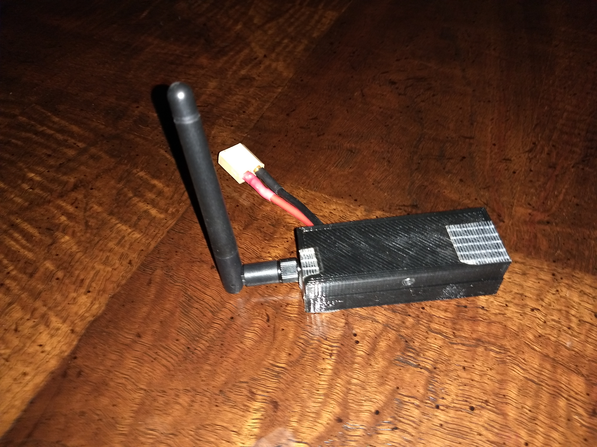
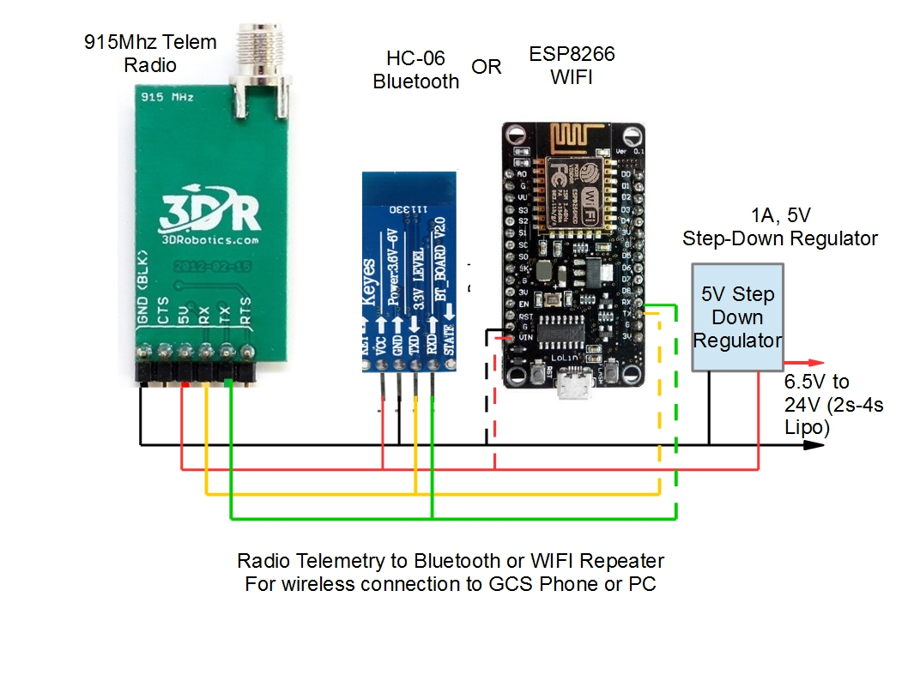

.. _common-wireless-gcs-repeater:

================================================
Repeater for Wireless Ground Station Connections
================================================

This page illustrates how wireless connectivity between the Ground Control Station and the Telemetry Radio Receiver can be accomplished.

Overview
=========

When using radio telemetry with ArduPilot, rather than attaching the telemetry receiver with a USB cable to the PC or Phone running the Ground Control Station (GCS) software, it is often more convenient to use a wireless repeater. This repeater will convert the telemetry radio receiver's output to either Bluetooh or WIFI for wireless connection to the GCS. In the case of a phone based GCS, it allows full freedom to move around while flying or driving the vehicle. And in the case where a directional receiving antenna is used, it allows the telemetry reciever to be placed high up, away from the GCS for optimum reception.

.. image:: ../../../images/wireless-gain-ant.jpg
   :target: ../_images/wireless-gain-ant.jpg

Components
==========

The repeater can be made very inexpensively and small, fitting into a small case. The required components are:

- Telemetry receiver such as a Sik radio. Preferably, the vehicle version since USB connection is not used, but a USB version can be easily converted for this application. See section below.
- Either an HC-06 Bluetooth module, or ESP8266 WIFI module. For use with a phone, either works well, with WIFI having further range than Bluetooth. For computer GCS, since most portable PCs do not have BT integrated, WIFI may be the best choice since most PCs have this integrated.
- 5V step down regulator for dropping the battery (2s-4s LIPO is ideal) to 5V needed by the above.

A connection diagram is shown below.

Setup
=====

Bluetooth Module Baud Rate
--------------------------

The module must be set for 57600 baud to work with the telemetry radio. How to change the baud rate is discussed `here <https://www.instructables.com/id/AT-command-mode-of-HC-05-Bluetooth-module/>`__, or you can buy a `module preconfigured <http://store.jdrones.com/Bluetooth_telemetry_modem_p/tlmbt01.htm>`__.

ESP8266 WIFI Module
-------------------

Setting up the WIFI module is detailed :ref:`here<common-esp8266-telemetry>` .

