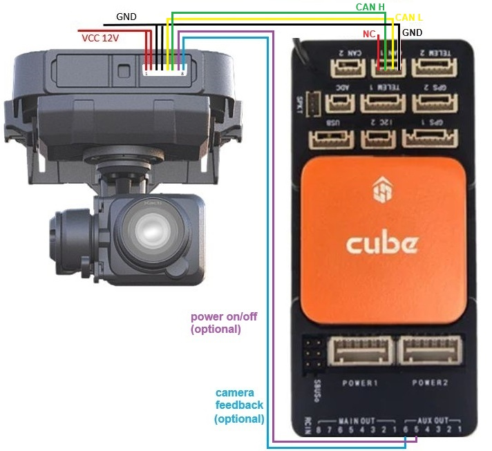
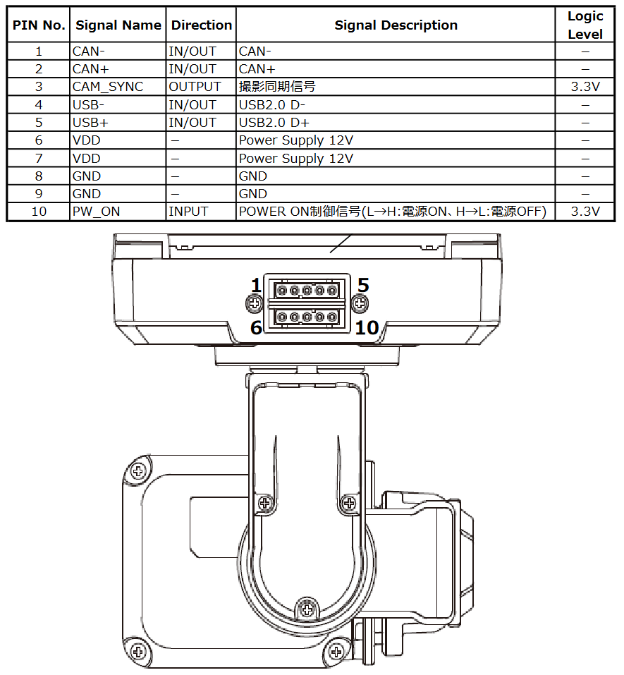
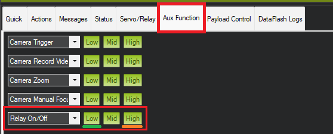
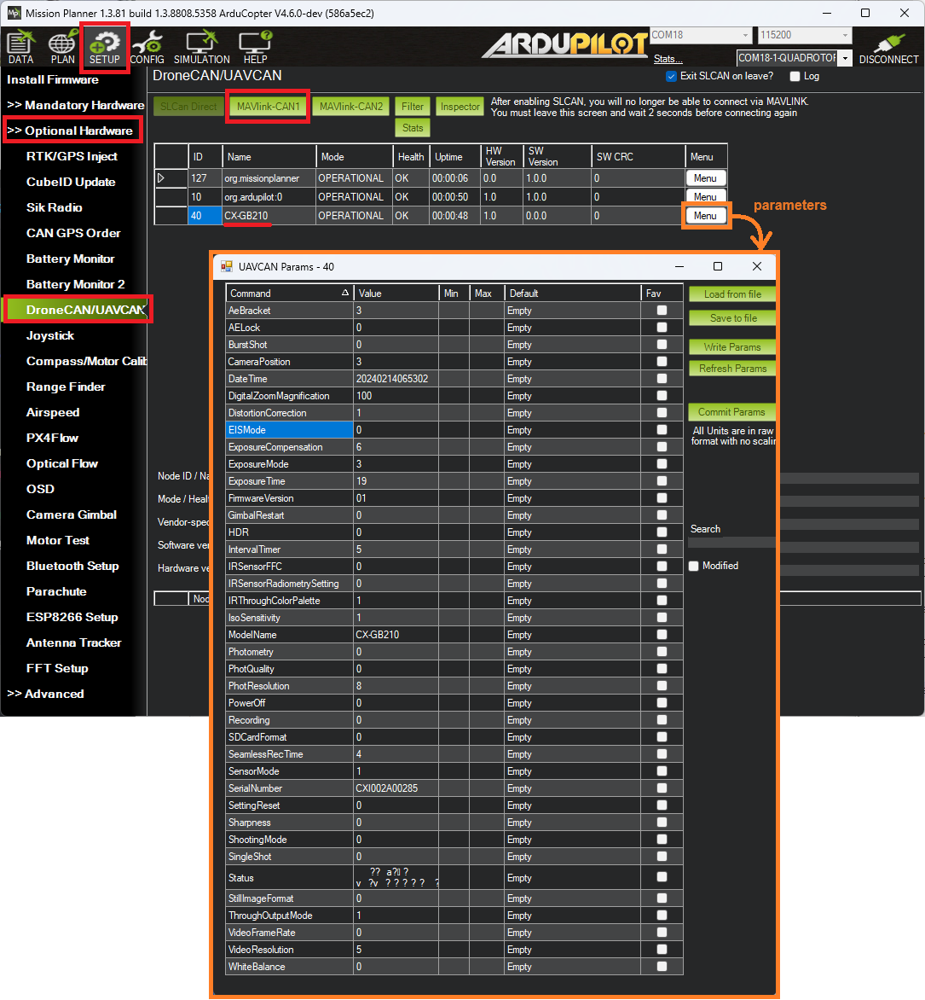

.. _common-xacti-gimbal:

=============
Xacti Gimbals
=============

The `Xacti Camera Gimbals <https://xacti-co.com/service/drone_camera/>`__ are relatively lightweight 3-axis camera gimbals which communicate with ArduPilot using the DroneCAN protocol.  Real time video output is available simulataneously through HDMI and USB.  Pictures taken include the vehicle's location (lat, lon, alt) stored using EXIF.

.. image:: ../../../images/xacti-gimbal.png

The four supported models are:

- CX-GB100 : 20MP RGB
- CX-GB200 : 12MP RGB + 640x512 pixel IR
- CX-GB300 : Multispectral NDVI
- CX-GB400 : 12MP RGB with 2.5x optical zoom

.. note::

    Support for these gimbals is available in ArduPilot 4.5.0 (and higher)

Some images courtesy of xacti-co.com

Where to Buy
------------

These gimbals can be purchased directly from `Xacti <https://xacti-co.com/service/drone_camera/>`__

Compatible connector and jumper wires are available from digikey

- `ZER-08V-S connector <https://www.digikey.jp/en/products/detail/jst-sales-america-inc/ZER-08V-S/1887023>`__
- `ASZESZE jumper wires <https://www.digikey.jp/en/products/base-product/jst-sales-america-inc/455/ASZESZE/587926>`__

Connecting to the Autopilot
---------------------------

The top image shows how to connect the gimbal's CANL, CANH and GND pins to one of the autopilot's CAN ports when using the gimbal mounting plate option.  The bottom image shows the camera's pinout which may be used with a custom designed mount.

Connect to the autopilot with a ground station and set the following parameters and then reboot the autopilot.  The params below assume the autopilot's CAN1 port is used,

- :ref:`CAN_D1_PROTOCOL <CAN_D1_PROTOCOL>` to 1 (DroneCAN)
- :ref:`CAN_D1_UC_NODE <CAN_D1_UC_NODE>` to 1 (only required for Xacti firmwares from before Aug 2023)
- :ref:`CAN_P1_DRIVER <CAN_P1_DRIVER>` to 1 (First driver)
- :ref:`MNT1_TYPE <MNT1_TYPE>` to 10 (Xacti) and reboot the autopilot
- :ref:`MNT1_PITCH_MIN <MNT1_PITCH_MIN>` to -90
- :ref:`MNT1_PITCH_MAX <MNT1_PITCH_MAX>` to 25
- :ref:`MNT1_YAW_MIN <MNT1_YAW_MIN>` to -90
- :ref:`MNT1_YAW_MAX <MNT1_YAW_MAX>` to 90
- :ref:`MNT1_RC_RATE <MNT1_RC_RATE>` to 30 (deg/s) to control speed of gimbal when using RC targetting
- :ref:`CAM1_TYPE <CAM1_TYPE>` to 4 (Mount)
- :ref:`CAM1_INTRVAL_MIN <CAM1_INTRVAL_MIN>` to 1 (second)
- :ref:`RC6_OPTION <RC6_OPTION>` = 213 ("Mount Pitch") to control the gimbal's pitch angle with RC channel 6
- :ref:`RC7_OPTION <RC7_OPTION>` = 214 ("Mount Yaw") to control the gimbal's yaw angle with RC channel 7

- Optionally these auxiliary functions are also available

  - :ref:`RC9_OPTION <RC9_OPTION>` = 166 ("Camera Record Video") to start/stop recording of video
  - :ref:`RC9_OPTION <RC9_OPTION>` = 168 ("Camera Manual Focus") to adjust focus in and out
  - :ref:`RC9_OPTION <RC9_OPTION>` = 169 ("Camera Auto Focus") to trigger auto focus

- To improve the accuracy of the location EXIF data stored to each image taken, the camera trigger feedback can be enabled as follows

   - Connect the CAM_SYNC wire (shown in blue in the image above) from the camera to one of the autopilot's AUX OUT signal pins (e.g. AUX OUT 6's bottom row pin)
   - :ref:`CAM1_FEEDBAK_PIN <CAM1_FEEDBAK_PIN>` to 55 (AUX6) (if connected to AUX OUT 6)
   - :ref:`SERVO14_FUNCTION <SERVO14_FUNCTION>` to -1 (GPIO) (if connected to AUX OUT 6)

- To allow remotely powering on/off the camera the POWER_ON pin can be connected to an autopilot :ref:`relay pin <common-relay>` (see purple wire in image above) and then set the following parameters (assuming the autopilot's AUX OUT 5 pin is used)

   - Connect the camera's POWER_ON pin (shown in purple in the image above) to one of the autopilot's AUX OUT signal pins (e.g. AUX OUT 5's bottom row pin)
   - :ref:`RELAY1_PIN<RELAY1_PIN>` to 54 (AUX5) (if connected to AUX OUT 5)
   - :ref:`SERVO13_FUNCTION <SERVO13_FUNCTION>` to -1 (GPIO) (if connected to AUX OUT 5)
   - The camera can be powered off/on using an :ref:`auxiliary switch <common-auxiliary-functions>` set to "Relay 1 On/Off" or Mission Planner's Aux Function screen can be used.  Pulling the relay high will turn the camera off, low will turn it back on.

.. warning::

   When the autopilot first detects the Xacti gimbal the :ref:`MNT1_DEVID<MNT1_DEVID>` will be set to a unique number to identify the gimbal.  If the gimbal is moved to another CAN port it may be necessary to manually set :ref:`MNT1_DEVID<MNT1_DEVID>` to zero and reboot the autopilot in order for the gimbal to be found.

Control and Testing
-------------------

See :ref:`Gimbal / Mount Controls <common-mount-targeting>` and :ref:`Camera Controls <common-camera-controls>` for details on how to control the gimbal using RC, GCS or Auto mode mission commands

Additional Settings
-------------------

Many more settings not directly supported by ArduPilot can be changed using DroneCAN.
If using Mission Planner, use the Setup, Optional Hardware, DroneCAN/UAVCAN screen as shown below.

Firmware Updates
----------------

Firmware updates are available from Xacti directly and normally include a "firmware.bin" file and an empty "UPDATE.txt" file.  To update the camera:

- Power down the gimbal and remove its SD card
- Copy the "firmware.bin" and "UPDATE.txt" files to the SD card
- Power up the gimbal and wait for at least 10 seconds
- Optionally power down the gimbal, remove the SD card and check that the "firmware.bin" and/or "UPDATE.txt" files have been deleted.  If either was deleted then the firmware update was successful
- Power up the gimbal and it should operate normally

Videos
------

..  youtube:: jZszQ4OmfVQ
    :width: 100%
