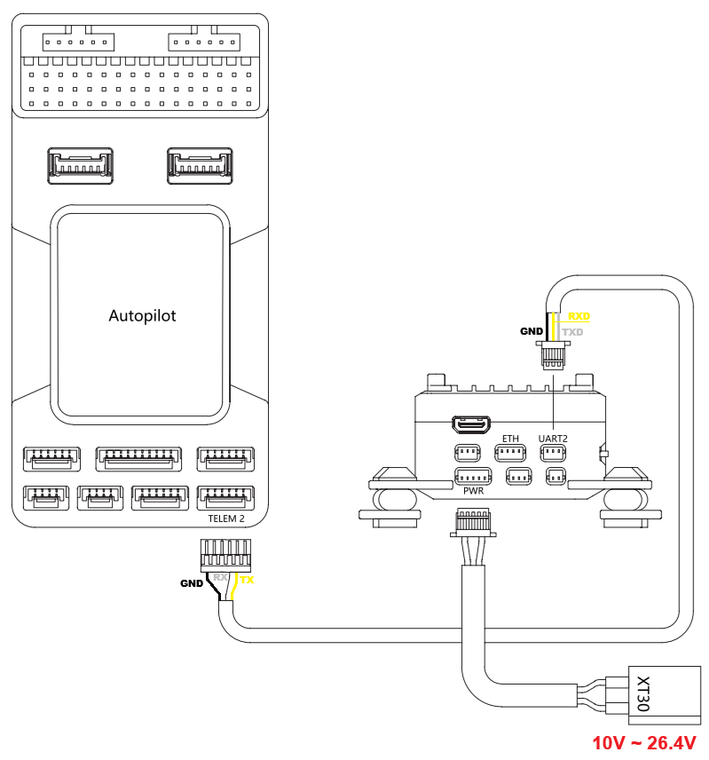

.. _common-xfrobot-gimbal:

[copywiki destination="plane,copter,rover"]

===============
XFRobot Gimbals
===============

`XFRobot gimbals <https://www.allxianfei.com/en/uav-payloads/>`__ can be controlled using a custom serial protocol

.. warning::

    Support for these gimbals is available in ArduPilot 4.7 (and higher)

Where and What to Buy
---------------------

- XFRobot gimbals can be purchased directly from `allxianfei.com <https://www.allxianfei.com/en/uav-payloads/>`__

Connecting to the Autopilot
---------------------------

Connect the gimbal's UART2 port to one of the autopilot's serial ports as shown above

Connect with a ground station and set the following parameters.  The params below assume the autopilot's telem2 port is used

- :ref:`SERIAL2_PROTOCOL <SERIAL2_PROTOCOL>` to 8 ("Gimbal")
- :ref:`SERIAL2_BAUD <SERIAL2_BAUD>` to "115", "250", "500" or "1000" (the gimbal auto detects the baudrate)
- :ref:`CAM1_TYPE <CAM1_TYPE>` to "4" ("Mount")
- :ref:`MNT1_TYPE <MNT1_TYPE>` to "14" ("XFRobot") and reboot the autopilot
- :ref:`MNT1_ROLL_MIN <MNT1_ROLL_MIN>` to -50
- :ref:`MNT1_ROLL_MAX <MNT1_ROLL_MAX>` to 50
- :ref:`MNT1_PITCH_MIN <MNT1_PITCH_MIN>` to -90 (down)
- :ref:`MNT1_PITCH_MAX <MNT1_PITCH_MAX>` to 90 (up)
- :ref:`MNT1_YAW_MIN <MNT1_YAW_MIN>` to -160
- :ref:`MNT1_YAW_MAX <MNT1_YAW_MAX>` to 160
- :ref:`MNT1_RC_RATE <MNT1_RC_RATE>` to 60 (deg/s) to control speed of gimbal when using RC targetting
- :ref:`RC6_OPTION <RC6_OPTION>` = 213 ("Mount Pitch") to control the gimbal's pitch angle with RC channel 6
- :ref:`RC7_OPTION <RC7_OPTION>` = 214 ("Mount Yaw") to control the gimbal's yaw angle with RC channel 7
- :ref:`RC8_OPTION <RC8_OPTION>` = 163 ("Mount Lock") to switch between "lock" and "follow" mode with RC channel 8

Ethernet Connectivity
---------------------

Instead of using a UART serial connection to control the gimbal, an Ethernet virtual serial connection may be used

An example of the setup of the gimbal in a networked ArduPilot vehicle system is detailed in :ref:`common-ethernet-vehicle` but in short, to control the gimbal over Ethernet:

- Connect the gimbal and autopilot using an :ref:`ethernet adapter <common-ethernet-adapters>`
- Ensure the autopilot and gimbal are on the same subnet (e.g the first 3 octets of the IP address match, 4th octet is different)

  - The gimbal's IP address defaults to 192.168.144.108
  - Set the autopilot's :ref:`NET_ENABLE<NET_ENABLE>` = 1 and reboot to enable networking
  - Set the autopilot's IP address using :ref:`NET_IPADDR0<NET_IPADDR0>`, :ref:`NET_IPADDR1<NET_IPADDR1>`, :ref:`NET_IPADDR2<NET_IPADDR2>`, :ref:`NET_IPADDR3<NET_IPADDR3>` (e.g. 192.168.144.14)
- Create a serial connection over ethernet

  - Set :ref:`NET_P1_TYPE<NET_P1_TYPE>` = 1 (UDP Client) and reboot the autopilot
  - Set :ref:`NET_P1_IP0<NET_P1_IP0>`, :ref:`NET_P1_IP1<NET_P1_IP1>`, :ref:`NET_P1_IP2<NET_P1_IP2>`, :ref:`NET_P1_IP3<NET_P1_IP3>` to the gimbal's IP address (e.g. 192.168.144.25)
  - Set :ref:`NET_P1_PORT<NET_P1_PORT>` = 2338 (port that gimbals listens for commands on)
  - Set :ref:`NET_P1_PROTOCOL<NET_P1_PROTOCOL>` = 8 (Gimbal)

The camera's live video is available at rtsp://192.168.144.108.  If connected to a PC, `VLC <https://www.videolan.org/>`__ can be used to test the feed

- Open VLC
- Select "Media", "Open Network Stream" and enter the RTSP URL, rtsp://192.168.144.108

Firmware Upgrades
-----------------

Both the camera and gimbal firmwares can be upgraded as described in the "GCU Upgrading" and "Gimbal Upgrading" sections of the user manual.  The user manual for each camera gimbal can be found on `its product page's "Downloads" tab <https://www.allxianfei.com/en/uav-payloads/>`__.  The process is also outlined below.

Camera firmware upgrade procedure:

- Open a browser to https://www.allxianfei.com/en/uav-payloads/, select the camera gimbal being used
- Click the Downloads tab and Download "GCU_Upgrade_Tool_Vx.x.xx", extract the contents of the file to a Windows PC
- Connect a PC to the camera gimbal's ethernet port using the provided RJ45 cable
- Power on the camera gimbal
- On the windows PC:

    - Open Settings, Ethernet Settings, IP assignment, Manual, IPv4 On, IP address of 192.168.144.99
    - run the "GCU Upgrade Tool.exe" (downloaded above)
- Run the GCU Upgrade Tool (downloaded above):

    - Push the "Search Device" button
    - Push the "Connect" button
    - Push the "Upgrade" button

Gimbal firmware update procedure:

- Open a browser to https://www.allxianfei.com/en/uav-payloads/, select the camera gimbal being used
- Click the Downloads tab and Download "Gimbal_Upgrade_package_V3.6", extract the contents of the file
- Connect a PC to the gimbal's UART1 port using the provided USB-to-Serial converter
- Power on the gimbal
- On a Windows PC run GimbalConfig.exe (downloaded above)
- On the GimbalConfig application:

    - Set the language to "English"
    - Select the gimbal's COM port
    - Push the "Open" button near the bottom left and select the "Gimbal_Firmware_V3.6.cahf" downloaded above
    - Push the "Upgrade" button
    - The gimbal can be tested by pushing the "Start Debug" and note that the camera image moves with the gimbal

Control and Testing
-------------------

The camera and gimbal can be tested using the Dragonfly application which is available from each product page's Download tab.  Alternatively VLC can be used, select Media, Network Stream and enter rtsp://192.168.144.108

See :ref:`Gimbal / Mount Controls <common-mount-targeting>` and :ref:`Camera Controls <common-camera-controls>`  for details on how to control the camera and gimbal using RC, GCS or Auto mode mission commands
