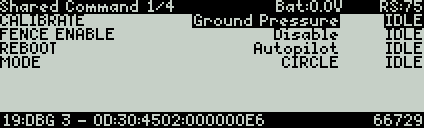
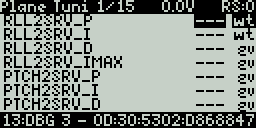
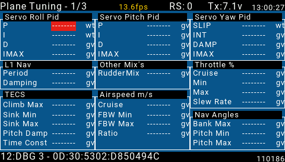

.. _common-yaapu-gcs:

====================================================
Yaapu FrSky GCS using FrSky Bi-Directional Telemetry
====================================================

ArduPilot now has the capability of not only displaying downlink telemetry data from the autopilot via FrSky telemetry (see :ref:`common-frsky-telemetry` )for display on an OpenTX compatible transmitter, but also the ability to request and change parameters and send a few commands to the autopilot.

Taranis Display Example
-----------------------

QX7 Display Example
-------------------

Horus/T16 Example
-----------------

Overview
========

In order to use this ability, you will need to setup the Yaapu LUAGCS script on your OpenTX transmitter.  The Yaapu Telemetry script,if you are using that also, will be paused when running this script. However, status messages and telemetry info will still be displayed on Horus style transmitters, but only battery voltage is shown on the the Taranis class transmitters.

Once the Yaapu LUACGS script is exited, then other scripts, like the Yaapu Telemetry script will restart.

Which parameters will be displayed can easily be changed in the script and parameter screens can be applied globally, by vehicle types, and/or by individual model.

Support for Taranis/QX7/Horus/T16 class OpenTx transmitters is provided.

Setup
=====

Complete instructions are given on the `Yaapu LUAGCS Wiki <https://github.com/yaapu/FrskyLuaGCS/wiki>`_ . Support questions can be posted `here <https://discuss.ardupilot.org/t/frsky-bidirectional-telemetry-implementation>`_ .

