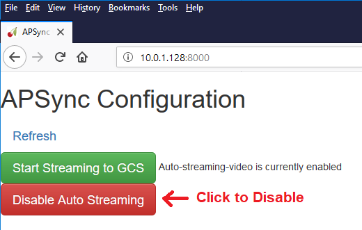

.. _common-zed:

========================================
ZED stereo camera for Non-GPS Navigation
========================================

[copywiki destination="copter,rover"]

This article explains how a `ZED stereo camera <https://www.stereolabs.com>`__ can be used with `OpenKai <https://github.com/yankailab/OpenKAI>`__ as a substitude for a GPS allowing position control modes like Loiter, PosHold, RTL, Auto.

.. note::

   This is an feature was released in Copter-3.5.

..  youtube:: ze3zs9Bhm98
    :width: 100%

Required Hardware
=================

* `Stereo Labs ZED camera <https://store.stereolabs.com/products/zed>`__
* `NVidia TX1 <https://www.nvidia.com/en-us/autonomous-machines/embedded-systems-dev-kits-modules/>`__
* `Auvidea J120 carrier board <https://auvidea.com/j120/>`__

Setup
=====

- connect the autopilot and TX1 as shown on the `NVidia TX1 as a Companion Computer <https://ardupilot.org/dev/docs/companion-computer-nvidia-tx1.html>`__ wiki page
- flash the TX1 as described in the `Setup the TX1 <https://ardupilot.org/dev/docs/companion-computer-nvidia-tx1.html#setup-the-tx1>`__ section of the above wiki page but use the apsync-tx1-openkai image from `firmware.ardupilot.org <https://firmware.ardupilot.org/Companion/apsync/beta/>`__
- mount the ZED camera upside-down and using vibration dampeners to the front of the vehicle.  
  It can be mounted right-side-up after `connecting with ssh <https://ardupilot.org/dev/docs/apsync-intro.html#connecting-with-ssh>`__ and then modify `~/src/OpenKAI/kiss/apmCopter.kiss <https://github.com/yankailab/OpenKAI/blob/master/kiss/apmCopter.kiss#L60>`__ so "bFlip" is `1`.
- in order to download the ZED camera's calibration parameters from stereolabs.com, connect the TX1 to the Internet with an Ethernet cable during powerup (this procedure is only required once)
- disable APSync's video streaming (so that OpenKai can use the camera) by connecting your computer to APSync's access point (``ssid=ardupilot``, pw=ardupilot), then open a browser to ``http://10.0.1.128:8000`` and click the red **Disable Auto Streaming** button (button should turn green) and reboot the TX1.

Configuration through the Ground Station 
========================================

Ensure that Copter-3.5 (or higher) is loaded onto the autopilot and connect with a Ground Station (i.e. Mission Planner).

- enable communication between the TX1 and autopilot using the `Setup the Pixhawk instructions from the tx1 setup wiki page <https://ardupilot.org/dev/docs/companion-computer-nvidia-tx1.html#setup-the-pixhawk>`__
- set :ref:`AHRS_EKF_TYPE <AHRS_EKF_TYPE>` to 3 (means use EKF3)
- set :ref:`EK2_ENABLE <EK2_ENABLE>` to 0 (disable EKF2)
- set :ref:`EK3_ENABLE <EK3_ENABLE>` to 1 (enable EKF3)
- set :ref:`GPS_TYPE <GPS_TYPE>` to 0 (disable the GPS)
- set :ref:`VISO_TYPE <VISO_TYPE>` to 1 (enable visual odometry)
- optionally set :ref:`PRX_TYPE <PRX_TYPE>` to 2 (enable using ZED's depth map for object avoidance)

Optionally you may also:

- set the :ref:`VISO_POS_X <VISO_POS_X>`, :ref:`VISO_POS_Y  <VISO_POS_Y>` and :ref:`VISO_POS_Z  <VISO_POS_Z>` to account for the camera's offset from the IMU or vehicle's center-of-gravity (:ref:`more details here <common-sensor-offset-compensation>`)
- mount the camera in other orientations and change the :ref:`VISO_ORIENT <VISO_ORIENT>` parameter.  
  Note: if you are using the ZED's depth sensing you will also need to modify `OpenKai's configuration <https://github.com/yankailab/OpenKAI/blob/master/kiss/apmCopter.kiss>`__  (not documented)

Ground Testing
==============

- Plug in the vehicle's LiPo battery so that both the TX1 and autopilot are powered
- Connect the autopilot to a ground station using a USB cable
- If you are using Mission Planner as your ground station, once messages are successfully passing from the ZED/TX1 to the autopilot:
  - a proximity viewer should appear showing the distance to objects ahead of the vehicle (if :ref:`PRX_TYPE <PRX_TYPE>` was enabled above) 
  - "Bad Vision Position" message should disappear from the HUD
- Set the home position from the ground station map (from MP's Flight Data screen, right-mouse-button-click on the map and select "Set EKF Origin Here").  The vehicle should appear on the map.

- Pick-up the vehicle and walk it around checking that the vehicle's position movements are shown on the map

Flight testing
==============

- Setup the vehicle with AltHold and Loiter flight modes
- Setup an :ref:`auxiliary switch <channel-7-and-8-options>` to enable/disable object avoidance and move switch to the off position.  Alternatively set :ref:`PRX_TYPE <PRX_TYPE>` to 0.  This helps ensure the vehicle will not backaway from objects in AltHold mode which could surprise the pilot.
- Attempt to arm and take-off in Loiter mode

DataFlash logging
=================

- The ZED's visual odometry information will appear in the VISO dataflash log messages.
- Distance to objects ahead of the vehicle will appear in the PRX messages.
- EKF's visual odometry information will appear in XKFD messages

