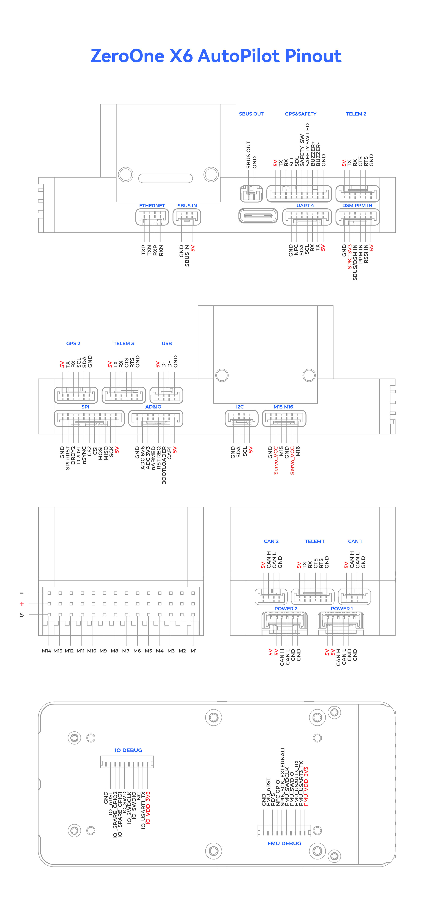

.. _common-zeroonex6:

=========
ZeroOneX6
=========
The ZeroOne X6 is a flight controller manufactured by ZeroOne, which is based on the open-source FMU v6X architecture and Pixhawk Autopilot Bus open source specifications.

Features:
=========

- **MCU**
   - STM32H753IIK6 32-bit processor running at 480MHz
   - STM32F103 IOMCU
   - 2MB Flash
   - 1MB RAM

- **Sensors**
   - IMUs:
      - Internal Vibration Isolation for IMUs
      - IMU constant temperature heating(1 W heating power).
      - Triple Synced IMUs, BalancedGyro technology, low noise and more shock-resistant:
      - IMU1-ICM45686(With vibration isolation) 
      - IMU2-BMI088(With vibration isolation) 
      - IMU3-ICM45686(No vibration isolation)
   - Baros:
      - Two barometers:2 x ICP20100
      - Magnetometer: Built-in RM3100 magnetometer

- **Interfaces**
   - Ethernet
   - Micro-C USB
   - 7 UARTs, 3 with hardware flow contrrol
   - Safety Switch
   - 2 CAN Power Monitor inputs
   - 2 CAN ports
   - SPI and I2C ports
   - 16 motor/servo outputs, 8 supporting BiDirDShot, 14 suporting DShot

Pinout
======

UART Mapping
============

The UARTs are marked Rn and Tn in the above pinouts. The Rn pin is the receive pin for UARTn. The Tn pin is the transmit pin for UARTn.  All are DMA enabled.

- SERIAL0 :USB     OTG1
- SERIAL1 :UART7   Telem1
- SERIAL2 :UART5   Telem2
- SERIAL3 :USART1  GPS1
- SERIAL4 :UART8   GPS2
- SERIAL5 :USART2  Telem3
- SERIAL6 :UART4   USER
- SERIAL7 :USART3  FMU DEBUG
- SERIAL8 :USB     OTG-SLCAN      |

RC Input
========

The remote control signal should be connected to the SBUS RC IN port or DSM/PPM RC Port.It will support ALL unidirectional RC protocols. For FPort, CRSF/ELRS, SRXL, etc. any UART can be used, see :ref:`common-rc-systems` for more information.

PWM Output
==========

The X6 flight controller supports up to 16 PWM outputs. First 8 outputs (labeled 1 to 8) are controlled by a dedicated STM32F103 IO controller. The remaining 8 outputs (labeled 9 to 16) are the "auxiliary" outputs. These are directly attached to the STM32H753 FMU controller.

All 16 outputs support normal PWM output formats. All 16 outputs support DShot, except 15 and 16. Outputs 1-8 supoort BiDirectional DShot.

The 8 IO PWM outputs are in 4 groups:

* Outputs 1 and 2 in group1
* Outputs 3 and 4 in group2
* Outputs 5, 6, 7 and 8 in group3

The 8 FMU PWM outputs are in 4 groups:

* Outputs 9-12 in group1
* Outputs 13 and 14 in group2
* Outputs 15 and 16 in group3 (PWM only)

Channels within the same group need to use the same output rate. If any channel in a group uses DShot then all channels in the group need to use DShot.

GPIO
====

All PWM outputs can be used as GPIOs (relays, camera, RPM etc). To use them you need to set the output’s ``SERVOx_FUNCTION`` to -1. The numbering of the GPIOs for PIN variables in ArduPilot is:

.. raw:: html

   <table>
     <tr>
       <th colspan="3">IO Pins</th>
       <th colspan="1"> </th>
       <th colspan="3">FMU Pins</th>
     </tr>
     <tr><td> Name </td><td> Value </td><td> Option </td><td>  </td><td> Name </td><td> Value </td><td> Option </td></tr>
     <tr><td> M1 </td><td> 101 </td> <td> MainOut1 </td><td>  </td><td> M9 </td><td> 50 </td><td> AuxOut1 </td></tr>
     <tr><td> M2 </td><td> 102 </td> <td> MainOut2 </td><td>  </td><td> M10 </td><td> 51 </td><td> AuxOut2 </td></tr>
     <tr><td> M3 </td><td> 103 </td> <td> MainOut3 </td><td>  </td><td> M11 </td><td> 52 </td><td> AuxOut3 </td></tr>
     <tr><td> M4 </td><td> 104 </td> <td> MainOut4 </td><td>  </td><td> M12 </td><td> 53 </td><td> AuxOut4 </td></tr>
     <tr><td> M5 </td><td> 105 </td> <td> MainOut5 </td><td>  </td><td> M13 </td><td> 54 </td><td> AuxOut5 </td></tr>
     <tr><td> M6 </td><td> 106 </td> <td> MainOut6 </td><td>  </td><td> M14 </td><td> 55 </td><td> AuxOut6 </td></tr>
     <tr><td> M7 </td><td> 107 </td> <td> MainOut7 </td><td>  </td><td> M15 </td><td> 56 </td><td>  </td></tr>
     <tr><td> M8 </td><td> 108 </td> <td> MainOut8 </td><td>  </td><td> M16 </td><td> 57 </td><td> BB Blue GPo pin 3 </td></tr>
     <tr><td>  </td><td>  </td> <td>  </td><td>  </td><td> FCU CAP </td><td> 58 </td><td>  </td></tr>
   </table>

Battery Monitoring
==================

The X6 flight controller has two six-pin power connectors, supporting CAN power modules.
These are set by default in the firmware and shouldn't need to be adjusted.

Compass
=======

The X6 flight controller built-in industrial-grade electronic compass chip RM3100. Users may want to disable this and use an external compass in case of motor noise interference.

Analog inputs
=============

The X6 flight controller has 3 analog inputs.

* ADC Pin12 -> ADC 6.6V Sense
* ADC Pin13 -> ADC 3.3V Sense
* RSSI input pin = 103

5V PWM Voltage
==============

The X6 flight controller supports switching between 5V and 3.3V motro/servo output levels. Switch the output pulse level by configuring parameter :ref:`BRD_PWM_VOLT_SEL<BRD_PWM_VOLT_SEL>`. Set 0 for 3.3V and 1 for 5V output. 

Where to Buy
============

`ZeroOne <https://www.01aero.cn>`__

[copywiki destination="plane,copter,rover,blimp"]
