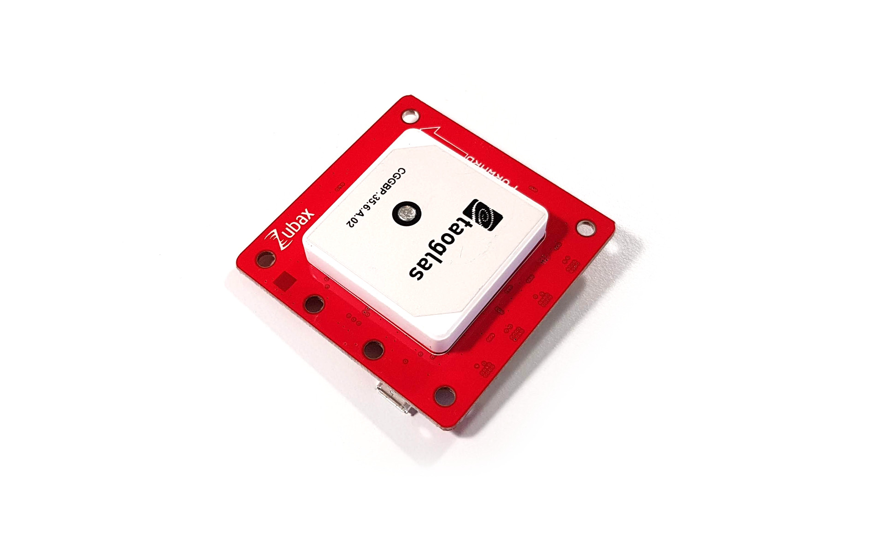

.. _common-zubax-gnss-positioning-module-gps-compass-and-barometer:

==========================================================
Zubax GNSS Positioning Module — GPS, Compass and Barometer
==========================================================

`Zubax GNSS 2 <https://zubax.com/products/gnss_2>`__ is a high-performance
positioning module for outdoor environments with doubly redundant `UAVCAN <https://uavcan.org>`__
bus interface. It includes a state-of-the-art GPS/GLONASS receiver, a
high-precision barometer and a 3-axis compass.

   Zubax GNSS 2: GPS, Compass and Barometer

The following parameter should be set on the autopilot (and then reboot the autopilot):

- :ref:`CAN_P1_DRIVER <CAN_P1_DRIVER>` = 1 (to enable the 1st CAN port)
- :ref:`GPS_TYPE <GPS_TYPE>` = 9 (UAVCAN)

If the device does not work please follow the instructions on enabling the CANBUS in the :ref:`common-canbus-setup-advanced` page, followed by :ref:`common-uavcan-setup-advanced` steps and then set the :ref:`GPS_TYPE <GPS_TYPE>` or :ref:`GPS_TYPE2 <GPS_TYPE2>` parameter to 9.

The `manufacturer's product page is here <https://zubax.com/products/gnss_2>`__ for general information about the device.
