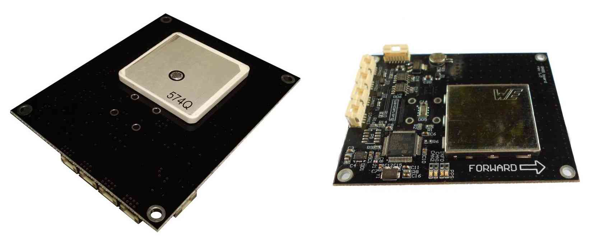

.. _common-zubax-gnss-positioning-module-gps-compass-and-barometer:

==========================================================
Zubax GNSS Positioning Module — GPS, Compass and Barometer
==========================================================

`Zubax GNSS <http://docs.zubax.com/Zubax_GNSS>`__ is a high-performance
positioning module for outdoor environments with doubly redundant UAVCAN
bus interface. It includes a state-of-the-art GPS/GLONASS receiver, a
high-precision barometer and a 3-axis compass.

   Zubax GNSS: GPS, Compass andBarometer

The Zubax website has all the documentation needed to use Zubax GNSS
with ArduPilot:

-  `Zubax GNSS tutorial: Using with Pixhawk <http://docs.zubax.com/Zubax_GNSS_tutorial:_Using_with_Pixhawk>`__
   (covers autopilot configuration in section `Configuring Pixhawk with APM firmware <http://docs.zubax.com/Zubax_GNSS_tutorial:_Using_with_Pixhawk#Configuring_Pixhawk_with_APM_firmware>`__).
-  `Technical Specification <http://docs.zubax.com/Zubax_GNSS>`__ for
   general information about the device, LED indicators, etc.
