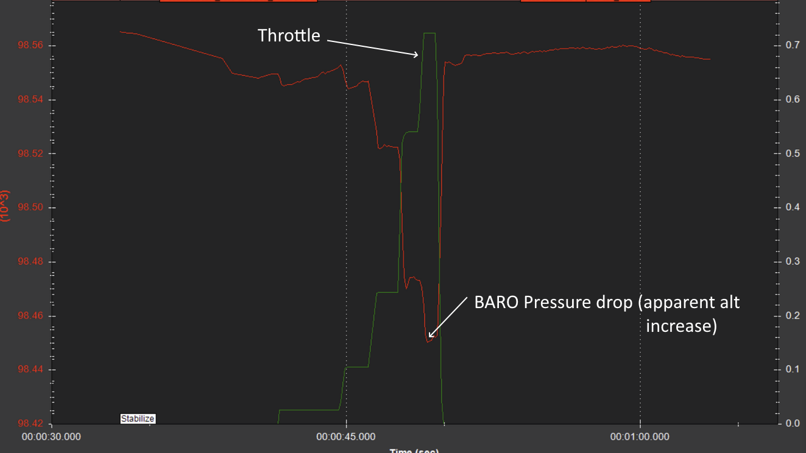
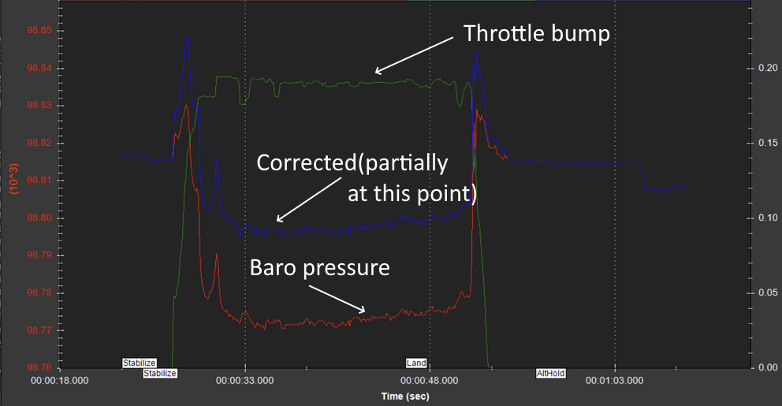

.. _common-baro-thrust-compensation:

[copywiki destination="copter"]

================================
Thrust Compensation of Barometer
================================

.. note:: this features is not included on most ArduPilot standard firmware builds. Use the `custom firmware build server <custom.ardupilot.org>`__ to create a firmware that includes it.

On very small multirotors, the autopilot's barometer might be in the prop wash and have its readings impacted by that pressure which will vary with respect to the thrust (Throttle) being produced.

The first barometer (BARO1) can have compensation applied as a linearly varying offset of throttle value to reduce this effect. The :ref:`BARO1_THST_SCALE<BARO1_THST_SCALE>` parameters determines the magnitude, and sign, of the offset and will need to be experimentally determined for a particular vehicle. Examining the the log messages for ``BARO1.Press`` vs ``BARO1.CPress`` (compensated atmospheric pressure) can be used for this.

