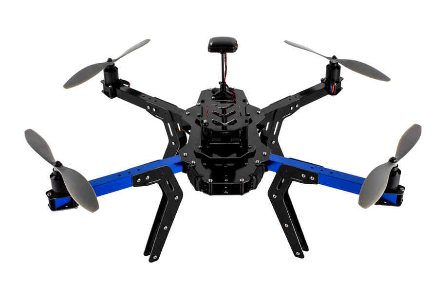

.. _3dr-kits-and-best-practices:

===========================
3DR Kits and Best Practices
===========================

3DR Kits
========

The `3DRobotics store <https://store.3dr.com/t/diyparts>`__
offers 2 DIY Kits (quad and Y6) .   Select a model below to jump to the
detailed assembly instructions.

.. image:: ../images/3DRKits_Y6.jpg
    :target:  https://3dr.com/support/

Best Practices
==============

..  youtube:: 33Tl_rjhQEE
    :width: 100%

When assembling your copter, we recommend using threadlocker on all
motor mount screws. For more information on using and applying
threadlocker, check out `this video <https://www.youtube.com/watch?v=qaO3wL3Ypqg>`__. When securing
wiring, keep positive and negative wires close together, use zip ties to
secure wiring to frame, and use cable mesh where possible. Use a
vibration dampening strategy as described in the :ref:`Vibration Dampening and Isolation page <common-vibration-damping>`.
