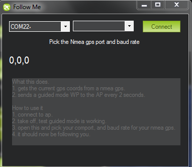

.. _ac2_followme:

============================
Follow Me Mode (GSC Enabled)
============================

Follow Me mode makes it possible for you to have your copter follow you
as you move, using a telemetry radio and a ground station.

.. note::

   Unlike other autopilot modes, this feature is implemented in
   the Ground Station. The ground station controls the movement by reading
   the vehicle position using MAVLink Telemetry and sending GUIDED mode
   instructions to move the vehicle appropriately. Currently this sort of
   functionality is supported by *Mission Planner* for Windows laptops, APM
   Planner for OS X laptops, and DroidPlanner for Android devices.

What you'll need
================

#. A Copter with telemetry
#. A laptop (or a phone/tablet with an integrated GPS available to the GCS app)
#. A GPS USB dongle `like this <http://www.amazon.com/ND-100S-GlobalSat-USB-GPS-Receiver/dp/B004K39QTY/refsr_1_9?ieUTF8&qid1329773762&sr=8-9>`__
   or Bluetooth GPS module `like this <http://www.amazon.com/GlobalSat-BT-368i-Bluetooth-GPS-Receiver/dp/B0018YZ836/refsr_1_2?selectronics&ieUTF8&qid1329773963&sr1-2>`__.

Instructions for Mission Planner
================================

#. Set one of your flight modes to "Loiter"
#. Set up your Copter at the field and establish a MAVLink connection
   over wireless telemetry
#. Ensure that your GPS USB dongle or Bluetooth device is plugged into
   to your laptop and showing up as a serial port. Using the software
   that came with the module, make sure that it's working and that you
   have GPS lock.
#. Take off, and once in the air switch to Loiter. (Sufficient altitude
   to ensure that while it is following you it isn't attacking you might
   be a good idea).
#. In the Mission Planner Flight Data screen try right-clicking on a
   nearby spot and select "Fly to Here". If this works, you're ready to
   try Follow Me mode.
#. In the Mission Planner, enter Control-F, which will open the
   following window. Click on "Follow Me"

.. image:: ../images/followme1.jpg
    :target: ../_images/followme1.jpg

-  This will bring up this window. Select the serial port that is
   assigned to your GPS device and whatever baud rate it uses.

-  Once you click "Connect", the Mission Planner will read the GPS data
   from your device and send it to your Copter as "fly to here" commands
   every two seconds.

-  Now pick up your laptop and start walking around.
-  The Copter should follow you!

   -  If you have set the altitude to 5 feet it might be a good idea to
      see if you can out run it.
   -  As mentioned before, sufficient altitude to prevent injury is
      useful.
   -  Seriously this is a great capability, but safety is really
      important when using Follow Me mode especially with an open bladed
      Multicopter.

.. warning::
   The barometer is used in the altitude calculation meaning that it can
   drift over time and impact rising terrain. Watch for obstacles and 
   elevation changes. The altitude maintaing behavior is similar to loiter mode.
