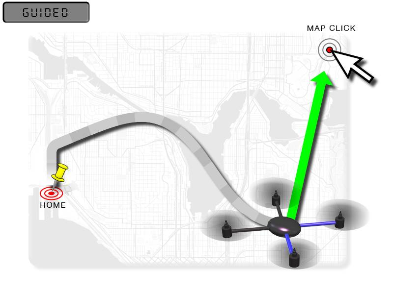
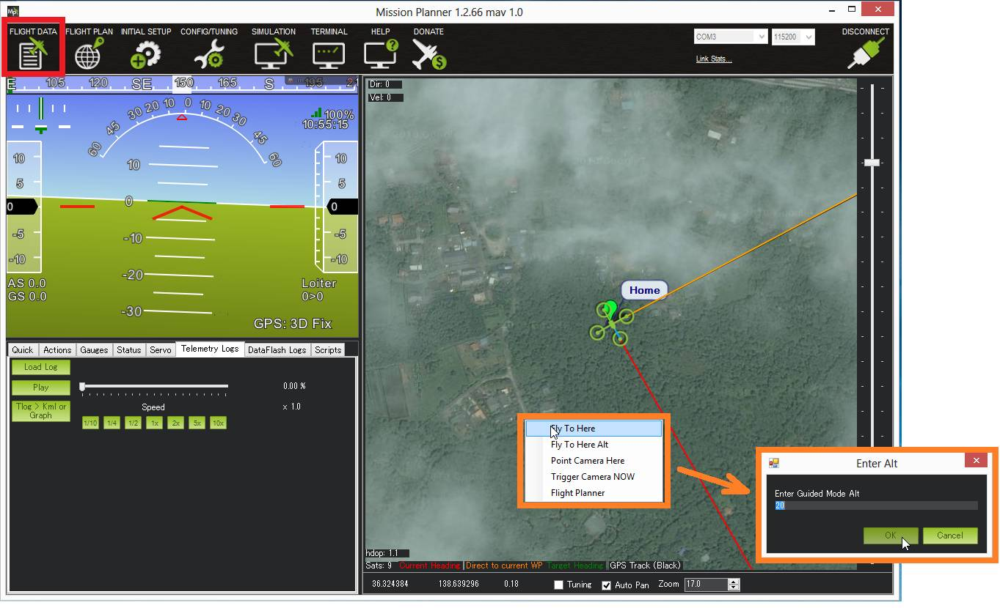

.. _ac2_guidedmode:

===========
Guided Mode
===========

Guided mode is a capability of Copter to dynamically guide the copter to
a target location wirelessly using a telemetry radio module and ground
station application. This page provides instructions for using guided
mode.

Overview
========

Guided mode is not a traditional flight mode that would be assigned to a
mode switch like other flight modes. The guided mode capability is
enabled using a ground station application (such as Mission Planner) and
telemetry radio (such as a :ref:`SiK Telemetry Radio <common-sik-telemetry-radio>`). 
This capability allows you to
interactively command the copter to travel to a target location by
clicking on a point on the Mission Planner Flight Data map. Once the
location is reached, the copter will hover at that location, waiting for
the next target. Follow Me mode also uses Guided Mode to make the copter
follow the pilot around the field.

What you'll need
================

To use guided mode, you'll need a :ref:`telemetry radio <common-telemetry-landingpage>` 
allowing your computer and
autopilot to communicate during flight, a ground station computer or
tablet, and a ground station application such as :ref:`Mission Planner <planner:home>`.

Instructions
============

-  Set up your copter at the field and establish a MAVLink connection
   over wireless telemetry between your copter and your laptop.
-  On your laptop, using the software that came with the telemetry
   module, make sure that it's working and that you have a GPS lock.
-  Take off in :ref:`Stabilize Mode <stabilize-mode>` and once
   at a reasonable altitude, switch to Loiter.
-  In the Mission Planner Flight Data screen map, try right-clicking on
   a nearby spot and select "Fly to Here".
-  You will be asked for a guided mode altitude. Enter an above home
   altitude in meters.

-  A "Guided" target should appear on the map and the orange line (which
   indicates the target heading) should point to this guided target.

.. image:: ../images/FlightModes_Guide_TargetEstablished.jpg
    :target: ../_images/FlightModes_Guide_TargetEstablished.jpg

-  The vehicle should fly to the target location and wait there until
   you enter another location or switch to another mode.

.. note::

   On *Mission Planner* there is no need to set up one of your flight
   modes as "Guided". This may not be the case for other Ground Control
   Stations.

.. _guided_nogps:

Guided_NoGPS
============
This variation of Guided mode does not require a GPS but it only accepts `attitude targets <https://mavlink.io/en/messages/common.html#SET_ATTITUDE_TARGET>`__.  Because it does not accept position or velocity targets like regular Guided mode it is generally not useful for regular users.  This mode was created for use by companion computers that may want to fly the vehicle as if it was in AltHold mode.

.. note::

   Guided_NoGPS does not allow a vehicle to hold position without a GPS (i.e. non-GPS navigation).  For information on :ref:`non-GPS navigation see this wiki page <common-non-gps-navigation-landing-page>`
