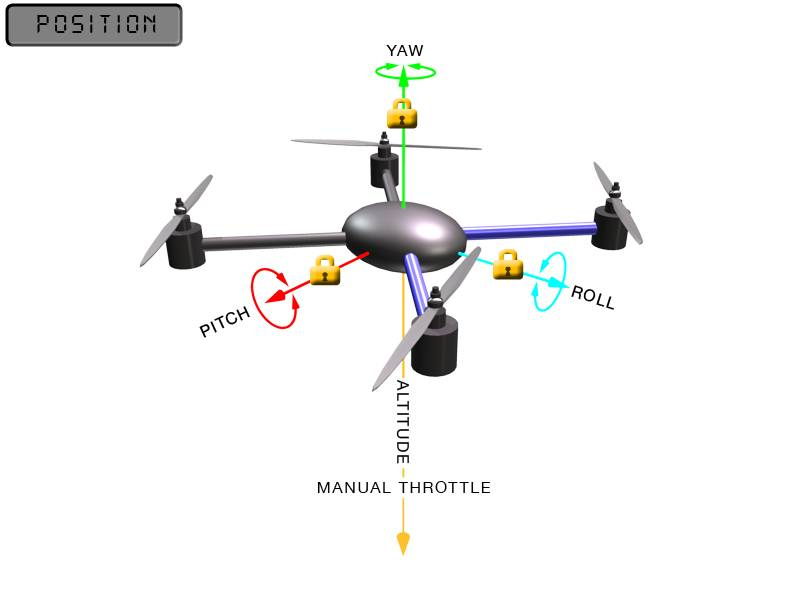

.. _ac2_positionmode:

=============
Position Mode
=============

**Position mode** is the same as loiter mode, but with manual throttle
control. This means that, in position mode, the copter maintains a
consistent location and heading, while allowing the operator to control
the throttle manually.

Position mode is GPS dependent, so it is important to ensure that GPS is
locked before arming the copter when using this mode. GPS lock is
indicated by the following LED states:

-  Blue LED on APM is solid.
-  Blue LED on GPS module is solid.
-  Blue LED on GPS+Compass module is blinking.
