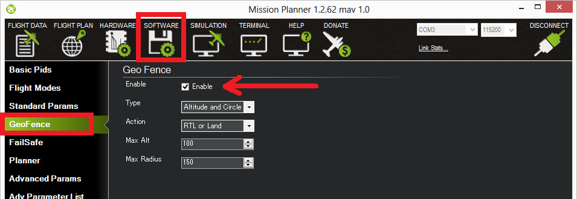

.. _ac2_simple_geofence:

===============
Simple GeoFence
===============

Overview
========

AC 3.0.1 (and higher) includes a simple "tin can" shaped fence centered
on home that will attempt to stop your copter from flying too far away
by stopping at the fence (if in Loiter mode and using Copter-3.4 or higher) or initiating an RTL.
The maximum circular distance and altitude and the vehicle behaviour when the fence is reached can be configured using
Mission Planner.

.. image:: ../images/copter_simple_tincan_geofence.jpg
    :target: ../_images/copter_simple_tincan_geofence.jpg

If the vehicle strays outside these borders it will switch into RTL or
LAND.  At the moment the fence is breached a backup fence is erected 20m
further out (or up).  If the copter breaches this backup fence (for
example if the the vehicle is not set up correctly or the operator takes
control but is unable to bring the copter back towards home) the copter
will be switched into RTL again (and another backup fence an additional
20m further out will be created).

If the copter eventually flies 100m outside the configured fence
distance, the vehicle will switch into LAND mode.  The idea being that
it's clearly impossible to get the copter home so best to just bring it
down.  The pilot can still retake control of course with the flight mode
switches.  Like with the earlier fences, another fence is erected 20m
out which will again switch the copter to LAND if it continues away from
home.

Enabling the Fence in Mission Planner
=====================================

The Fence can be set-up by doing the following:

-  Connect your flight controller to the Mission Planner
-  Go to the **Config/Tuning \| GeoFence** screen
-  Click the **Enable** button
-  Leave the "Type" as "Altitude and Circle" (unless you want only an
   Altitude limit or only a Circular fence in which case you can select
   "Altitude" or "Circle")
-  Leave the Action as "RTL or Land"
-  Set "Max Alt" to the altitude limit you want (in meters)
-  Set "Max Radius" to the maximum distance from home you want (in
   meters).  This should normally be at least 50m

Enabling the fence with Channel 7 or 8
======================================

It is not necessary to set-up a switch to enable or disable the fence
but if you wish to control the fence with a switch please follow these
steps:

-  Go to the Mission Planner's Config/Tuning > Extended Tuning screen and set
   either "Ch7 Opt" OR "Ch8 Opt" to Fence.
-  holding the switch high (i.e. PWM > 1800) will enable the fence, low
   (under 1800) will disable the fence.

.. image:: ../images/Fence_MPCh78.png
    :target: ../_images/Fence_MPCh78.png

Warnings:
=========

-  The minimum recommended fence radius is 30m
-  The fence requires the GPS to be functioning well so do not disable
   the :ref:`GPS arming check <prearm_safety_check>` nor the :ref:`EKF failsafe <ekf-inav-failsafe>` while the fence is enabled. 
   Conversely if you disable either of these checks, disable the Fence.
-  For the best results, ensure RTL is working on your vehicle.
-  With the Fence enabled, the pre-arm checks will require you have GPS
   lock before arming the vehicle.
-  If GPS failsafe is not enabled and the Fence is enabled and you loose
   GPS lock while flying the fence will be disabled.
-  If GPS failsafe is enabled and the Fence is enabled and you lose GPS
   lock while flying the vehicle will switch to LAND because we no
   longer know the vehicle position and we want to ensure the copter
   never travels far outside the fence.  This beahviour will occur
   regardless of the flight mode.  If a LAND sequence is not desired,
   the pilot can retake control by moving the flight mode switch.
-  The backup fences are created 20m out from the previous breached
   fence not 20m out from the vehicle's position.  This means if you
   choose to override the fence you may have less than 20m to regain
   vehicle control before the fence switches the copter to RTL (or LAND)
   again.  If you really want to override the fence, you should be ready
   to switch the flight mode twice or alternatively set-up the
   enable/disable fence switch.

Video overview of the Fence setup and Operation
===============================================

..  youtube:: HDnGdo54o-4
    :width: 100%
