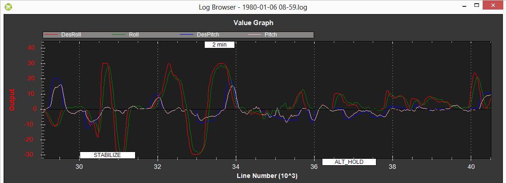

.. _ac_rollpitchtuning:

============================
Manual Roll and Pitch Tuning
============================

Although there are many gains that can be tuned in Copter to get optimal
performance, the most critical is the Rate Roll and Pitch P values which
convert the desired rotation rate into a motor output.  This alone will
likely get it flying reasonably well at least in Stabilize mode.

This guide assumes you are using Mission Planner as your Ground Control software.
Other software, such as QGroundControl or APM Planner can also be used.

Some general advice on how to tune this parameter:

-  Too high and the copter will oscillate quickly in roll and/or pitch
-  Too low and the copter will become sluggish
-  High powered copter should use a lower gain, under powered copters
   are a higher gain

.. _ac_rollpitchtuning_in-flight_tuning:

Transmitter based tuning
~~~~~~~~~~~~~~~~~~~~~~~~

See the :ref:`Transmitter based tuning <common-transmitter-tuning>` page for information on how to tune these values, as well as other parameters while in the air.

Video of in-flight tuning
~~~~~~~~~~~~~~~~~~~~~~~~~

..  youtube:: NOQPrTdrQJM#t=145
    :width: 100%

Verifying performance with dataflash logs
=========================================

Viewing the stabilize mode performance is best done by downloading a
dataflash log from your flight, then open it with the mission planner
and graph the ATT message’s Roll-In or DesRoll (pilot desired roll
angle) vs Roll (actual roll) and Pitch-In or DesPitch (desired pitch
angle) vs Pitch (actual pitch angle). These two should track well as
shown below.

