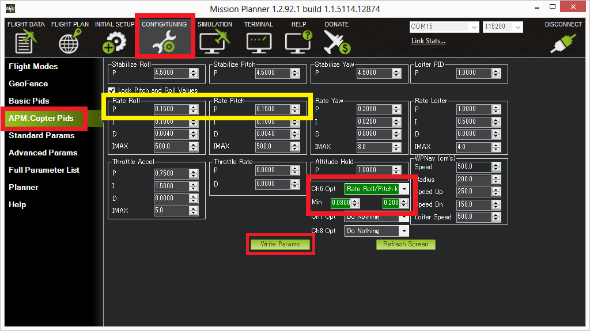

.. _ac_rollpitchtuning:

=================================
InFlight tuning of Roll and Pitch
=================================

Although there are many gains that can be tuned in Copter to get optimal
performance, the most critical is the Rate Roll and Pitch P values which
convert the desired rotation rate into a motor output.  This alone will
likely get it flying reasonably well at least in Stabilize mode.

This guide assumes you are using Mission Planner as your Ground Control software.
Other software, such as QGroundControl or APM Planner can also be used.

Some general advice on how to tune this parameter:

-  Too high and the copter will oscillate quickly in roll and/or pitch
-  Too low and the copter will become sluggish
-  High powered copter should use a lower gain, under powered copters
   are a higher gain

.. _ac_rollpitchtuning_in-flight_tuning:

In-flight tuning
~~~~~~~~~~~~~~~~

Rate Roll P and Rate Pitch P can be tuned in flight using your
transmitter's channel 6 tuning knob by following these instructions:

#. Connect your Flight Controller to Mission Planner
#. On Mission Planner, select Config/Tuning >> Copter Pids
#. Set the CH6 Opt to "Rate Roll/Pitch kP"
#. Set Min to 0.08, Max to 0.20 (most copters ideal gain is within this
   range although from a small number of copter the Max can be as high
   as 0.25)
#. Push the "Write Params" button
#. Turn your transmitter's CH6 tuning knob to the minimum position,
   press the "Refresh Params" button and ensure that the Rate Roll P and
   Rate Pitch P values become 0.08 (or something very close)
#. Turn the CH6 knob to it's maximum position, press "Refresh Params"
   and ensure the Rate Roll P moves to 0.20
#. Move the CH6 knob back to the middle
#. Arm and fly your copter in Stabilize mode adjusting the ch6 knob
   until you get a copter that is responsive but not wobbly
#. After the flight, disconnect your LiPo battery and reconnect the APM
   to the mission planner
#. With the CH6 knob in the position that gave the best performance,
   return to the Copter Pids screen and push the "Refresh Params" button
#. In the Rate Roll P and Rate Pitch P fields re-type the value that you
   see but just slightly modified so that the mission planner recongises
   that it's changed and resends to the APM/PX4 (Note: if you re-type
   exactly the same number as what appears in Rate Roll P it won't be
   updated).  So for example if the Rate Roll P appears as "0.1213" make
   it "0.1200"
#. Set Ch6 Opt back to "None" and push "Write Params"
#. Push the Disconnect button on the top right, and the Connect
#. Ensure that the Rate Roll P value is the value that you retyped in
   step #12

Note: while you are moving the tuning knob the values update at 3 times
per second.  The need to press the Refresh button in the mission planner
in steps #6 and #7 above is just because the Copter is not sending the
updates to the mission planner in real-time.

Video of in-flight tuning
~~~~~~~~~~~~~~~~~~~~~~~~~

..  youtube:: NOQPrTdrQJM#t=145
    :width: 100%
