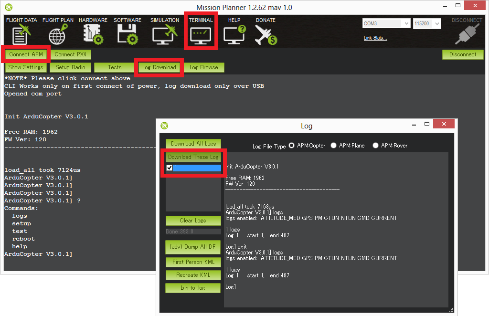
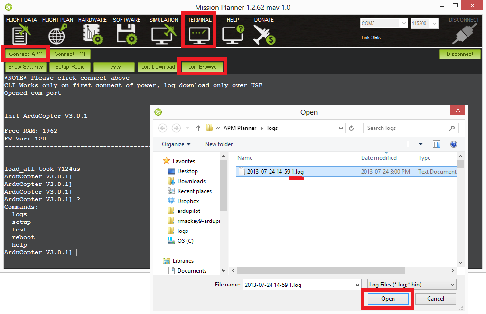
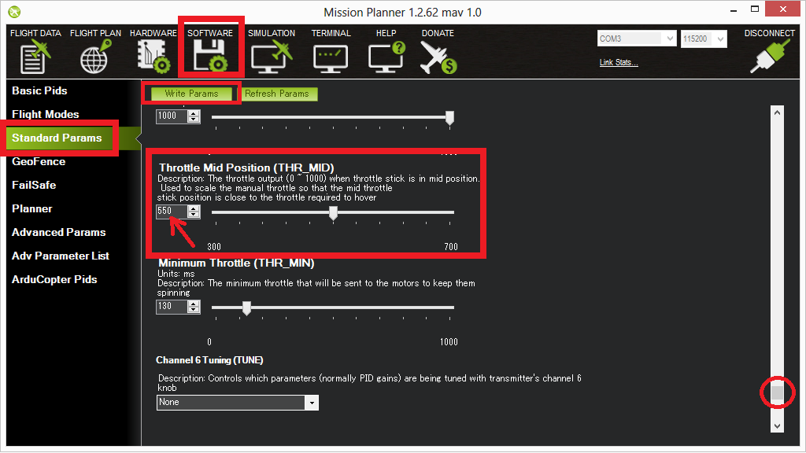
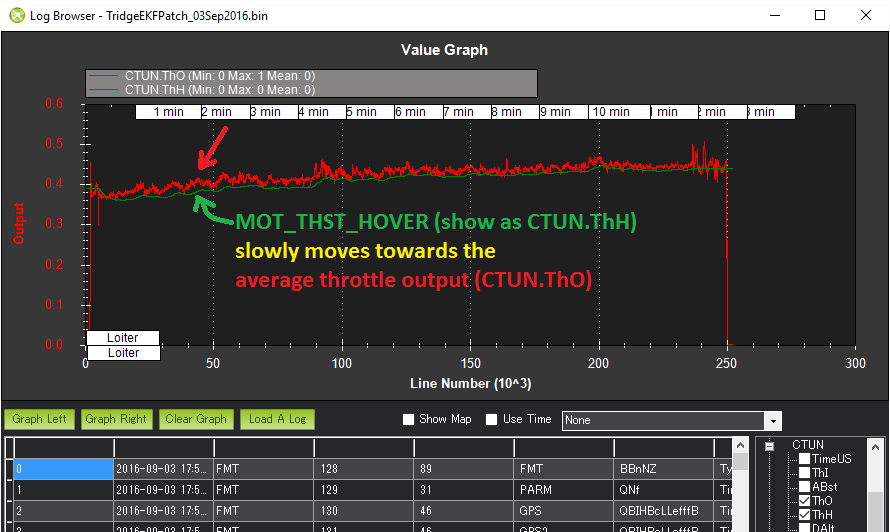

.. _ac_throttlemid:

=========================================
Setting Throttle Mid (aka Hover Throttle)
=========================================

.. note::

   Copter-3.4 (and higher) includes :ref:`automatic learning of hover throttle <automatic_learning_of_hover_throttle>` which means manually setting the parameter is generally not required.

If you have a slightly overpowered or underpowered copter the throttle
required to keep the vehicle in a stable hover may be under 40% or over
60%.  Although this is fine while flying purely stabilize mode it can
lead to a rough transition to autopilot modes (Alt Hold, Loiter) where
having the throttle outside of the 40% ~ 60% deadzone will be
interpreted as meaning you want the copter to climb or descend.

For this reason it is a good idea to adjust the Throttle Mid parameter
(also known as THR_MID) so that your mid throttle while in stabilize
mode is closer to 50%.

Please follow these instructions to adjust your manual throttle to so
that your copter hovers at 50% throttle:

-  Fly your copter in stabilize mode in a stable hover for at least 30
   seconds
-  Disconnect your LiPo battery and connect your APM/PX4 to the Mission
   Planner
-  Go to the Terminal screen and download your latest dataflash log file
   (more details on working with dataflash logs can be found
   :ref:`here <common-downloading-and-analyzing-data-logs-in-mission-planner>`)

-  After the download has completed, close the “Log” window and push the
   “Log Browse” button and open the latest file in the log directory
   (it’s last digit will be the Log number you downloaded so in the
   example above we downloaded Log #1 so the filename will end in 1.log)

-  When the Log Browser appears, scroll down until you find any CTUN
   message.  Click on the row's "ThrOut" column and push "Graph this
   data Left" button.

.. image:: ../images/ThrMid_DataFlash_ThrOut1.png
    :target: ../_images/ThrMid_DataFlash_ThrOut1.png

-  While referring to the scale on the left of the graph, estimate
   approximately what the throttle level was during the hover.  In the
   example above (which was an unnecessarily long flight) the mid
   throttle appears to be about 550.

   -  Note: if the average throttle is below 300 (i.e. 30%) then you
      have a very overpowered copter and it would be best to add a some
      extra weight (i.e. a bigger battery perhaps) or reduce the power
      in some other way (smaller motors, move from a 4S to a 3S battery,
      etc)
   -  If the average throttle is above 700 (i.e. 70%) then you have a
      very underpowered copter.  You should consider increasing the
      power of the motors and ESCs or use a higher voltage battery (i.e.
      switch from a 3S to a 4S battery).

Open the Mission Planner's Software > Standard Params screen and update
the Throttle Mid Position (THR_MID) to the value estimated above
(you'll find it near the bottom of the list)

Push the Write Params button

-  On your next flight you should find the throttle is closer to mid
   while flying in stabilize mode

.. _automatic_learning_of_hover_throttle:

Automatic Learning of Hover Throttle
====================================

Copter-3.4 (and higher) includes automatic learning of mid throttle (aka "Hover Throttle").
The :ref:`MOT_THST_HOVER <MOT_THST_HOVER>` value will slowly move towards the average motor output whenever the vehicle is holding a steady hover in non-manual flight modes (i.e. all modes except Stabilize and Acro).

If you wish to manually set the :ref:`MOT_THST_HOVER <MOT_THST_HOVER>` value, it is best to download a dataflash log and set the value to what is seen in the CTUN.ThO field.  The value should be between 0.2 and 0.8.

If for some reason you wish to disable learning, you can set the :ref:`MOT_HOVER_LEARN <MOT_HOVER_LEARN>` parameter to 0.

