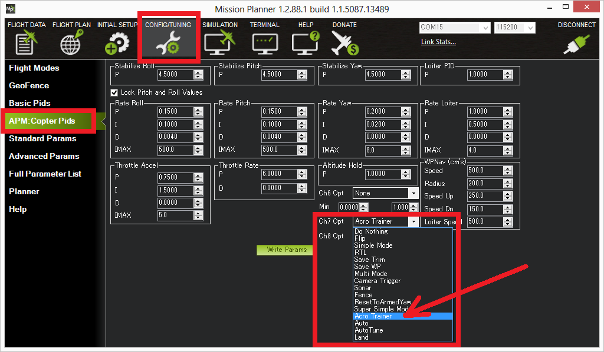

.. _acro-mode:

=========
Acro Mode
=========

Acro mode (Rate mode) uses the RC sticks to control the angular velocity
of the copter. Release the sticks and the vehicle will maintain its
current attitude and will not return to level. Acro mode is useful for
aerobatics such as flips or rolls, or FPV when smooth and fast control
is desired.

Overview
========

-  The throttle is completely manual with no compensation for tilt angle
   of the vehicle. If the pilot puts the throttle completely down the
   motors will go to their minimum rate and stabilization will cease.However, this behavior
   can be changed by enabling :ref:`airmode` 
-  AC3.1 and higher include an Acro Trainer functionality that can be
   turned on/off to make learning to fly Acro easier.
-  Stick inputs are interpreted in the "body frame" (as opposed to Sport
   mode in which they are "earth frame"). The difference between "body
   frame" and "earth frame" is most obvious when the vehicle is leaned
   over. For example when pitched forward at 45 degrees, when left yaw
   is applied if using an earth frame controller (i.e. Sport mode) the
   copter will maintain it's pitch and roll angles as it's heading
   changes. With a body frame controller like Acro it will rotate about
   the vehicle's vertical axis meaning the pitch angle will become the
   roll angle and the roll angle will become the pitch angle.

.. warning::

   Acro is the most difficult flight mode to master and you can
   look forward to crashing multiple times before you get the hang of
   it. While Acro mode does not necessarily require GPS, switching to RTL in case of emergency does. Make sure you do have a reliable
   position estimate prior to arming, most commonly provided by 3D GPS fix with sufficient HDOP.

.. youtube:: tC0mF-N5z0Q
    :width: 100%

The above video was filmed with a Pixhawk running AC3.2 in ACRO mode
using :ref:`FPV goggles <common-fpv-first-person-view>`.

AirMode
=======

Acro mode can be setup to provide full stabilization at idle throttle. See :ref:`airmode` 

.. _acro-mode_acro_trainer:

Acro Trainer
============

The :ref:`ACRO_TRAINER <ACRO_TRAINER>` parameter can be set to:

-  0 = disabled. This means the pilot operates in full Rate control with
   no automatic leveling nor angle-limiting performed by the autopilot.
-  1 = automatic leveling. The vehicle will automatically return to the
   level when the pilot releases the sticks. The aggressiveness with
   which it returns to level can be controlled with the :ref:`ACRO_BAL_ROLL<ACRO_BAL_ROLL>`
   and :ref:`ACRO_BAL_PITCH<ACRO_BAL_PITCH>` parameters. The default of 1.0 will cause it to
   return to level at up to 30deg/sec. Higher values will make it return
   more quickly.
-  2 (Default) = automatic leveling and lean angle limited. Includes the
   automatic leveling as option #1 but in addition the vehicle will not
   lean more than 45 degrees (this angle can be configured with the
   :ref:`ANGLE_MAX<ANGLE_MAX>` parameter).

The trainer can be enabled/disabled using the Ch7/Ch8 switches or a channel setup via its ``RCx_OPTION`` parameter.  With a
3 position switch the off position (i.e. PWM < 1200) will disable the
trainer, middle position will enable option #1 (automatic leveling) and
the top position (i.e. PWM > 1800) will enable option #2 (leveling and
lean angle limited). With a 2 position switch only options #0 (disabled)
and option #2 (leveling & limited) are possible.

Traditional Helicopters
=======================

For Traditional Helicopters, this modes operates the same. However, experienced pilots might find that this mode has a slightly robotic feel, and attitude jumps as it lifts from the skids that they are not familiar with. In Copter-4.0 and later, a "Virtual Flybar" feature has been introduced, that simulates the classic feel of a flybar helicopter. By setting the :ref:`ACRO_BAL_ROLL<ACRO_BAL_ROLL>` and :ref:`ACRO_BAL_PITCH<ACRO_BAL_PITCH>` parameters to non-zero values, this feature takes effect. 

The Virtual Flybar will add decay term to the attitude controller to bleed off accumulated differences between the current attitude and accumulated commanded attitude, if the copter has not quickly obtained it, such as when sitting on the ground but stick inputs are being given. Otherwise, when the helicopter clears it will jump to the accumulated commanded attitude when skids clear, perhaps surprisingly. This is familiar to Multicopter pilots.

Values for :ref:`ACRO_BAL_ROLL<ACRO_BAL_ROLL>` and :ref:`ACRO_BAL_PITCH<ACRO_BAL_PITCH>` parameters ~ 2, will usually give good results.

.. note:: This feature is not active when :ref:`ACRO_TRAINER<ACRO_TRAINER>` is active

Tuning Parameters
=================

-  :ref:`ACRO_RP_P <ACRO_RP_P>` controls the rotation rate for the roll and pitch axis. The default,
   4.5, will command a 200deg/sec rotation rate. Higher values lead to
   higher rotation rates, lower to slower rotation rates.
-  :ref:`ACRO_YAW_P <ACRO_YAW_P>` controls the rotation rate for the yaw axis. The default, 4.5, like
   roll and pitch, will command a 200deg/sec rotation rate.
-  :ref:`ACRO_RP_EXPO <ACRO_RP_EXPO>` and :ref:`ACRO_Y_EXPO <ACRO_Y_EXPO>` are
   an amount of Exponential to apply to the pilots stick inputs that
   only applies to ACRO mode. By default, ACRO mode is much more
   responsive, even in the center-sticks positions, than the other
   modes, so this parameter allows the pilot to fine-tune stick response
   in the control to match what they feel when they are in other modes
   such as Stabilize, AltHold, PosHold, etc. The default value of 0
   applies 30% expo to Roll and Pitch demands from the pilot.

Advanced Tuning Parameters
==========================

After you have become very confident with flying in ACRO mode, you may
want to go deeper in to tuning it based on your vehicle's performance
characteristics. These parameters should be adjusted by advanced users
only with the intent of removing "bounce" after very fast roll or flip
maneuvers on a vehicle that you are confident is very well tuned. Note
that these parameters are global parameters that apply to all flight
modes, not just ACRO.

-  :ref:`ATC_ACCEL_R_MAX <ATC_ACCEL_R_MAX>` and
   :ref:`ATC_ACCEL_P_MAX <ATC_ACCEL_P_MAX>`: Maximum
   acceleration in roll/pitch axis measured in Centi-degres/sec/sec.
   Let's say you have a highly nimble quadcopter and you have your
   :ref:`ACRO_RP_P<ACRO_RP_P>` parameter set to 9, which translates to a roll request of
   ~400deg/sec. The copter is not physically capable of going from
   0deg/sec to 400deg/sec without a brief moment of acceleration. During
   that time, error is building up in the controller in order to get you
   to 400deg/sec. When you let off the sticks, that error can still be
   present, resulting in an overshoot of desired attitude, followed by a
   bounce-back. This parameter can be tuned to help remove that error
   during the maneuver and soften if not remove the bounce-back. Note
   that this is completely different from tuning the Rate D terms for
   Pitch and Roll, and should come only after those terms are properly
   tuned.
-  :ref:`ATC_ACCEL_Y_MAX <ATC_ACCEL_Y_MAX>`: Maximum acceleration in Yaw axis measured in 
   Centi-degress/sec/sec. Same principle as ``ATC_ACCEL_R_MAX`` and :ref:`ATC_ACCEL_P_MAX` 
   but on the YAW axis based on the `ACRO_YAW_P <ACRO_YAW_P>` parameter value 
   (likely a much lower, more attainable value.)

User Videos
===========

.. youtube:: dnygfyvXmL4
    :width: 100%
