.. _advanced-multicopter-design:

=====================================
Archived: Advanced MultiCopter Design
=====================================

This section is topics related to advanced multicopter construction and
design.

.. note::

   -  For information on understanding how a multicopter works please go
      :ref:`Here <what-is-a-multicopter-and-how-does-it-work>`
   -  For information on how to build your own simple Quadcopter using kits
      or frames go :ref:`Here <build-your-own-multicopter>`
   -  For information on building or setting up a copter for first Person
      View (FPV) go :ref:`Here <common-fpv-first-person-view>`

There are several popular frame layouts for MultiCopters
========================================================

-  The Tricopter uses 3 motor / propeller propulsion units with a servo
   to rotate one of them to compensate for adverse yaw.

   -  Tricopters were popular early on when the brushless motor /
      propeller units were new and scarce.
   -  They suffer from less than stellar performance and do not scale
      well to larger sizes.
   -  But they still have some popularity for small, light hobby use
      applications.
   -  Because this is primarily an outdated design we will not expand
      further on it in this article.

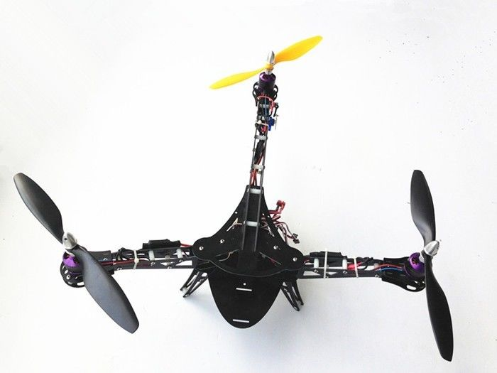

-  The very popular Quadcopter has 4 motor/propeller units and is
   available in any size.

   -  A Quadcopter is an elegantly simple design and is hands down the
      most popular layout for a whole lot of reasons.
   -  Quadcopters are symmetrical and embody the simplest principle of
      operation for controlling roll, pitch, yaw and motion.
   -  Simply varying the speed of each of the motors provides full 3D
      motion and rotation and hover capability.
   -  They are relatively inexpensive to produce and they scale well to
      production manufacturing techniques.
   -  In various sizes and layouts they are capable of actually
      performing useful tasks beyond simply flying around.
   -  Their primary drawback is that a single motor failure generally
      results in an abrupt descent to the ground (crash).
   -  A very wide variety of materials and techniques can be employed to
      produce a useful Quadcopter.
   -  There are several popular configurations for QuadCopters:

      -  X with and X frame arm layout and the front and back of the
         copter between 2 propellers.
      -  and with the same kind of X frame layout as above but with the
         front and back of the copter in line with one of the
         propellers.
      -  "Dead Cat" a variation on X which in which the frame arms are
         further apart in the front and the back than they are side to
         side.

         -  Name actually comes from Bart Jansen a Dutch artist who
            stuffed his expired cat and made a Quadcopter out of it.

      -  H which has frame side arms running between the motors on each
         side and connected with one or more frame arms in the middle.
      -  Square which has frame arms connecting between motors (and
         usually intermediate frame arms supporting a central frame.)
      -  And variations including ones with the motors laid out on a
         circle.
      -  Most of them primarily operate the same as the X frame
         (provides better camera exposure between motors among other
         things).
      -  I recommend the standard X frame design because it is strong
         and simple and its natural symmetry balances flying forces
         better.

   -  A humming bird sized `Estes Proto X <http://www.estesrockets.com/helis-quads/quadcopters/004606-proto-x>`__
      is shown below.

      .. image:: ../images/leste4606__92098.1384842703.1020.1020.jpg
          :target: ../_images/leste4606__92098.1384842703.1020.1020.jpg

-  A fifteen thousand dollar SteadyDrone Q4D-X Quadcopter with 28"
   propellers, 8KG lifting capability and claimed 60 minute flight
   times.

   .. image:: ../images/SteadiDroneQ4DX.jpg
       :target: ../_images/SteadiDroneQ4DX.jpg

-  For professional use, HexaCopters and OctoCopters with 6 and 8
   Motor/propeller propulsion units are popular.

   -  Hexacopters, Octocopters, Hex Y's and Octo X's can provide stable
      heavy lift platforms good for photography and other uses.
   -  Hex and Octocopters may have the benefit of potentially being able
      to continue to fly with a single motor failure.
   -  However the increased complexity versus a Quadcopter makes them
      more failure prone.
   -  The reduction in prop size and increase in prop speed result in a
      smoother flight than an equivalent large blade Quadcopter.
   -  However it also results in some reduction in flight efficiency and
      endurance all other things being equal.

   .. image:: ../images/hexacopter.jpg
       :target: ../_images/hexacopter.jpg

-  Hex Y6 and Octo X8 designs with pairs of coaxial motor/propeller
   units mounted back to back are also becoming popular.
-  Singlecopters and Coax copters are very new designs and have some
   advantages in specific applications.

   -  Since they tend to a single ducted body for either the one or two
      motor/propeller units they tend to be self protected indoors.
   -  The coax copter which relies on variable thrust on each of its 2
      props for rotation is functionally simpler than the single copter.
   -  The side profile of the ducted body makes these copters more
      susceptible to winds outdoors requiring more effort to compensate.
   -  While generally good at hovering and fine positioning, they are
      more speed and performance limited than other multicopter designs.
   -  The Singlecopter in particular is reasonably adaptable to gasoline
      engines for much greater endurance.
   -  The possibility of using a single large propeller implies that
      good efficiencies could be realized even with an electric
      versions.
   -  The Singlecopter features a single motor/propeller unit with 4
      servo controlled vanes to direct roll, pitch and yaw.

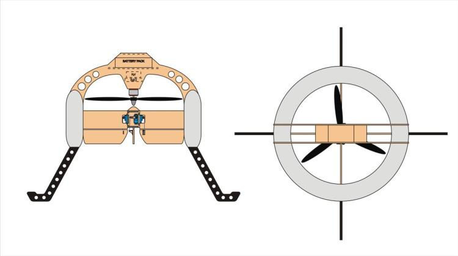

-  The Coaxcopter has dual motor/propeller units for thrust and yaw
   control and 2 servo controlled vanes for roll and  pitch.

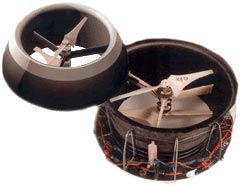

-  There are also variable pitch Multicopters for incredible acrobatic
   performance.

   -  Variable pitch multicopters have some interesting potential uses as well like the 
      `Curtis Youngblood Stingray 500 <http://curtisyoungblood.com/V2/products/quadcopters/stingray-500>`__ shown below.
   -  Servo control of the props (rotors) produces roll, pitch and yaw
      so they are often powered by a single motor with shaft or belt
      drive.
   -  If you use a single motor it is feasible to use a gasoline engine
      giving you the potential for considerable endurance and range.
   -  These are very high performance and can even fly inverted, they
      are also mechanically more complex but can be built robustly.

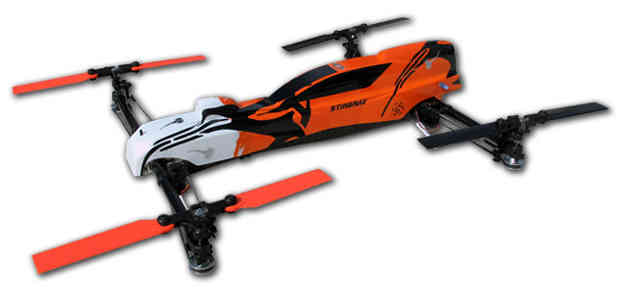

-  And copters with more than 8 motor/propeller units may be useful for
   specialized, extreme `(or
   insane) <https://www.youtube.com/watch?v=L75ESD9PBOw>`__ applications.

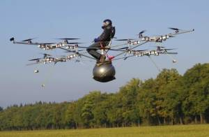

Motors, propellers and ESCs
===========================

For multicopters, motors, propellers and ESCs (speed controllers) are
critical and have been failure prone in the past.

This ECalc based `Xcopter: motor - propeller - battery - ESC calculator <https://www.ecalc.ch/xcoptercalc.php?ecalc&lang=en>`__ will
help you pick the best components for your copter.

-  Quadcopter design will be used for illustration as they are the most
   wide spread and the most versatile.

   -  But the information applies equally to Hex and Octo designs,
      either conventional or coaxial Y and X types.

-  The brushless out-runner motors have to support the full weight of
   the copter continuously while turning at high speed.

   -  Hobby grade motors have often used inadequate Conrad type unsealed
      bearings which are good axially but not in thrust.

      -  And the motors are usually open frame to permit the greatest
         cooling but providing little or no protection
      -  This has meant an unnecessarily high failure rate and very poor
         survival in wet or dusty conditions.
      -  The cheapest possible Chinese motor is never a good choice for
         something that literally hangs in the air by its motor.

   -  Some of the best motors have 2 or better 3 easily replaceable
      ABEC-7 bearings, RCTiger-Motor Pro series and KDE for instance.

      -  The best motors are well ventilated, made with high temperature
         components and coated and sealed for environmental protection.
      -  The best motors like TMotor and KDE have performance comparison
         charts, these should be reviewed when designing a copter
      -  You are best off selecting motor - prop - battery cell
         combinations that will provide 10% or higher G/W efficiency at
         50% throttle.
      -  You should also target you copter design weight so that it
         hovers at approximately 50% throttle for optimum efficiency and
         flight time.
      -  Top motors can cost considerably more, but reliability,
         performance and efficiency can be much better and worth it in
         the long run.
      -  Low KV motors running on lower voltage (fewer cells) with large
         propellers are the most efficient and provide the longest
         flight times.

   -  Selecting the best motor, propeller, battery set will enable you
      to build a copter with a usable 30 minute flight time including a
      camera.

      -  You can get 30 minutes from 330 copters with 8" props to 700
         size copters with 18" props depending on camera / gimbal
         weight.
      -  It is very hard to get much more than 30 minutes of usable
         flight time from any "useful" multicopter regardless of size.
      -  For hobby grade components, 20 minute maximum flight times
         would be a more realistic goal.

-  ESCs are also very important.

   -  High quality ESCs are more reliable than cheap ones.
   -  And ESCs need to be properly sized to ensure they can provide the
      maximum current that is necessary.

      -  Generally use the right size not over sized because they are
         more efficient if operated in the appropriate range (and
         lighter).

   -  Sufficient cooling is also very important especially for "Heavy
      Lift" copters, and the ESCs may need to be placed in the air
      stream.
   -  For small to medium QuadCopters there are four in one ESCs in the
      20 - 30 Amp size range with several advantages.

      -  They eliminate the need for a power distribution plate or block
         and all the attendant wiring.
      -  The considerable reduction in DC wiring results in less DC EMF
         radiation interference with the compass.
      -  They can often be conveniently installed tidily in the center
         of the copter frame.
      -  The 20 and 25 amp ones work with 3 or 4 cell LiPo batteries and
         the 30 amp one works with 3 to 6 cell batteries.
      -  They have a built in aluminum heat sink plate on one side
         (which you can augment with a finned heat sink if necessary).
      -  You can use a thin layer of Fujik silicone thermal glue to
         attach a finned heat sink if one is needed.
      -  They generally have higher reliability than individual ESCs and
         are reasonably priced.

-  Larger diameter slower turning propellers are normally a lot more
   efficient than smaller, faster ones.

   -  But there are limits and drawbacks:

      -  Trying to turn too large a prop for a given motor can cause it
         to overheat so motors usually have a maximum prop size.
      -  Also, really large, slow props can reduce the responsiveness of
         the multicopter and even cause it to oscillate in the air or
         vibrate.
      -  Unless taken to extremes these difficulties are not usually
         significant and can be compensated for by various means.
      -  And you can always drop the diameter an inch if the handling
         characteristics or motor stress are not what you want.

   -  There are also different designs of propellers and for larger ones
      turning at slower speeds design is especially critical.

      -  Carbon fiber designs with cupped blades that are wider at the
         hub and narrower at the tip are best for larger sizes 14" and
         over.
      -  Smaller ones in the 14" and under category can be of more
         conventional design with a wider than normal blade and of
         plastic or CF.
      -  Often motors are "charted" with specific propellers and these
         are certainly the best starting point for optimum performance.
      -  TMotor is considered a premium prop, but good results have been
         obtained with RC-Timer and Tarot in the large tapered props.
      -  APC, DJI, GemFan, RC Drones and Graupner all produce good props
         in the 14" and under category.

Professional Grade Power System for large Quadcopters (28" Propellers)
----------------------------------------------------------------------

-  The `Tigermotor U8 Pro Series <http://www.rctigermotor.com/html/2013/Efficiency-Type_1219/176.html>`__
   motor is currently top of the line for a commercially
   available (large) copter motor.

   - It features Environmentally protected, closed construction and
      easily replaceable bearings.

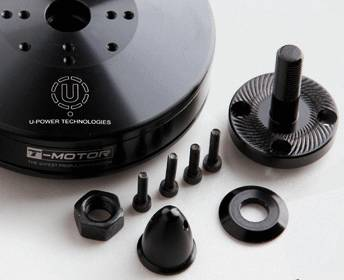

-  They have very high quality two piece 27, 28 and 29" carbon fiber
   propellers for them as well

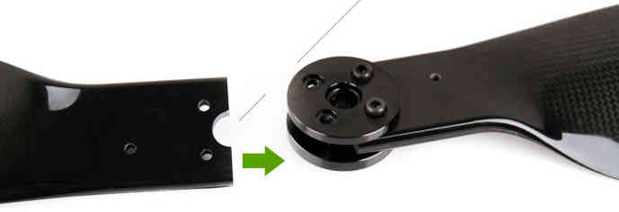

-  And a top quality 70 AMP ESC (speed controller) to go with it.

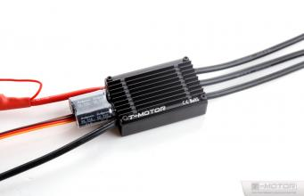

-  U8 Pro T-Motor $300.00, 28" CF Props $370.00 a pair, 70 Amp Pro ESC
   $110.00 @ four each = $2380.00.
-  These are used in the large Steadidrone Quadcopter shown above,
   clearly a top quality professional and expensive product.
-  This is a very heavy lift and long endurance copter and is completely
   excessive and hazardous for most uses and needs.
-  This combination will work well for a Quadcopter with a total weight
   of up to 24 pounds and can achieve 40 minute flight times.
-  This is a copter designed for very serious uses that demand its
   heavy lift and long endurance capabilities and is not for amateurs.
-  Disaster relief, search and rescue, fire spotting, surveillance,
   ecological and geographical survey and mapping are appropriate uses.

Professional Grade Power System for Medium Quadcopters (16" Propellers)
-----------------------------------------------------------------------

-  Clearly, applying similar quality to a more reasonably sized (and
   cost) copter is normally going to be a lot more practical.

   -  A `380KV T-Motor 4008 <http://www.rctigermotor.com/html/2013/Professional_0912/52.html>`__ 
      is $85.00, 16x5 CF Prop $90.00 a pair and 30 Amp Pro ESC $50.00 @
      four each = $720.00.
   -  This setup will work well for a copter up to 10 pounds or so and
      provide exceptional durability, efficiency and endurance.
   -  This is a very practical setup for a professional Quadcopter for
      photo or video use with full sized cameras and a brushless gimbal.
   -  It can be set up to let you choose 4S 14.8 volt, 5S 18.8 volt or
      6S 22.2 volt batteries and 14" to 17" props according to your
      total weight.
   -  With a proper setup you could reasonably expect to achieve
      practical 30 minute plus flight times with full camera equipment.

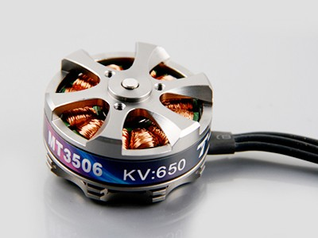

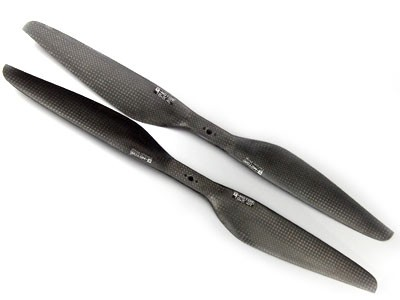

-  This is a very superior ($120.00) `KDE 4014XF-380KV Motor <https://www.kdedirect.com/products/kde4014xf-380>`__ with 3 large
   replaceable ABEC bearings rated at about 200 hours.

   -  This motor is capable of using 13" to 18" propellers and operating very efficiently with a wide range of batteries from 3 cell to 6 cell.
   -  This KDE Motor has a phenomenal range of operation and can be used on a 7 pound to a 20 pound Quadcopter.
   -  Every component and manufacturing technique was clearly optimized to produce the best possible motor without compromise.
   -  This motor has a finned heat-sink case and a self ventilated design with high temperature encapsulated components.
   -  In fact it is designed to run, if necessary, continuously at temperatures that would instantly destroy most other motors.
   -  It is reasonable to expect that various configurations could provide well over an hour of useful operating time with cameras.
   -  It is feasible to produce a QuadCopter that will approach the performance of the $15,000.00 Steadidrone at a fraction of the cost.
   -  A similar practical lifting capability and nearly 40 minute useful flight times should be achievable even with 18" Propellers.
   -  And given the extreme over design and ruggedness of the motors, similar reliability and longevity could also be expected.
   -  This is the motor I will be using in my next Quadcopter and I will allow for up to 18" propellers.

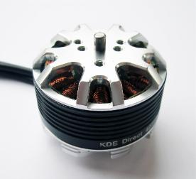

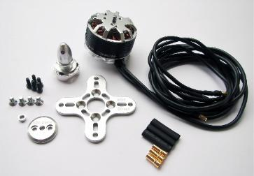

A Hyper Efficient Medium Small Professional Grade Motor For Long Endurance
--------------------------------------------------------------------------

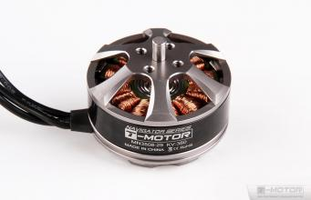

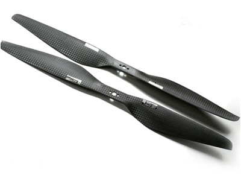

-  The $70.00 \ `T-Motor MN3508 380KV Navigator series motor <http://www.rctigermotor.com/html/2013/Navigator_0910/36.html>`__
   is ideal for long flight time applications.
-  This is the only motor in this size that can get G/W efficiencies
   over 17 at 50 percent throttle.
-  If you want to build a 4-8 pound copter for maximum endurance this is the motor to use with a 4 cell LiPo.
-  Because of its extremely high efficiency in its hover range it is also a candidate for high efficiency lithium batteries.
-  Panasonic or LG's high power Lithium batteries have about twice the energy density of the LiPos we normally use.
-  But maximum discharge is only 2C so low current draw is required, the high efficiency of these motors can provide that.
-  Carbon fiber 14" to 16" propellers will be required.

Professional Grade Power System for Small Quadcopters (10" - 14" Propellers)
----------------------------------------------------------------------------

-  The largest market segment is for Quadcopters in frame sizes that use
   10 to 14 inch propellers and weigh 3 to 7 pounds.

   -  The `650 KV T-Motor MT3506 <http://www.rctigermotor.com/html/2013/Professional_0912/49.html>`__ 
      at $65.00 is a high quality small but powerful pancake that can turn props from 11" to 14" diameter.
   -  With a 3 cell LiPo battery and T-Motor 14" prop at $73.00 a pair it can lift up to 7 pounds and achieve very good endurance.
   -  Add 4 T-Motor 18 Amp ESCs at $27.00 @ four each = $514.00 for top quality motors, props and ESCs.
   -  This small pancake motor can achieve good efficiency with 3S 11.1 volt or 4S 14.8 volt LiPo batteries and an appropriate sized prop.
   -  The frame should be sized to accept up to 14" propellers and various battery configurations.
   -  It should be configurable to achieve 20+ minute flight times with a GoPro size camera and brushless gimbal plus FPV or telemetry.
   -  This would still be a very capable and rugged Quadcopter capable
      of professional results and reliability.

-  The above Motor / Propeller / ESC setups are all as close to
   professional quality as we can currently make them.

Consumer Grade Power System for Medium Quadcopters (15" - 16" Propellers)
-------------------------------------------------------------------------

-  It is also possible to build a reasonably reliable and efficient
   Quadcopter using less expensive components.

   -  The $45.00 `SunnySky 390KV X4112S <http://www.himodel.com/electric/SUNNYSKY_X4112S_400KV_Outrunner_Brushless_Motor_for_Multi-rotor_Aircraft.html>`__
      motor or the really low cost $18.00 `RCTimer 5010-14 <http://rctimer.com/product-575.html>`__ 360KV motors.
   -  Which will work well with an easy to install and low EMF $40.00
      Hobbywing four in one ESC.

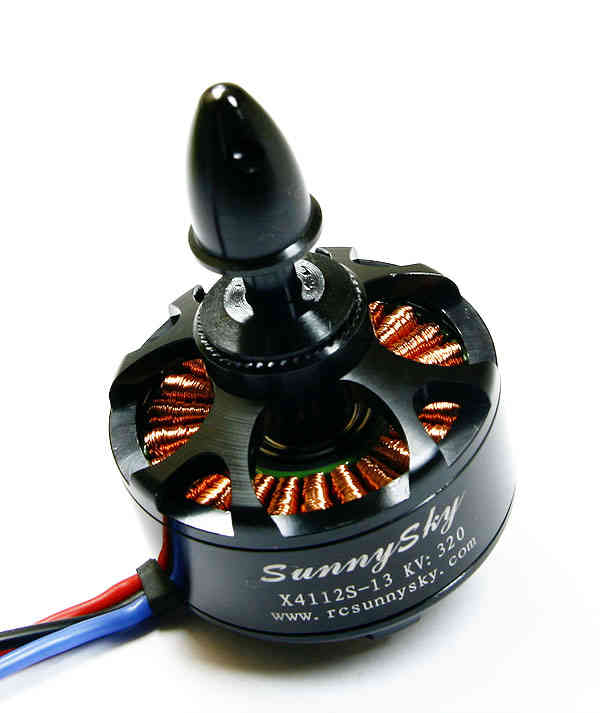

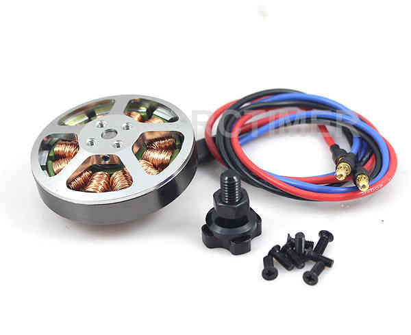

.. image:: ../../../images/3281_dimg2.jpg
    :target: ../_images/3281_dimg2.jpg

-  And they both work well with RCTimer 15x5.5" (4 for $28.00) or
   16x5.5" (4 for $35.00) CF propellers.

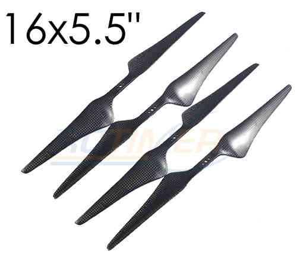

-  The Sunnysky Combo will cost about $260.00 and work very efficiently for copters up to about ten pounds.
-  The RCTimer Combo will cost about $150.00 and will provide extended flight time for copters up to about 6 pounds.
-  These motors will both actually support up to 17" propellers and work with 3 to 6 cell LiPo batteries.
-  You could still design a copter that would get 30 minute flight times while carrying a GoPro and gimbal if desired.
-  The frame for either of these motors should be designed to support at least 16" prop diameter and 17" would be better.
-  These will not last as long nor be as reliable as the previous T-Motor configurations but will still deliver lots of solid use.

Consumer Grade Power System for Small Quadcopters (8" - 12" Propellers)
-----------------------------------------------------------------------

-  Here is a durable and low cost alternative for powering smaller hobby
   or even semi-pro sub 5 pound Quadcopters.

   -  The `DJI 2212 Motors <http://www.ebay.com/itm/like/231128616387?lpid=82>`__
      provided with their low cost ARF Flamewheel Quadcopters are unusually durable and cost $24.00 each.
   -  And DJI's specially hubbed 10" plastic props at $8.00 a pair are well balanced, efficient and rugged.
      
      .. image:: ../images/dji-motor01.jpg
          :target: ../_images/dji-motor01.jpg
      
      .. image:: ../images/DJI-PROP-1038-2.jpg
          :target: ../_images/DJI-PROP-1038-2.jpg|DJI-PROP-1038-2|

-  And this easy to use $40.00 four in one ESC eliminates a power
   distribution board, reduces EMF and provides good reliability.

   .. image:: ../../../images/3281_dimg2.jpg
       :target: ../_images/3281_dimg2.jpg

-  For $150.00 you can actually get quite a useful and durable power
   system for a smaller sub five pound quadcopter.

The $40.00 SunnySky X4108S pancake motor is also capable of being used on Quadcopters lifting up to 10 pounds.

-  It is well regarded, efficient and durable and is suitable for use with 14" or 15" propellers and 4 cell to 6 cell LiPo batteries.

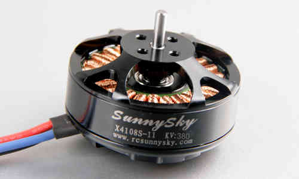

-  Clearly these are not the only alternatives.

   -  If you want to use your copter for constant, professional use you will want something like the first 3 configurations.
   -  For occasional, hobby or non-critical use for flying, FPV and / or personal video or photography the others should be OK.
   -  The KDE and Pro T-Motors bearings will last longer and are more weather proof and reliable than the less expensive alternatives.
   -  And the more expensive Carbon Fiber props are more efficient, better balanced and more durable than cheaper alternatives.
   -  But properly installed on an appropriate copter the less expensive alternatives listed can provide many reliable hours of flying.
   -  I have favored slow speed pancake motors because efficiency and flight time benefit from the larger propellers they can use.

-  The above illustrates just some of the possibilities in identifying an appropriate power system for your project.

The MultiCopter Frame
=====================

There are many types of frames and it is most important to put together a frame that is appropriate for your use.

-  There are a lot of Multicopter frame types and many are available as bare frame kits or Almost Ready To Fly or Ready To Fly copters.

   -  Most professional grade Multicopters are made from fiberglass and carbon fiber cut tubing and plate.

      -  Carbon fiber is very strong, but is also brittle and can
         shatter on impact, it is also hard to machine and to glue to.
      -  Fiberglass weighs a bit more for equivalent strength but is
         more shatter resistant and easier to machine and glue to.
      -  Fiberglass or carbon fiber tube and sheet construction are very
         suitable to use for making your own copters.

   -  Many consumer grade Multicopters are made with injection molded
      plastic parts and aluminum tubing.

      -  Some injection molded parts can be very durable (the Iris's
         Zytel frame arms for instance), but others are cheap and break
         easily.
      -  Square aluminum tubing frame arms are common, but they tend to
         bend or break with annoying frequency in normal mishaps.
      -  Except in specialized welded H or box frames aluminum tubing
         frame arms are sub optimal and will not be covered in depth
         here.

   -  Some of the newer, smaller, commercially made Quadcopters have
      monolithic injection molded plastic shells.

      -  On smaller copters these shells can be quite durable but they
         would be too fragile on larger ones even if mold costs were
         justified.

   -  A few Quadcopters have monolithic shells made from vacuum formed
      laminated Kydex or other plastic sheet

      -  Vacuum formed shells of laminated Kydex have proven very
         durable on small copters and are very good for waterproof uses.
      -  At least one vacuum formed copter has been made with built in
         blade guards the Safe Flight 4410 (unfortunately out of
         business).

   -  Hand laid fiberglass or carbon fiber is also popular on high end
      quadcopters.

      -  There are some very attractive, hard to get and not inexpensive
         hand laid fiberglass and carbon fiber shells made by "DeX".
      -  There are also a variety of fiberglass shells for civilian,
         commercial and military use including an amphibious one.
      -  Fiberglass shells tend to be expensive and may get damaged in
         use and can be difficult to repair.

   -  Each type of construction has advantages and disadvantages and it
      is very important to figure out what is important for your needs.
   -  Prop to prop and prop to frame clearance limit the max diameter of
      your propeller blades.

      -  Allowing for various prop diameters will let you tune the
         copter for its current weight, batteries and function..
      -  Generally allow an additional half inch of clearance from prop
         tip to tip or to center frame to avoid asymmetrical prop wash
         vibration.
      -  A major design criteria is to size the frame appropriately for
         the largest propellers you might ever want to use.
      -  Generally bigger propeller diameter equals better efficiency
         and an X frame layout normally permits the largest possible
         props.
      -  Of course the motor speed and power and frame strength have to
         be matched to the propeller diameter and to total lifting
         capacity.
      -  Pancake Low KV, Low RPM motors can turn bigger propellers
         efficiently.
      -  It is possible to overlap prop tips if you have one above the
         other, but it does affect efficiency and induces asymmetric
         vibration.
      -  Big slow props can have adverse vibration, instability, gust
         compensation and response rate issues also so that is a
         downside.

   -  The additional motors of Hex and Octocopters can permit single
      motor out recovery and provide for smoother flight for photo uses.

      -  But they need to use smaller propellers because of motor to
         motor clearance which is less efficient resulting in shorter
         flight times.
      -  There is also additional cost and weight of the frames and
         extra motors and propellers.
      -  And, the overall increase in complexity also reduces
         reliability.
      -  High quality extended service larger pancake motors and props
         are just starting to become available.
      -  So we are likely to see a shift to large Quadcopters from
         Hexacopters and Octocopters even for professional and
         commercial uses.

The Carbon Fiber or Fiberglass Tube and Plate Frame
---------------------------------------------------

The carbon fiber or fiberglass tube and plate frame is popular because
it is strong and light and easily manufactured.

-  The `Tarot 650 <http://www.helipal.com/tarot-fy650-quadricopter-frame-set.html>`__
   is a typical layout medium sized carbon fiber Quadcopter frame that
   can work with up to 17" propellers.

   -  It features folding arms and landing gear.
   -  Its ability to support pancake motors and 17" props means it can
      provide long flight times.
   -  Some people have said the quality of construction is not as good
      as it could be but for $125.00 it is an amazing bargain.

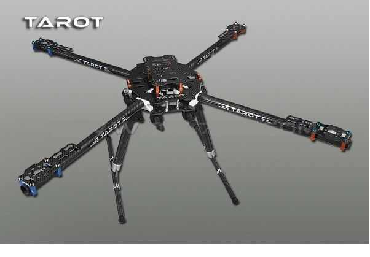

-  Fabrication requirements and techniques for fiberglass and carbon
   fiber tube and plate copters.
-  On the copters shown above the method of attachment is by clamping
   carbon fiber tube frame arms with aluminum brackets.

   -  This is because of the difficulties in attaching carbon fiber
      parts as well as the stress that can result from drilling the
      tubing.
   -  Fiberglass is not quite as strong or light as carbon fiber but it
      is more flexible and easier to join and machine.

-  If what you need is available in a commercial frame kit you are
   normally better off buying it as you will spend more making your own.

   -  It will also take a lot of time and effort to design the copter,
      to obtain the components and to, cut, drill, machine and fabricate
      them.
   -  There is also a strong possibility that design and fabrication
      mistakes and misperceptions will require that some things get
      redone.

-  If you have sufficient reason to make your own frame, tube and plate
   construction is generally the most practical for home production.
-  It is reasonable to mix materials, commonly carbon fiber frame tubes
   and fiberglass central and motor mounting plates.

   -  Carbon fiber and fiberglass tubing and plate can be cut with a
      hacksaw or power jig or band saw (with metal or fiberglass
      blades).

      -  It can also be drilled and milled with HSS or TC coated drills
         and mills, but all tooling wears out very quickly cutting these
         materials.

   -  Carbon fiber in particular is tricky to cut, drill and machine, it
      can tear, shatter or de-laminate if not done smoothly and slowly.

      -  A drill press is mandatory for carbon fiber, you cant center
         punch a pilot drill hole, so it needs to be held precisely in
         place.
      -  Avoid milling of carbon fiber if at all possible, it is very
         difficult to accomplish satisfactory results.
      -  You will see carbon fiber plates that have milled slots on
         consumer copters but these have generally been cut with a water
         jet.
      -  With carbon fiber you will generally get better results
         drilling precision placed holes rather than attempting to mill
         slots in it.
      -  You can carefully and slowly cut a carbon fiber plates exterior
         edges with a power saw and smooth them with a Dremel tool.
      -  If you must put in slots consider drilling a hole at each end
         and using a small circular saw on a Dremel or flex shaft to
         connect them.

-  It will be necessary to provide appropriate brackets to clamp
   the motor mounts and central hub to the frame arm tubes.

   -  Tubing needs to be clamped but must not be "crushed", silicone or
      rubber gasket can provide protection and vibration isolation.
   -  Hardware should be aluminum or stainless steel machine screws and
      you can use Nylok nuts or "Blue" Loctite on regular nuts.
   -  Plate separation and mounting can be provided with Nylon or
      aluminum standoffs.
   -  (Note: It would be really nice if somebody made an X internal
      slip-glue fit ferrule for the center of the frame tubes but they
      don't - yet!)

-  There are a wide variety of Carbon fiber and epoxy fiberglass
   components to choose from.

   -  Carbon fiber products are available from \ `RockWest Composites <https://www.rockwestcomposites.com/>`__ and `Carbon Fiber Tube Shop <http://www.carbonfibertubeshop.com>`__\ and \ `Dragon Plate <https://dragonplate.com/>`__
   -  A really good article on cutting and gluing carbon fiber products
      from \ `Carbon Fiber Tube Shop <http://www.carbonfibertubeshop.com/cut%20&%20bond.html>`__
   -  Fiberglass and Carbon Fiber products are available from: `CST Sales <http://www.cstsales.com/products.html>`__ and `ACP Sales <http://www.acpsales.com/Carbon-Fiber.html>`__
   -  A datasheet for `3M 2216 Epoxy Glue <http://multimedia.3m.com/mws/media/153955O/3mtm-scotch-weldtm-epoxy-adhesive-2216-b-a.pdf>`__
      and a source for it
      `Amazon <https://www.amazon.com/3M-Scotch-Weld-Epoxy-Adhesive-EC-2216/dp/B000WXL090/>`__
   -  A datasheet for Loctite 9430 Glue and a source for Loctite
      9340 \ `Amazon <https://www.amazon.com/Loctite-9340%C3%A2-Hysol-Adhesive-Temperature/dp/B000WXL1YE/>`__

Using manufactured Plastic and Fiberglass Components in Your Own Frames.
------------------------------------------------------------------------

-  Although often not reasonable to make yourself some parts can be used
   effectively in your own designs.
-  There are retrofit kits like the Team Blacksheep FPV subframe for a
   DJI Flamewheel quadcopter that reuse its plastic frame arms.
-  And there are many cases where components from various frames can be
   used to good effect in our own designs.
-  Clearly it is necessary to research your individual design to assure
   that the component pieces are actually available from the
   distributors.
-  Research can provide an excellent source of very desirable
   components:

-  Or the $14.00 CNC milled ultra tough `fiberglass frame arms <http://www.hoverthings.com/fliparmblack>`__ used in the
   Hoverthings Quadcopters:

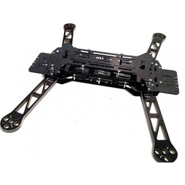

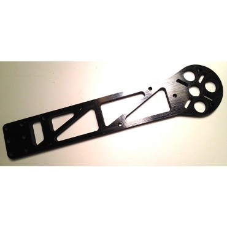

-  DJI injection molded frame arms from their Flamewheel copters are
   used in the `TBS Discovery FPV frame. <http://team-blacksheep.com/products/product:98>`__

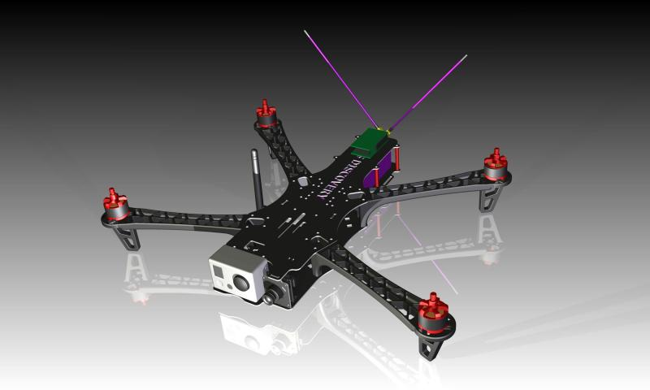

-  Clearly using manufactured parts will require research as to
   suitability and size for your project as well as actual availability.

   -  But  if you can accommodate them they can make your project
      simpler and better.

Homemade waterproof frame using a hinged electrical box
-------------------------------------------------------

An absolutely excellent, very clean, rugged and waterproof design using
carbon fiber arms and plastic electrical and plumbing parts.

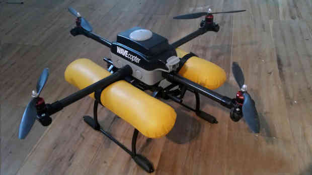

-  Here is a link to `Alec Short's construction article in Makezine <http://makezine.com/projects/wavecopter-a-waterproof-quadcopter/>`__
-  I really like the use of the central 4 way hub for stabilizing the
   tubes and the slip fit adjustable tension T's for motor mounts are
   also great.
-  The mounting of n Pixhawk or APM2.x would really require the separate
   GPS / compass module in order to work correctly.
-  There are a wide variety of latch type weatherproof electrical boxes
   which could be used for this.
-  The  main requirement is to get CF tube with an outer diameter
   appropriate to the plumbing / electrical fittings you want to use.
-  I'll definitely be visiting the electrical and plumbing section the
   next time I'm in Home Depot.

Vacuum Formed Frames and Components.
------------------------------------

-  Although this is specialized and requires a vacuum forming "press" it
   may be justified for some applications.

   -  A vacuum molding press can be made relatively inexpensively that
      can make whole small shell type frames or for components.
   -  Copters made this way can be made weather tight and even water
      proof and they can be incredibly tough.
   -  Kydex is a laminated plastic sheet that produces a quite strong
      monocoque shell when molded properly.
   -  The no longer in production Safe Flight Copters SFC4410-1 vacuum
      formed propeller protected H Quad Frame.

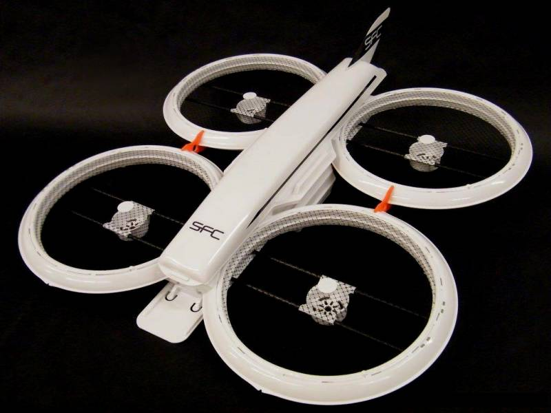

-  And the inexpensive ($120.00) and extra tough, water proof
   `Aquacopter frame <http://www.aquacopters.com/>`__

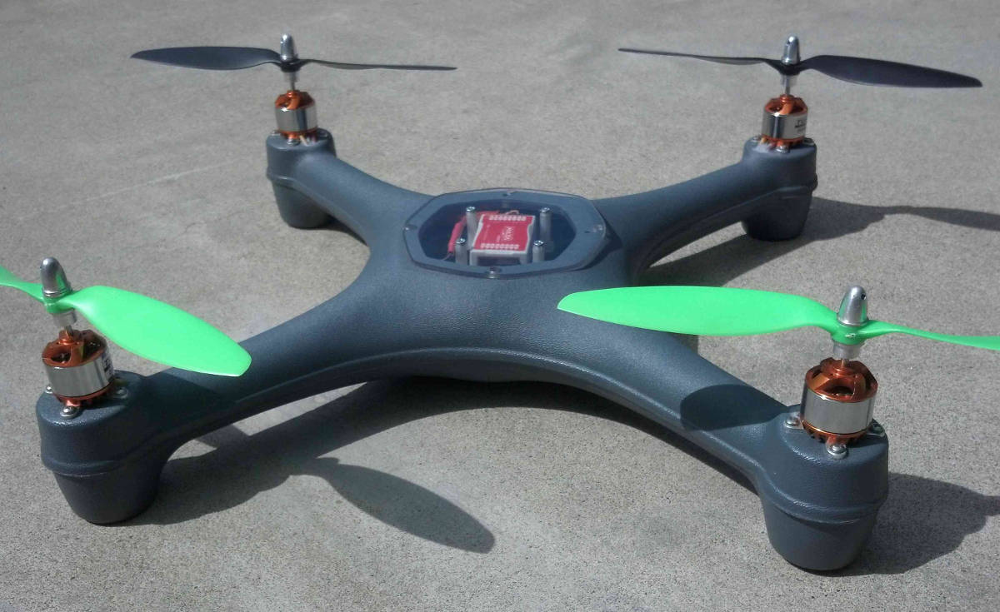

-  A fully functional vacuum forming system can actually be constructed
   with a shop vacuum and an electric grill.

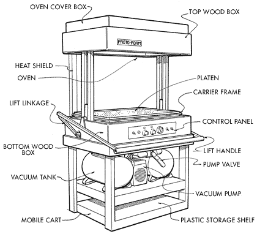

-  Vacuum forming can also be used to make central shells for copters
   with tube, plastic or fiber glass frame arms.
-  This may be over specialized for most uses, but if you want to make
   tough, light central frame shells or covers.
-  Or, if you want to build multiple small to medium Quadcopters that
   are tough and waterproof this could be just the ticket.
-  (Or you could just buy an Aquacopter frame!!!)

Specific Building Examples and Techinques
=========================================

-  Some design considerations for a medium large, high efficiency, heavy
   lift Quadcopter build.

   -  A simple, rugged and very versatile X Quadcopter with a frame
      sized large enough to accept 18" diameter propellers might
      include:
   -  High quality 20mm carbon fiber tube frame arms with SteadiDrone
      motor mounts and central frame tube clamps from EBay or China.
   -  Cut and drilled carbon fiber or fiberglass top and bottom central
      frame plates mounted to the tube clamps and standoffs.
   -  A custom or commercial off the shelf landing gear system.
   -  An optimal Pro configuration might include the top rated
      $120.00 KDE 4014XF-380KF motors and a 30 amp 3 - 6 cell  four in
      one ESC.

      -  The motors and ESC would cost about $540.00 and you would get a
         copter tuneable to lift up to 20+ pounds in total weight.
      -  It is reasonable to get this configuration to achieve usable 60
         minute flight times even with photo or video equipment aboard.

   -  A more conservative hobby configuration might include the $40.00
      SunnySky X4108S 380KV motors and a 25 amp four in one ESC.

      -  The motors and ESC would cost about $200.00 and you would get a
         copter tuneable to lift up to 10+ pounds in total weight.
      -  Even with this setup you could achieve usable flight times in
         excess of 30 minutes with small to medium consumer size
         cameras.

-  Some additional features that need to be considered are:

   -  A third frame plate under the two frame tube sandwiching plates
      can accommodate the batteries, ESCs and Receiver.
   -  A vacuum formed, fabricated or adapted top and bottom shell can
      weatherproof the copter and increase its resistance to mishaps.
   -  This frame is less than 27" from corner to corner, but props can
      be removed for transport or folding arms could be incorporated.
   -  This frame will be very light and strong and it will allow lots of
      latitude in how it is set up and it will be easy to upgrade.
   -  Its ability to accept larger props even with an inexpensive power
      system will provide much better than average flight times.

   -  The copters capabilities will be according to the power system
      selected, the battery combination used and the total weight.
   -  You can include a camera gimbal under the center plate, make sure
      the landing gear does not interfere with the cameras view.
   -  The landing gear should minimize interference with prop wash and
      provide strong, resilient and stable support.
   -  If you really are determined to build your own frame, this is a
      really good place to start.

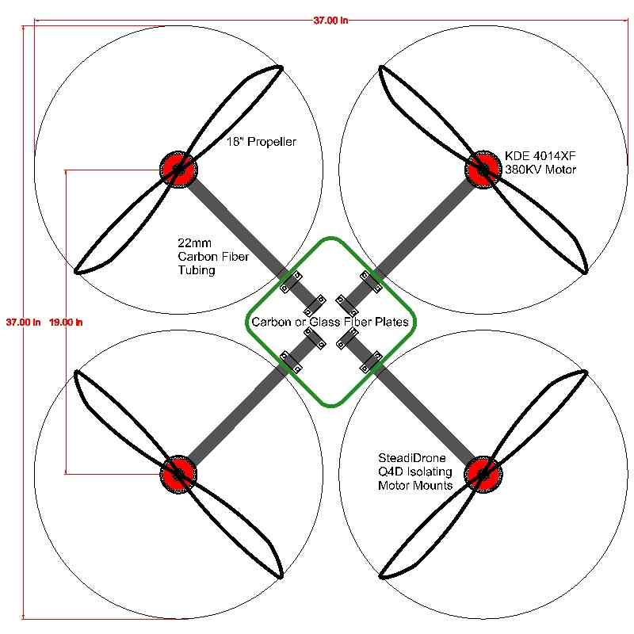

-  The above design is a very capable pro-grade Quadcopter with an
   exceptionally wide performance and endurance envelope.

A Small Quadcopter Optimised to Use High Efficiency Lithium Batteries
---------------------------------------------------------------------

-  Modern ultra efficient Lithium batteries can have nearly twice the
   energy per unit weight of the LiPo batteries we normally use.
-  3300 mah 3.7volt Panasonic NCR18650B batteries weigh 47 grams versus
   a normal LiPo equivalent of about 100 grams per cell.
-  Their disadvantage is that their maximum discharge rate is only 2C so
   6.6 Amps.
-  They will also last for many times the number of charge discharge
   cycles of our normal LiPos.
-  Used properly a copter using these batteries can get nearly twice the
   flight time of one with the same weight of LiPo batteries.
-  The most important factor in designing a copter to use these
   batteries is to keep the weight low enough that their is sufficient
   current.
-  This quadcopter design uses carefully selected T-Motor MT2206 1200 KV
   30 gram motors and 10" props with a light carbon fiber frame.
-  It includes a 2S 2P 6600mah lithium battery, autopilot,
   receiver and even an FPV camera and transmitter.
-  It weighs about a pound and since the battery is 2 parallel it can
   provide 13.2 amps of current (max current is less than 10 amps.)
-  `Xcalc computations <http://www.ecalc.ch/xcoptercalc.php?ecalc>`__
   show that a hover time of 60 minutes might be possible with a
   realistic fly around time of about 30 minutes.

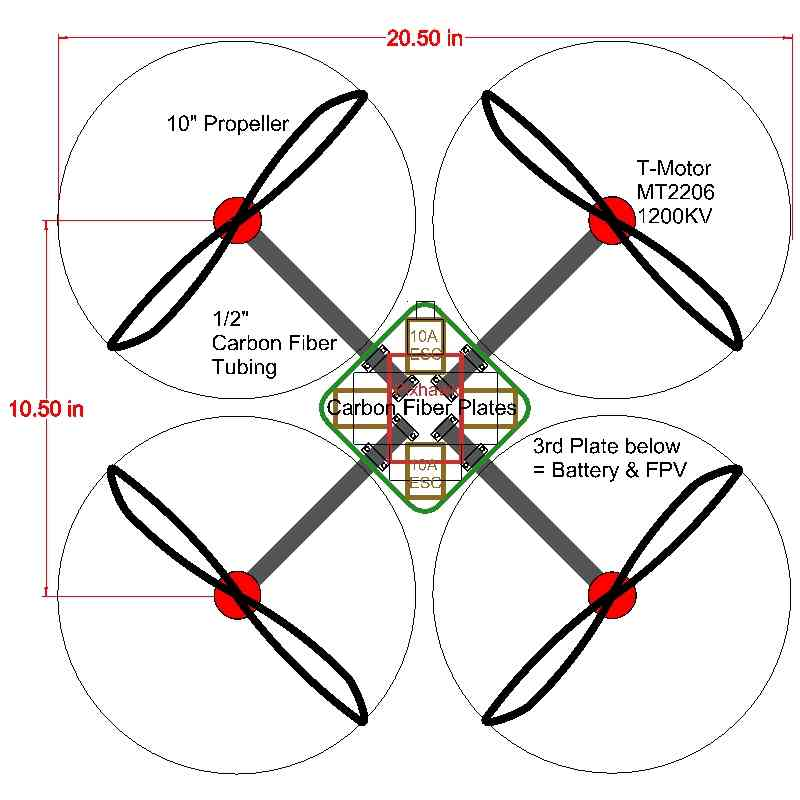

This is an easy to build example of a practical and rugged design with
exceptional capabilities and double the normal flight time.

Links To Specific MultiCopter Builds
====================================

-  Here is a link to Forrest Franz's build of a very simple, very light
   weight, very strong \ `carbon fiber Quadcopter frame <https://diydrones.com/forum/topics/build-your-own-copter-part-iii?xg_source=activity>`__

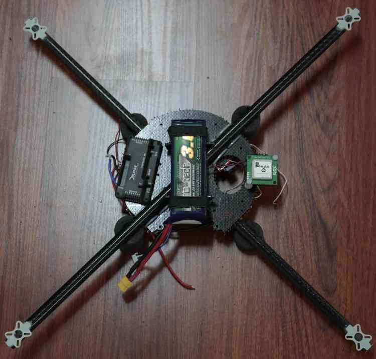

-  And some links to some of Forrests extremely ambitious copter
   building techniques and concepts.

   -  `building-copters-with-round-tubes-stronger-lighter-easier <https://diydrones.com/forum/topics/building-copters-with-round-tubes-stronger-lighter-easier-to?groupUrl=arducopterusergroup&>`__
   -  `build-your-own-copter-part-ii <https://diydrones.com/forum/topics/build-your-own-copter-part-ii>`__
   -  `build-your-own-copter-part-iii <https://diydrones.com/forum/topics/build-your-own-copter-part-iii>`__
   -  `build-your-own-copter-part-iv <https://diydrones.com/forum/topics/build-your-own-copter-part-iv>`__

-  And here is a link to Luke Cook's very serious, very well thought out
   and meticulously executed \ `OctoCopter Build <https://diydrones.com/profiles/blogs/octocopter-scratch-build>`__

   .. image:: ../images/octocopter_luke_cook.jpg
       :target: ../_images/octocopter_luke_cook.jpg

-  A link to Stuart Dodin's really nice X8 heavy lifter Octocopter

   .. image:: ../images/x8_octocopter_stuart_dodin.jpg
       :target: ../_images/x8_octocopter_stuart_dodin.jpg

A Commercial MultiCopter Exhibiting Advanced Design Concepts
============================================================

Here is an example of an excellent QuadCopter design: the Aeryon
SkyRanger for high end UAV applications.

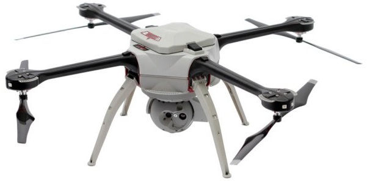

This copter has a lot of things right and is really a study in good
design and quality construction.

#. The rotating ball full enclosure camera Gimbal provides good weather
   protection and improved performance.
#. The motors are on the bottom under the arms.

   #. More aerodynamically efficient with no prop wash interference and
      very little intake interference.
   #. Noticeably increased flight times, greater lift capability and
      quieter as well.

#. High torque, low KV "pancake" style motors and slow turning, large
   diameter, high efficiency props.

   #. This is much more efficient than faster motors with smaller
      diameter conventional design props.
   #. This also increases flight times and load capacity and reduces the
      sound footprint.

#. Tapered carbon fiber frame arms are more aerodynamically efficient
   and are light and very strong.
#. The fully enclosed weather tight framework with snap latch type
   access makes maintaining the copter easy.
#. A simple spring loaded landing gear provides for uneven landing sites
   and minimal interference with the prop wash.

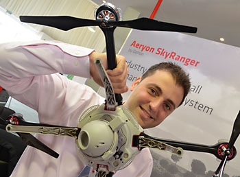

This QuadCopter incorporates several excellent design concepts and shows
what can be done without budget constraints.

The Skyranger has features we can use in our own designs but it is
important to understand all designs are compromises.

The 3DRobotics Iris is one of the best designed QuadCopters that you can
actually get and it is a real bargain.

Conclusion and Additional Design Considerations
===============================================

-  I have not covered either 3D printing or CNC machining.

   -  These are both perfectly valid techniques for either whole frames
      or for parts or accessories.
   -  But most people do not have the equipment or capability which is
      why they are not covered here.
   -  Clearly if you have either of these capabilities they can greatly
      enhance your copter projects.

-  I have also not covered in depth hand laid fiberglass or carbon fiber
   or vacuum bagging.

   -  You can make Dynamite frames or shells this way but this too
      requires serious individual skill  and capability (especially
      carbon fiber).

-  I have also not gone into detail about the engineering criteria for
   multicopters:

   -  A. I don't know.
   -  B. From what I've seen very few people do.
   -  C. One who does is Paul Pounds PHD and here is his Paper on the
      subject: \ `Quadrotors <http://eprints.qut.edu.au/33833/1/33833.pdf>`__

-  If you stick to a simple design and try to keep frame arm to a simple
   single small tube under the prop wash it will work fine.

   -  Round tubing has about half the flat plate area (prop wash
      interference) as the same sized square tubing.
   -  You can improve efficiency by putting the motor prop under the
      frame arm but then there are frame design and clearance issues.

-  Try to keep the weight centralized as much as possible and keep the
   autopilot near the horizontal center if possible.

   -  So that the copter tends to roll and pitch as though pivoting
      around the center of mass and around the autopilot.
   -  However it is not as critical as some people have made it out to
      be because the stabilizing throttles will automatically
      compensate.

-  You can do a lot with a rudimentary understanding of the forces
   involved, if you need more it is a career, not a hobby.
