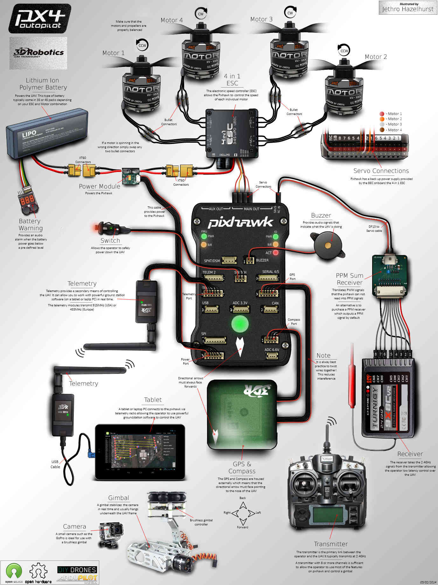

.. _advanced-pixhawk-quadcopter-wiring-chart:

========================================
Advanced Pixhawk Quadcopter Wiring Chart
========================================

Jethro Hazelhurst produced this magnificent Pixhawk wiring chart for a
Quadcopter for us.

(Control Scroll wheel will let you zoom in on the image below!)

This chart Illustrates a quadcopter with a variety of options.
~~~~~~~~~~~~~~~~~~~~~~~~~~~~~~~~~~~~~~~~~~~~~~~~~~~~~~~~~~~~~~

-  A 4 in 1 ESC is used instead of individual ESCs reducing EMF and
   allowing a neater installation and no power distribution board.
-  Actual Motor number to Quadcopter frame location is shown below and
   will require appropriate signal and motor wire routing.

-  A 3DR PPM-Sum encoder with conventional receiver is illustrated, A
   PPM-Sum receiver could be used instead.
-  Generally a 3S or 4S LiPo battery is appropriate for a Quadcopter and
   the XT60 connectors shown are a reliable choice.
-  An optional battery warning indicator can provide quick battery
   status and provide an audible warning when nearby.
-  Optional 3DR telemetry radios may be connected to your Pixhawk and
   tablet or laptop to permit real time monitoring and operation.

   -  A (GCS (Ground Control Station) program like Mission Planner,
      AndroPilot or DroidPlanner provides in flight information and
      control.

-  An optional GoPro camera and brushless gimbal are illustrated and can
   provide very high quality photo and video results.

   -  It is quite reasonable to use a GoPro camera and brushless gimbal
      on 400 and larger Quadcopters.
   -  Brushless camera gimbals perform more smoothly and adequately than
      the older servo type gimbals.
   -  The brushless gimbal illustrated above has an anti-vibration mount
      which is important for good photo results.
   -  For cameras larger than GoPro or "Sport" types, a larger
      QuadCopter, HexaCopter or OctoCopter should be used.

-  You could also install an optional FPV (First Person View) video
   system but it is not shown in the illustration above.

   -  An FPV system consists of a tiny video camera and transmitter on
      the copter plus a receiver and video goggles or an LCD screen.
   -  Almost any size Quadcopter can support a First Person View system.
   -  An optional OSD (On Screen Display) can add a video heads up
      display of current in flight conditions to your FPV flight
      display.

-  The telemetry, camera, gimbal, FPV and OSD options mentioned above
   can be combined as you wish for your copter but start simple.
