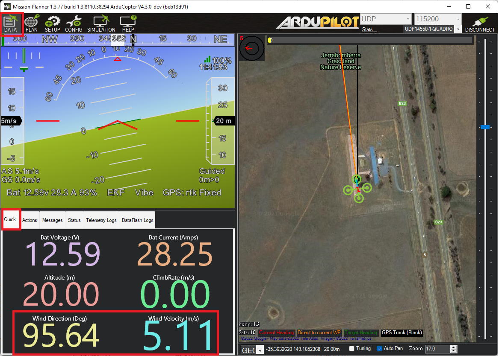
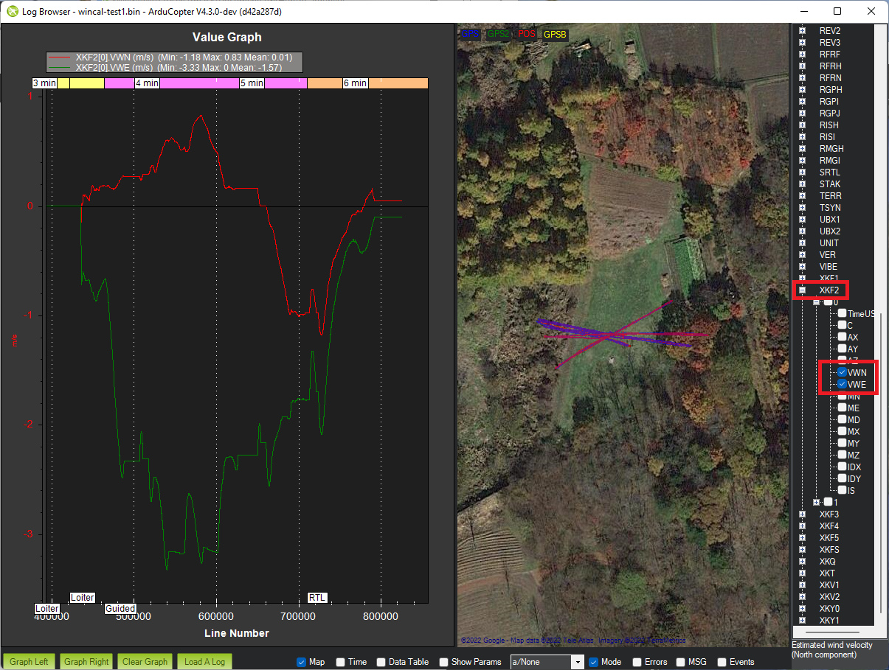

.. _airspeed-estimation:

==========================================
Windspeed Estimation and Baro Compensation
==========================================

ArduPilot's :ref:`EKF<common-apm-navigation-extended-kalman-filter-overview>` can estimate the windspeed a multicopter is flying in without requiring an airspeed sensor.  This can be useful information for the pilot but it can also be used to compensate for wind related barometer interference.  This interference can occur on vehicles where the autopilot is exposed to the open air and can lead to the vehicle climbing or descending a few meters especialy after slowing down from fast-forward flight.

The mechanism and setup are explained below.

.. youtube:: xVVtvVuZGQE

Calculate the Body Drag Coefficient
-----------------------------------

Weigh the vehicle including the battery.  The weight should be expressed in kg.

Measure the front and side area of the vehicle in m^2 using one of the methods below

- Take two pictures of the vehicle (one of the front, one of the side) from a few meters away
- Measure the surface area in cm^2 using one of these online tools:

  - Use `this free online tool <https://yomotherboard.com/add-grid-to-image/>`__ to overlay a grid on the image.  Scale the size of the grid squares to match the known width or length of the vehicle (in cm).  Count the total number of squares which include parts of the vehicle (do not including propeller blades).  This is the area in cm^2

    .. image:: ../images/windspeed-drag-coef-iris.png
        :target: ../_images/windspeed-drag-coef-iris.png
        :width: 450px

  - `SketchAndCalc <https://www.sketchandcalc.com/>`__ offers a free trial (1hr only) and makes it relatively easy to scale and then measure the area (in cm^2) of a polygon drawn over the vehicle

    .. image:: ../images/windspeed-drag-coef-iris-sketchandcalc.jpg
        :target: ../_images/windspeed-drag-coef-iris-sketchandcalc.jpg
        :width: 450px

- Divide the area by 10,000 to convert from cm^2 to m^2

Update the drag coefficient parameters

- :ref:`EK3_DRAG_BCOEF_X <EK3_DRAG_BCOEF_X>` = mass in kg / frontal area in m^2
- :ref:`EK3_DRAG_BCOEF_Y <EK3_DRAG_BCOEF_Y>` = mass in kg / side area in m^2

For the IRIS shown above:

- Weight: 1.45kg
- Frontal area: 203 cm^2 = 0.0203 m^2
- Side area: 217 cm^2 = 0.0217 m^2
- :ref:`EK3_DRAG_BCOEF_X <EK3_DRAG_BCOEF_X>` = 1.45kg / 0.0203 m^2 = 71.4
- :ref:`EK3_DRAG_BCOEF_Y <EK3_DRAG_BCOEF_Y>` = 1.45kg / 0.0217 m^2 = 66.8

Calculate the Propeller Drag Coefficient
----------------------------------------

The :ref:`EK3_DRAG_MCOEF <EK3_DRAG_MCOEF>` should be calculated after performing a flight test as described `here in the video <https://youtu.be/xVVtvVuZGQE&t=1421s>`__.

1. Fly in a low wind conditions in a wide open space
2. Optionally set :ref:`LOG_DISARMED <LOG_DISARMED>` = 1 and :ref:`LOG_REPLAY <LOG_REPLAY>` = 1 to allow post flight tuning with :ref:`Replay <dev:testing-with-replay>`
3. Arm and takeoff in :ref:`Loiter <loiter-mode>` mode (this ensures the EKF has a good position estimate) and fly to the middle of the testing area
4. Switch to :ref:`AltHold <altholdmode>` and let the vehicle drift downwind to establish the wind direction and speed
5. Yaw the vehicle so the nose faces into the wind and apply full forward pitch until the vehicle has finished accelerating upwind
6. Release the pitch stick and allow the vehicle to decelerate and then drift back to the starting line
7. Reposition the vehicle to a comfortable position
8. Yaw the vehicle 90 deg (e.g. clockwise) to the wind and apply full left roll stick until the quad has finished accelerating.  Release the stick and allow the vehicle to again decelerate and drift back downwind to the starting line
9. Reposition the vehicle to a comfortable position
10. Repeat step 8 but with the vehicle facing backwards into the wind (pilot should pull back on the pitch stick to accelerate into the wind)
11. Repeat step 8 but with the vehicle's right side facing into the wind (pilot should apply full right roll to accelerate into the wind)
12. Download the :ref:`onboard logs <common-downloading-and-analyzing-data-logs-in-mission-planner>` for analysis as described in the video

The final value for :ref:`EK3_DRAG_MCOEF <EK3_DRAG_MCOEF>` is normally between 0.1 and 1.0.

Viewing Windspeed and Direction in Real-Time
--------------------------------------------

Once enabled, the estimated wind speed is sent to the ground station in real-time via the `WIND <https://mavlink.io/en/messages/ardupilotmega.html#WIND>`__ mavlink message.  If using Mission Planner, on the Data page, select the "Quick" tab, double-click on any number shown and select "wind_dir" or "wind_vel".

Viewing Windspeed recorded in the Onboard Logs
----------------------------------------------

The EKF's wind speed estimate is recorded in the onboard log XKF2 message's VWN and VWE fields

Barometer Position Error Compensation
-------------------------------------

Once wind estimation has been enabled, it can be used to compensate for the wind's effect on each barometer in each of four directions (foward, back, left right).  The method to calculate each parameter's value is discussed `here in the video <https://youtu.be/xVVtvVuZGQE&t=3486s>`__.

Perform a test flight

- Fly the vehicle nose-first into the wind, then tail-first, then right-side first, then left-side first
- Land and download the :ref:`onboard logs <common-downloading-and-analyzing-data-logs-in-mission-planner>`

Calculate the position error coefficient for each direction

- Calculate the air density (in kg/m^3) using an online calculator (`like this one <https://www.density.co.uk/calculators/density-of-air>`__)
- Calculate the static pressure error (in Pa) = -height * gravity * air density
- Calculate the dynamic pressure = 0.5 * air density * airspeed^2
- Position error coefficient = static pressure error / dynamic pressure.  This value should be between -1 and +1

Enable the compensation and copy the calculated position error coefficients into the appropriate parameters.  Below are the parameters for the first barometer.

- Set :ref:`BARO1_WCF_ENABLE <BARO1_WCF_ENABLE>` = 1 to enable and then reboot the autopilot
- :ref:`BARO1_WCF_FWD <BARO1_WCF_FWD>`: Pressure error coefficient in positive X direction (forwards)
- :ref:`BARO1_WCF_BCK <BARO1_WCF_BCK>`: Pressure error coefficient in negative X direction (backwards)
- :ref:`BARO1_WCF_RGT <BARO1_WCF_RGT>`: Pressure error coefficient in positive Y direction (right)
- :ref:`BARO1_WCF_LFT <BARO1_WCF_LFT>`: Pressure error coefficient in positive Y direction (left)
- :ref:`BARO1_WCF_UP<BARO1_WCF_UP>`: Pressure error coefficient in positive Z direction (climbing)
- :ref:`BARO1_WCF_DN<BARO1_WCF_DN>`: Pressure error coefficient in negative Z direction (descending)