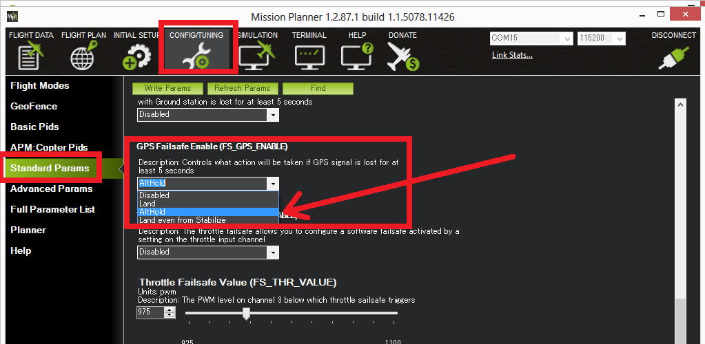

.. _archived-gps-failsafe:

======================
Archived: GPS Failsafe
======================

This page covers the set-up and testing of the GPS failsafe.

.. warning::

   **ARCHIVED ARTICLE**

   The GPS Failsafe was merged into/replaced by the :ref:`EKF / DCM Check & Failsafe <ekf-inav-failsafe>` in Copter 3.3. 

Overview
========

The GPS Failsafe is enabled by default but you can enable or disable it
on the Mission Planner's Standard Parameter List, by set the
FS_GPS_ENABLE parameter to 0 (Disable) or 1 (Land) or 2 (switch to
AltHold).  It is highly recommended to leave it enabled and no known
reason why it should ever be disabled.

If you lose GPS lock or experience a GPS Glitch for 5 seconds while in a
mode that requires the GPS (Auto, Guided, Loiter, RTL, Circle, Position
or Drift) mode it will initiate a Land (or AltHold if FS_GPS_ENABLE is
set to 2).

Additional information on the GPS failsafe and Glitch protection can be
found :ref:`here <gps-failsafe-glitch-protection>`.

Video
=====

Below is a video of a simulated GPS Failure resulting in the copter
Landing.

..  youtube:: sqofSFd0MuU
    :width: 100%
