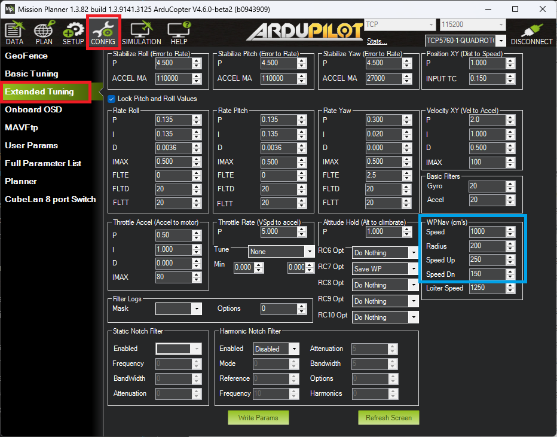

.. _auto-mode:

=========
Auto Mode
=========

In Auto mode the copter will follow a pre-programmed mission script
stored in the autopilot which is made up of navigation commands (i.e.
waypoints) and "do" commands (i.e. commands that do not affect the
location of the copter including triggering a camera shutter). This page
provides an overview of  Auto mode. 

Information on creating a mission script, can be found on
the :ref:`Planning a mission with waypoints and events <common-planning-a-mission-with-waypoints-and-events>` page. 
A full list of supported commands can be found on the :ref:`Mission Command List <mission-command-list>` page.

Overview
========

.. image:: ../images/auto.jpg
    :target: ../_images/auto.jpg

AUTO mode navigates between each waypoint in a straight line and as it approaches each waypoint follows a smooth curving path towards the next waypoint (S-Curve). It controls the path as it approaches a waypoint to be within the WPNAV_RADIUS of each waypoint. The speed is lowered below :ref:`WPNAV_SPEED<WPNAV_SPEED>`, as necessary, to keep the path within the set corner lateral acceleration limit parameter (:ref:`WPNAV_ACCEL_C<WPNAV_ACCEL_C>`).

.. note:: this smooth curving path as it changes direction to the next waypoint will not occur if the next naviation mission item after the waypoint is anything other than a normal waypoint, ie LAND, LOITER_TURNS, etc., etc. In these cases the copter will approach the waypoint, stop, and then proceed to the next navigation waypoint instead of smoothly curving in front of it and proceeding to that next navigation waypoint. Also, small :ref:`WPNAV_RADIUS<WPNAV_RADIUS>` values will require that the curve be very small, effectively appearing like the non-S-Curve behavior explained above.

AUTO mode incorporates the altitude control from :ref:`AltHold mode <altholdmode>` and position
control from :ref:`Loiter mode <loiter-mode>` and should not
be attempted before these modes are flying well.  All the same
requirements apply including ensuring that vibration levels and compass
interference levels are acceptable and that the GPS is functioning well
including returning an HDOP of under 2.0.

Controls
========

AUTO should be set-up as one of the :ref:`Flight Modes <flight-modes>`
on the flight mode switch.

You must arm your copter before you can engage AUTO mode. See
:ref:`Arming the motors <arming_the_motors>` for details on how to arm
your copter.

.. note:: The :ref:`AUTO_OPTIONS<AUTO_OPTIONS>` parameter can be used to alter this behaviour, allowing arming while in AUTO mode, and/or, allowing a mission takeoff command to start upon AUTO mode entry, even if the throttle has not been raised.

If starting the mission while the copter is on the ground the pilot
should ensure the throttle is down, then switch to the Auto flight mode,
then raise the throttle.  The moment that the throttle is raised above
zero, the copter will begin the mission.

If starting the mission from the air the mission will begin from the
first command the moment that the flight mode switch is moved to Auto.
If the first command in the mission is a take-off command but the
vehicle is already above the take-off command's altitude the take-off
command will be considered completed and the vehicle will move onto the
next waypoint.

At any time the pilot can retake control from the autopilot by returning
the flight mode switch to another flight mode such as Stabilize or
Loiter.  If the pilot then switches to AUTO again, the mission will
resume from the last command.

During the mission the pilot's roll, pitch and throttle inputs are
ignored but the yaw can be overridden with the yaw stick.  This allows
the pilot to for example aim the nose of the copter (which might have a
hard mounted camera on it) as the copter flies the mission.  The
autopilot will attempt to retake yaw control as the vehicle passes the
next waypoint.

Missions can be entered, amended through the Mission Planner's Flight
Plan screen.  Please refer to the :ref:`Mission Command List wiki page <mission-command-list>` for a
full list of supported commands along with a short description of each.

Ending a Mission
================

Missions should normally have an RTL as their final command to ensure
the copter will return after the mission completes.  Alternatively the
final command could be a LAND with a different location.  Without a
final RTL or LAND command the copter will simply stop at the final
waypoint and the pilot will need to retake control with the transmitter.

Remember that when using RTL, the copter will return to the "home"
position which is the location where the copter was armed.

As the copter touches down at the end of the mission the vehicle should automatically disarm but occasionally the vehicle may not sense the landing and the pilot may need to hold the throttle down and takeoff in another mode like Stabilize or Loiter and then manually disarm the vehicle.

Tuning
======

AUTO mode incorporates the altitude control from :ref:`AltHold mode <altholdmode>` and position
control from :ref:`Loiter mode <loiter-mode>`.

The maximum horizontal speed of the copter can be adjusted with the
**Speed** (:ref:`WPNAV_SPEED<WPNAV_SPEED>`) parameter from the Mission Planner's
Config/Tuning >> Copter Pids screen (see blue box above).  The default
is 1000 meaning 10m/s.  A typical copter can reach top speeds of 10m/s ~
13m/s (i.e. 1000 ~ 1300) before it becomes unable to both maintain
altitude and horizontal speed.

The vertical speeds up and down can similar be adjusted with the **Speed Up** (:ref:`WPNAV_SPEED_UP<WPNAV_SPEED_UP>`) and **Speed Dn** (:ref:`WPNAV_SPEED_DN<WPNAV_SPEED_DN>`) parameters. :ref:`WPNAV_ACCEL_Z<WPNAV_ACCEL_Z>` determines how fast the speed can change.

Other speed control related parameters that can be adjusted to manage how fast speed changes occur are: :ref:`WPNAV_ACCEL<WPNAV_ACCEL>`, and :ref:`WPNAV_JERK<WPNAV_JERK>`.

The **Radius** (:ref:`WPNAV_RADIUS<WPNAV_RADIUS>` allows you to control how close the copter must come to the exact waypoint position before the waypoint is considered "complete"
and the copter moves onto the next waypoint.  This only applies when the
waypoint command includes a delay of 1 second or more.  Without a delay
the waypoint is considered a "fast waypoint" and the copter will begin
towards the next waypoint once the intermediate target that it is
chasing has reached the waypoint (S-Curve behavior only applies to "fast" waypoints).  This intermediate target can be 10m
or more ahead of the copter (its distance ahead of the copter increases
with the Speed parameter).
