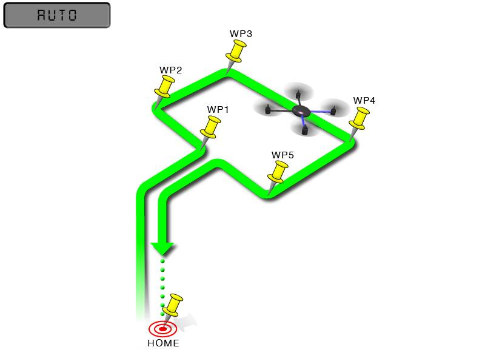

.. _auto-mode:

=========
Auto Mode
=========

In Auto mode the copter will follow a pre-programmed mission script
stored in the autopilot which is made up of navigation commands (i.e.
waypoints) and "do" commands (i.e. commands that do not affect the
location of the copter including triggering a camera shutter). This page
provides an overview of  Auto mode. 

Information on creating a mission script, can be found on
the :ref:`Planning a mission with waypoints and events <common-planning-a-mission-with-waypoints-and-events>` page. 
A full list of supported commands can be found on the :ref:`Mission Command List <mission-command-list>` page.

AUTO mode incorporates the altitude control from :ref:`AltHold mode <altholdmode>` and position
control from :ref:`Loiter mode <loiter-mode>` and should not
be attempted before these modes are flying well.  All the same
requirements apply including ensuring that :ref:`vibration levels <common-measuring-vibration>` and compass
interference levels are acceptable and that the GPS is functioning well
including returning an HDOP of under 2.0.

Overview
========

AUTO mode navigates between each waypoint in a straight line and as it approaches each waypoint follows a smooth curving path towards the next waypoint (S-Curve). It controls the path as it approaches a waypoint to be within the :ref:`WPNAV_RADIUS <WPNAV_RADIUS>` of each waypoint. The speed is lowered below :ref:`WPNAV_SPEED<WPNAV_SPEED>`, as necessary, to keep the vehicle within the configured acceleration limits (:ref:`WPNAV_ACCEL <WPNAV_ACCEL>` and :ref:`WPNAV_ACCEL_C <WPNAV_ACCEL_C>`).

This smooth curving path as it changes direction to the next waypoint will not occur if the next mission command after the waypoint is anything other than a normal waypoint (e.g LAND, LOITER_TURNS, RTL, etc). In these cases the copter will approach the waypoint, stop, and then proceed to the next navigation waypoint instead of smoothly curving in front of it and proceeding to that next navigation waypoint.

Also, small :ref:`WPNAV_RADIUS<WPNAV_RADIUS>` values will require that the curve be very small, effectively appearing like the non-S-Curve behavior explained above.

Starting a Mission
==================

Missions can be entered and amended through the Mission Planner's Plan screen.  In general most missions begin with a Takeoff command, include a series of waypoints followed by a Return-To-Launch command.  Please refer to the :ref:`Mission Command List wiki page <mission-command-list>` for a list of supported commands along with a short description of each.

AUTO should be set-up as one of the :ref:`Flight Modes <flight-modes>` on the flight mode switch.

By default the vehicle cannot be armed in Auto mode meaning the pilot must first :ref:`arm the motors <arming_the_motors>` in another mode before switching to Auto mode.  The :ref:`AUTO_OPTIONS <AUTO_OPTIONS>` parameter can be used to alter this behaviour, allowing arming while in AUTO mode, and/or, allowing a mission takeoff command to start as soon as the vehicle enters AUTO mode, even if the throttle has not been raised.

If starting the mission while the copter is on the ground the pilot
should ensure the throttle is down, then switch to the Auto flight mode,
then raise the throttle.  The moment that the throttle is raised above
zero, the copter will begin the mission.

If starting the mission while the vehicle is already flying, the mission will begin from the
first command as soon as the vehicle is switched into Auto mode.
If the first command in the mission is a take-off command but the
vehicle is already above the take-off command's altitude the take-off
command will be considered completed and the vehicle will move onto the
next waypoint.

At any time the pilot can retake control from the autopilot by returning
the flight mode switch to another flight mode such as Stabilize or
Loiter.  If the pilot then switches to AUTO again, by default the mission will
resume from the last command unless :ref:`MIS_RESTART <MIS_RESTART>` has been set to "1" in which case the mission will restart from the first command.

During the mission the pilot's roll, pitch and throttle inputs are
ignored but the yaw can be overridden with the yaw stick.  This allows
the pilot to, for example, aim the nose of the copter (which might have a
hard mounted camera on it) as the copter flies the mission.  The
autopilot will attempt to retake yaw control as the vehicle passes the
next waypoint.  The :ref:`AUTO_OPTIONS <AUTO_OPTIONS>` param can be set to always ignore pilot yaw input.

Ending a Mission
================

Missions should normally have an RTL as their final command to ensure
the copter will return after the mission completes.  Alternatively the
final command could be a LAND with a different location.  Without a
final RTL or LAND command the copter will simply stop at the final
waypoint and the pilot will need to retake control with the transmitter.

Remember that when using RTL, the copter will return to the "home"
position which is the location where the copter was armed.

As the copter touches down at the end of the mission the vehicle should automatically disarm but occasionally the vehicle may not sense the landing and the pilot may need to hold the throttle down and takeoff in another mode like Stabilize or Loiter and then manually disarm the vehicle.

.. note:: for a NAV_LAND, the :ref:`LAND_SPEED<LAND_SPEED>` and the :ref:`LAND_SPEED_HIGH<LAND_SPEED_HIGH>` parameters affect descent speed just like in the :ref:`land-mode`. The :ref:`PILOT_THR_BHV<PILOT_THR_BHV>` option bit 1, when set, allows high throttle stick position to cancel the landing, and the mission will move to the next mission item, or just hover in place until the mode is changed or mission restarted. During landing the pilot can re-position the vehicle using the pitch and roll sticks to avoid obstacles.

Tuning
======

AUTO mode incorporates the altitude control from :ref:`AltHold mode <altholdmode>` and position control from :ref:`Loiter mode <loiter-mode>`.

Commonly adjusted settings are listed below.  Most of these can be adjusted from the Mission Planner's Config, Extended Tuning screen (see above).

- :ref:`WPNAV_SPEED <WPNAV_SPEED>` is the maximum horizontal speed (in cm/s) during missions.  The default is 1000 which is 10m/s.  A typical copter can reach top speeds of 10m/s ~ 20m/s (e.g. 1000 ~ 2000) before it becomes unable to maintain both altitude and horizontal speed
- :ref:`WPNAV_ACCEL <WPNAV_ACCEL>` determines how quickly the horizontal speed can change (in cm/s/s).  Lower values result in smoother acceleration and deceleration and may also cause the vehicle to cut the corners more.  Higher values will lead to more aggressive movements and tighter cornering
- :ref:`WPNAV_SPEED_UP <WPNAV_SPEED_UP>` determines the max speed up in cm/s.  Low values may lead to the vehicle's horizontal speed slowing during diagonal climbing waypoint segments
- :ref:`WPNAV_SPEED_DN <WPNAV_SPEED_DN>` determines the max speed down in cm/s.  Low values may lead to the vehicle's horizontal speed slowing during diagonal descending waypoint segments.  High values (above 150) may lead to unstable vertical descents as the vehicle passes through its own prop wash
- :ref:`WPNAV_RADIUS <WPNAV_RADIUS>` allows you to control how close the copter must come to the waypoint before it is considered "complete" and the copter moves onto the next waypoint.  Setting this to a larger value may cause the vehicle to cut the corners more leading to a smoother path

Less commonly adjusted parameters include:

- :ref:`WPNAV_ACCEL_C <WPNAV_ACCEL_C>` determines the maximum cornering acceleration in cm/s/s.  Higher values will cause the vehicle to make sharper corners meaning it will cut the corners less
- :ref:`WPNAV_ACCEL_Z <WPNAV_ACCEL_Z>` determines how quickly the vertical speed can change
- :ref:`WPNAV_JERK <WPNAV_JERK>` determines how quickly the horizontal acceleration can change (in m/s/s/s).  Lower values will lead to a smoother acceleration and deceleration but will also lead to the mission taking slightly longer to complete

Common Problems
===============

Below are a list of commonly reported problems and recommendations

1. The vehicle does not cut the corners as much as I would like and/or stops at each waypoint

   - Increase :ref:`WPNAV_RADIUS <WPNAV_RADIUS>` to allow the vehicle to pass further from each waypoint
   - Increase :ref:`WPNAV_SPEED <WPNAV_SPEED>` to cause the vehicle to start turning earlier in order that it not surpass the max acceleration
   - Decrease :ref:`WPNAV_ACCEL <WPNAV_ACCEL>` to cause the vehicle to start turning earlier and more gradually
   - Decrease :ref:`WPNAV_ACCEL_C <WPNAV_ACCEL_C>` or reset to the default of zero
   - Ensure the waypoint command's Delay field is 0.  A delay of even 1 second will cause the vehicle to stop at the waypoint
   - If :ref:`Dijkstras object avoidance <common-oa-dijkstras>` is enabled, by default the vehicle will stop at each waypoint.  This can be avoided by setting the :ref:`OA_OPTIONS <OA_OPTIONS>` parameter

2. The vehicle does not reach the configured maximum horizontal speed (e.g. :ref:`WPNAV_SPEED <WPNAV_SPEED>`)

   - Increase :ref:`WPNAV_ACCEL <WPNAV_ACCEL>` to allow the vehicle to accelerate to its maximum speed more quickly
   - Increase :ref:`WPNAV_JERK <WPNAV_JERK>` to allow the vehicle to get to its maximum acceleration more quickly
   - If the waypoint includes a climb or descent the vehicle's horizontal speed may be limited by :ref:`WPNAV_SPEED_UP <WPNAV_SPEED_UP>` or :ref:`WPNAV_SPEED_DN <WPNAV_SPEED_DN>`
   - Ensure the vehicle's maximum lean angle (e.g. :ref:`ANGLE_MAX <ANGLE_MAX>`) is sufficient to reach the desired speed
   - Ensure the vehicle has enough power to maintain both altitude and the desired speed
   - If the mission command uses :ref:`terrain following <terrain-following>` the vehicle may need to slow horizontally to maintain the desired altitude above terrain
   - Move the waypoints to be further apart.  S-Cruve navigation only looks forward two waypoints and plans a path that allows it to stop by the time it reaches the 2nd waypoints (`see this issue for more details <https://github.com/ArduPilot/ardupilot/issues/28953>`__)
