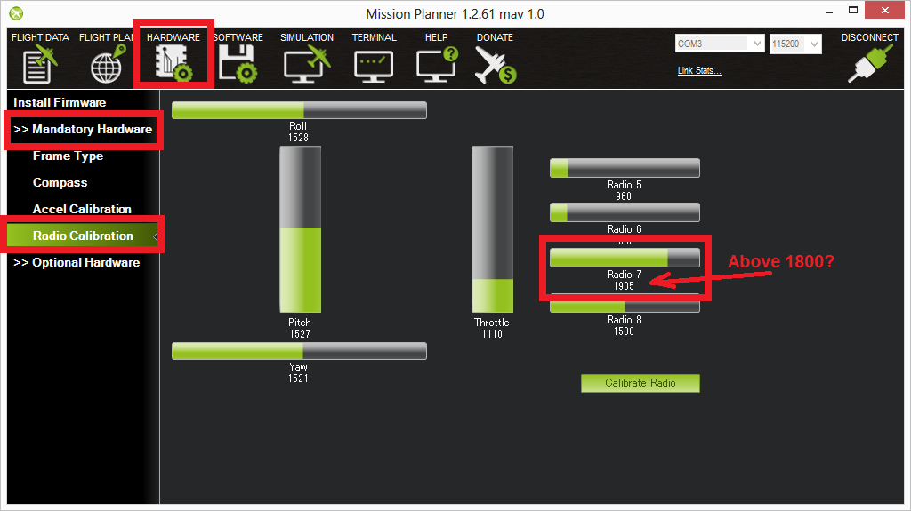
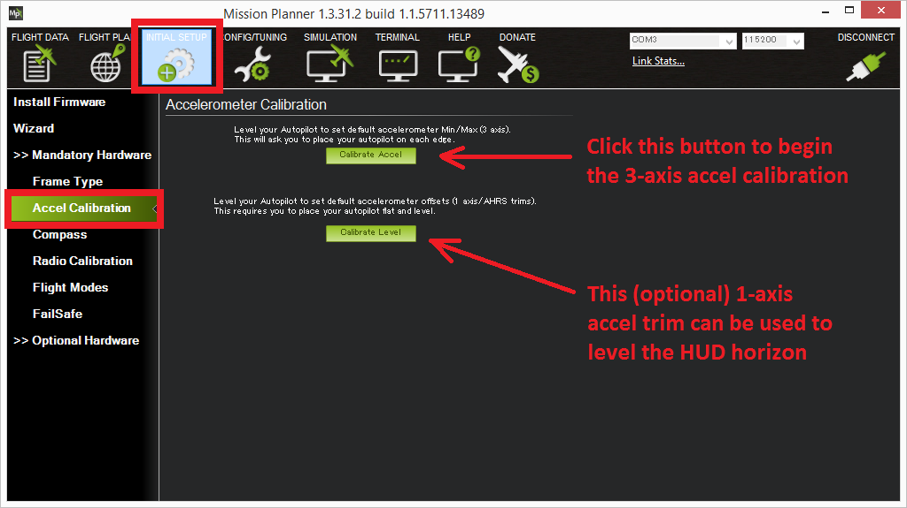

.. _autotrim:

========
AutoTrim
========

Wind of course has a strong effect on your copter and will push it around. However you may also find that while flying in stabilize mode, even in a windless environment your copter tends to always drift away in the same direction. This can largely be corrected using the "Save Trim" or "Automatic Trim" functions.

.. note::

    For most users this procedure is not necessary because the :ref:`accelerometer calibration <common-accelerometer-calibration>` does a good job of setting the trim values.

AHRS AutoTrim
~~~~~~~~~~~~~

With AHRS AutoTrim the roll and pitch corrections are captured as you fly in a stable hover. Setup a :ref:`common-auxiliary-functions` switch to "In Flight AHRS trim adjust" ("182"). We will use CH7 in the following:

1. Check that your CH7 switch goes above 1800 on the MissionPlanner's Hardware > Mandatory Hardware > Radio Calibration screen

2. Set the CH7 Option to "AHRS AutoTrim" on the Software > Copter Pids screen and press the "Write Params" button

3. Find a wind free environment with sufficient space to fly your copter without crashing into something

4. Put the vehicle in STABILIZE or ALT_HOLD mode.

5. Arm the vehicle and lift into a hover. The vehicle must be flying in order to enable autotrim. Flip the switch that you setup(CH7) to its High position (>1800us). "Autotrim running" message will be sent to the GCS.

6. Fly your copter for about 25 seconds in a stable hover in position, keeping it from drifting with the pitch and roll sticks. As the trim is adjusted, less and less corrections with the sticks will be required.

7. Once satisfied, flip the switch low, saving the trims, and land. "Trim save" message will be sent to the GCS.

8. Take off again in stabilize mode and check if your copter is flying level now. If not repeat steps 4 - 7 again.

.. note::

     You can manually set the trim by modifying the :ref:`AHRS_TRIM_X <AHRS_TRIM_X>` and :ref:`AHRS_TRIM_Y <AHRS_TRIM_Y>`. Roll trim is :ref:`AHRS_TRIM_X <AHRS_TRIM_X>`, Pitch trim is :ref:`AHRS_TRIM_Y <AHRS_TRIM_Y>`. Both values are in radians with left roll and forward pitch being negative numbers.

.. note::

    It is nearly impossible to get rid of all drift so that your copter remains completely motionless without any input.

Save Trim
~~~~~~~~~
.. note:: the above AHRS AutoTrim method is preferred since it does not involve moving transmitter trims after RC calibration.

Save trim involves essentially transferring your radio transmitter's trims to correct the autopilot's accelerometer trim. Normally, once :ref:`common-accelerometer-calibration` is done, you never want to change the transmitter's trims, but in this case it is done **temporarily**. The "Save Trim" function ("5") is assigned to any free RC channel, usually a switch based one, using an :ref:`common-auxiliary-functions`. For the example below, Channel 7 will be used.

1. Check that your CH7 switch goes above 1800 on the MissionPlanner's Hardware > Mandatory Hardware > Radio Calibration screen

2. Set the CH7 Option to Save Trim on the Software > Copter Pids screen and press the "Write Params" button

3. With your CH7 switch in the off (Low) position, fly your copter in Stabilize mode and use your transmitters's roll and pitch trim to get it flying level

4. Land and put your throttle to zero

5. Release the roll and pitch sticks and switch the CH7 switch high for at least 1 second.  The words "Trim saved" should appear in the MP's Flight Data screen's Messages tab

6. Reset your transmitters roll and pitch trims back to the center and fly again and it should fly level now. If it does not repeat steps 3, 4 & 5

Desktop method
~~~~~~~~~~~~~~

The trim can also be updated by setting the vehicle level, connecting to
the Mission Planner (or perhaps other ground stations) and selecting
Initial Setup, Mandatory Hardware, Accel Calibration and pushing the
lower "Calibrate Level" button.

Please note though that making the HUD level while the vehicle is on the
ground does not necessarily mean it won't drift horizontally while
flying because of other small frame issues including the flight
controller not being perfectly level on the frame, CG placement, an/ord slightly tilted
motors.

