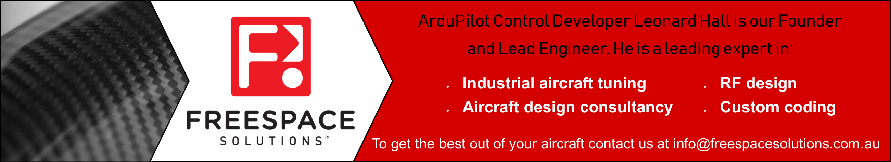

.. _autotune:

========
AutoTune
========

AutoTune attempts to automatically tune the Stabilize P, Rate P and D, and maximum rotational accelerations to provide the highest response without significant overshoot. Copter needs to be "basically" flyable in :ref:`AltHold mode <altholdmode>` before attempting to use AutoTune as the feature needs to be able to "twitch" the copter in the roll and pitch axis.

.. warning::

   AutoTune is not always able to determine a good tune for the vehicle and may result in gains that lead to an unflyable vehicle that may crash.  Please follow the :ref:`Tuning Process Instructions <tuning-process-instructions>` before attempting to use AutoTune. After following those instructions, and have :ref:`evaluated your initial tune <evaluating-the-aircraft-tune>`, should to try AutoTune.

..  youtube:: js2GzeRysAc
    :width: 100%

There a number of problems that can prevent AutoTune from providing a good tune including:

- Strong wind
- High levels of gyro noise
- Non-linear ESC response caused by incorrect value of :ref:`MOT_THST_EXPO <MOT_THST_EXPO>`
- Flexible frame or payload mount
- Overly flexible vibration isolation mount
- Very low setting for :ref:`MOT_SPIN_MIN <MOT_SPIN_MIN>`
- Overloaded propellers or motors

Setup before flying in AutoTune mode
====================================
#. Set up one flight mode switch position to be AltHold.
#. Set an RC channel :ref:`Auxiliary Function <common-auxiliary-functions>` switch or an :ref:`Auxiliary Function Switch <channel-7-and-8-options>` (prior to version 4.0) to AutoTune to allow you to turn the auto tuning on/off with the a switch.
#. Remove the camera gimbal or any other parts of the frame that could wobble in flight
#. Select which combination of axis (roll, pitch, yaw) you wish to tune using the :ref:`AUTOTUNE_AXES <AUTOTUNE_AXES>` parameter
#. Set the autotune's aggressiveness using the :ref:`AUTOTUNE_AGGR <AUTOTUNE_AGGR>` parameter (0.1=agressive, 0.075=medium, 0.050=weak), normally start with the default 0.1.
#. For large copters (with props at least 13inch or 33cm diameter) set the Rate Roll and Pitch filters to 10hz, these are: :ref:`ATC_RAT_RLL_FLTT <ATC_RAT_RLL_FLTT__AC_AttitudeControl_Multi>` , :ref:`ATC_RAT_RLL_FLTD<ATC_RAT_RLL_FLTD__AC_AttitudeControl_Multi>` , :ref:`ATC_RAT_PIT_FLTT <ATC_RAT_PIT_FLTT__AC_AttitudeControl_Multi>` , :ref:`ATC_RAT_PIT_FLTD <ATC_RAT_PIT_FLTD__AC_AttitudeControl_Multi>` , (in Copter-3.4 they are ATC_RAT_RLL_FILT and ATC_RAT_PIT_FILT) 
#. It is recommended to enable :ref:`battery voltage scaling of PID gains <current-limiting-and-voltage-scaling>`

How to invoke AutoTune
======================
#. Wait for a calm day and go to a large open area.
#. Ensure the ch7 or ch8 switch is in the LOW position.
#. Take off and put the copter into AltHold mode at a comfortable
   altitude.
#. Face the vehicle so that it will twitch at 90degrees from the direction the wind is blowing (i.e. if tuning Roll first, point the vehicle into the wind)

   .. image:: ../images/autotune_copterwind.png
       :target: ../_images/autotune_copterwind.png
       :width: 500px
#. Set the ch7/ch8 switch to the HIGH position to engage auto tuning:

   -  You will see it twitch about 20 degrees left and right for a few
      minutes, then it will repeat forward and back.
   -  Use the roll and pitch stick at any time to reposition the copter
      if it drifts away (it will use the original PID gains during
      repositioning and between tests).  When you release the sticks it
      will continue auto tuning where it left off.
   -  Move the ch7/ch8 switch into the LOW position at any time to
      abandon the autotuning and return to the origin PIDs.
   -  Make sure that you do not have any trim set on your transmitter or
      the autotune may not get the signal that the sticks are centered.

#. When the tune completes the copter will change back to the original
   PID gains.
#. Put the ch7/ch8 switch into the LOW position then back to the HIGH
   position to test the tuned PID gains.
#. Put the ch7/ch8 switch into the LOW position to fly using the
   original PID gains.
#. If you are happy with the autotuned PID gains, leave the ch7/ch8
   switch in the HIGH position, land and disarm to save the PIDs
   permanently.

   If you DO NOT like the new PIDS, switch ch7/ch8 LOW to return to the
   original PIDs. The gains will not be saved when you disarm.

If you find after performing an AutoTune that the vehicle feels overly twitchy when flying Stabilize, AltHold or PosHold (but ok in more
autonomous modes like Loiter, RTL, Auto) try increasing the :ref:`ATC_INPUT_TC<ATC_INPUT_TC>` parameter to 0.25.  This smooths out the pilot's input.
Alternatively try reducing the :ref:`AUTOTUNE_AGGR <AUTOTUNE_AGGR>` parameter (it should always be in the range 0.05 to 0.10) and try again.

If the vehicle feels sloppy after the AutoTune, try increasing the :ref:`AUTOTUNE_AGGR <AUTOTUNE_AGGR>` parameter as high as 0.10 and attempt the autotune again.

Invoke AutoTune with Position Hold
==================================

In Copter-3.5 (and higher) AutoTune performs a weak position hold if invoked from Loiter or PosHold flight modes (as opposed to AltHold) while doing an autotune.

   .. image:: ../images/autotune_from_loiter.png
       :target: ../_images/autotune_from_loiter.png
       :width: 400px

- The vehicle will gently lean (up to 10 degrees) towards a "target point" which is initially set to the vehicle's location at the moment AutoTune was invoked.
- The pilot can reposition the vehicle using the roll, pitch, yaw or throttle sticks.  The target position will be reset to the vehicle's location at the moment the pilot releases the roll and pitch sticks.
- In order to twitch perpendicular to the wind direction, the vehicle may suddenly rotate in either direction up to 90 degrees as it drifts 5m (or more) from the target location.
- If there is little or no wind, the vehicle's gentle position control may mean it moves back and forth, ping ponging around the target point changing yaw each time it strays more than 5m from the target.  In these cases it may be more comfortable to revert the simpler AltHold based AutoTune. 

If AutoTune fails
=================

If AutoTune has failed you will need to do a manual tune.

Some signs that AutoTune has been successful are (besides DataFlash logs and Ground Control Station messages):

- An increase in the values of :ref:`ATC_ANG_PIT_P <ATC_ANG_PIT_P>` and :ref:`ATC_ANG_RLL_P <ATC_ANG_RLL_P>`.
- :ref:`ATC_RAT_PIT_D <ATC_RAT_PIT_D__AC_AttitudeControl_Multi>` and :ref:`ATC_RAT_RLL_D <ATC_RAT_RLL_D__AC_AttitudeControl_Multi>` are larger than :ref:`AUTOTUNE_MIN_D <AUTOTUNE_MIN_D>`.

AutoTune will attempt to tune each axis as tight as the aircraft can tolerate. In some aircraft this can be unnecessarily responsive. A guide for most aircraft:

- :ref:`ATC_ANG_PIT_P <ATC_ANG_PIT_P>` should be reduced from 10 to 6
- :ref:`ATC_ANG_RLL_P <ATC_ANG_RLL_P>` should be reduced from 10 to 6
- :ref:`ATC_ANG_YAW_P <ATC_ANG_YAW_P>` should be reduced from 10 to 6
- :ref:`ATC_RAT_YAW_P <ATC_RAT_YAW_P__AC_AttitudeControl_Multi>` should be reduced from 1 to 0.5
- :ref:`ATC_RAT_YAW_I <ATC_RAT_YAW_I__AC_AttitudeControl_Multi>` : :ref:`ATC_RAT_YAW_P <ATC_RAT_YAW_P__AC_AttitudeControl_Multi>` x 0.1

These values should only be changed if AutoTune produces higher values. Small aerobatic aircraft may prefer to keep these values as high as possible.

Additional Notes
================

-  In Copter-3.3 (and higher) AutoTune can be setup as a flight-mode.  Switching into or out of the AutoTune flight mode responds in the same way as raising or lowering a ch7/ch8 aux switch high assigned the AutoTune function.
-   :ref:`AUTOTUNE_AXES <AUTOTUNE_AXES>` allows control of which axis are to be tuned.  This is useful if the vehicle's battery life is not long enough to complete all 3-axis).  "1" = tune roll, "2" = tune pitch, "4" = tune yaw.  Add these numbers together to tune multiple axis in a single session (i.e. "7" = tune all axis)
-   :ref:`AUTOTUNE_AGGR <AUTOTUNE_AGGR>` : Should be in the range of 0.05 to 0.10.  Higher values will produce a more aggressive tune but sometimes results in gains that are too high.  More specifically this parameter controls the threshold for D-term bounce back and P-term overshoot. This affects the tuning noise immunity (a higher value is more tolerant to flex in the frame or other disturbances that could trick the tuning algorithm).  High values also leads to a tune that rejects external disturbances better.  Lower values result in a tune that is more responsive to pilot input.

-   The full list of parameters that may be updated by AutoTune

        - Roll angular P gain :ref:`ATC_ANG_RLL_P <ATC_ANG_RLL_P>` 
        - Roll rate P, I and D gains :ref:`ATC_RAT_RLL_P <ATC_RAT_RLL_P__AC_AttitudeControl_Multi>`, :ref:`ATC_RAT_RLL_I <ATC_RAT_RLL_I__AC_AttitudeControl_Multi>`, :ref:`ATC_RAT_RLL_D <ATC_RAT_RLL_D__AC_AttitudeControl_Multi>`  
        - Roll max acceleration :ref:`ATC_ACCEL_R_MAX <ATC_ACCEL_R_MAX>`
        - Pitch angular P gain :ref:`ATC_ANG_PIT_P <ATC_ANG_PIT_P>` 
        - Pitch rate P, I and D gains :ref:`ATC_RAT_PIT_P <ATC_RAT_PIT_P__AC_AttitudeControl_Multi>`, :ref:`ATC_RAT_PIT_I <ATC_RAT_PIT_I__AC_AttitudeControl_Multi>`, :ref:`ATC_RAT_PIT_D <ATC_RAT_PIT_D__AC_AttitudeControl_Multi>`  
        - Pitch max acceleration :ref:`ATC_ACCEL_P_MAX <ATC_ACCEL_P_MAX>`
        - Yaw angular P gain :ref:`ATC_ANG_YAW_P <ATC_ANG_YAW_P>`
        - Yaw rate P, I gain :ref:`ATC_RAT_YAW_P <ATC_RAT_YAW_P__AC_AttitudeControl_Multi>`, :ref:`ATC_RAT_YAW_I <ATC_RAT_YAW_I__AC_AttitudeControl_Multi>`, :ref:`ATC_RAT_YAW_D <ATC_RAT_YAW_D__AC_AttitudeControl_Multi>`
        - Yaw rate filter :ref:`ATC_RAT_YAW_FLTT <ATC_RAT_YAW_FLTT__AC_AttitudeControl_Multi>` , :ref:`ATC_RAT_YAW_FLTE <ATC_RAT_YAW_FLTE__AC_AttitudeControl_Multi>` (in AC3.6: ATC_RAT_YAW_FLT)
        - Yaw max acceleration :ref:`ATC_ACCEL_Y_MAX <ATC_ACCEL_Y_MAX>`
        - Roll and pitch axis rate feed-forward is enabled (:ref:`ATC_RATE_FF_ENAB <ATC_RATE_FF_ENAB>`)
-   After you have a good tune, you may wish to increase :ref:`ATC_THR_MIX_MAX <ATC_THR_MIX_MAX>`  to 0.9 (default is 0.5) to increase prioritization of attitude control over throttle.  This can reduce the pitch overshoot sometimes seen (especially on copters with large propellers) in AltHold if the vehicle suddenly slows after performing fast forward flight.  In this situation wind catches under the propellers providing lift but also disturbs the vehicle's attitude leading to a conflict between throttle and attitude control.  The danger in increasing this parameter's value is that if the rate gains are later raised so high that the vehicle oscillates badly it may be difficult for the vehicle to descend (because it will prioritize trying to correct the attitude oscillations and never reduce throttle sufficiently).
-   AutoTune can **request very large and fast changes in output**\ s to the motors which can cause ESC sync issues especially when using SimonK firmware and/or low KV motors (under 500KV). See this `video showing a test <https://www.youtube.com/watch?v=hBUBbeyLe0Q>`__ which recreates a sync problem.
-   For best results the copter shouldn't be allowed to build up too much horizontal speed. This can be prevented by applying a quick correction between tests (twitches) to stop the vehicle from flying too fast.
-   Be advised that AutoTune will engage from Stabilize, so don't accidentally flip your AutoTune switch until you are in AltHold and ready to begin the procedure.
-   As a general rule, for Pitch and Roll, P and I should be equal, and D should be 1/10th P. For Yaw, I should be 1/10th P and D = 0, in most cases.

Common Problems
===============

- If the vehicle will not start tuning (i.e. it won't twitch) even though it is in AutoTune mode then the problem is likely that the roll, pitch, yaw or throttle sticks are not exactly in the middle. It may help to increase the deadzone on the RC input by increasing :ref:`RC1_DZ <RC1_DZ>`, :ref:`RC2_DZ <RC2_DZ>`, :ref:`RC3_DZ <RC3_DZ>` and :ref:`RC4_DZ <RC4_DZ>` to 50 (or higher).
- If the AutoTune produces an overly twitchy vehicle try reducing the :ref:`AUTOTUNE_AGGR <AUTOTUNE_AGGR>` parameter (should never be below 0.05) and perform the AutoTune again.
- If the AutoTune produces a sloppy vehicle, try increasing the :ref:`AUTOTUNE_AGGR <AUTOTUNE_AGGR>` parameter (should never be above 0.1) and perform the AutoTune again.

.. tip::

   When reporting issues with AutoTune please include a description of your frame and a dataflash log of the flight.

Dataflash logging
=================

ATUN (auto tune overview) and ATDE (auto tune details) messages are
written to the dataflash logs. Some details of the contents of those
messages can be found on the :ref:`Downloading and Analyzing Data Logs in Mission Planner <common-downloading-and-analyzing-data-logs-in-mission-planner_message_details_copter_specific>` wiki page.

Ground Control Station Messages
===============================

For each axis there are several phases to the tune. Rate PIDs are adjusted first, then ANGLE parameters. Progress messages during these phases are sent to the GCS (and recorded in the Dataflash logs).

Typical sequence during tuning might be:

::

 09:09:33	AutoTune: Twitch
 09:09:34	AutoTune: (P) Rate P Up\
 09:09:34	AutoTune: WFL (Rate(P)) (15.13040 > 10.00000)
 09:09:34	AutoTune: p=0.052298 d=0.005232
 09:09:34	AutoTune: success 1/4

This is during Pitch Rate P adjustment, indicating a twitch is about to happen as the P is being tried at an increased value of 0.052298, but first it is waiting until it gets back to level from the last twitch (WFL= Waiting for level), and then it reports that the result of this twitch is within targets and successful. But this has to occur 4 times in a row, before moving on to the next phase.

.. note:: During YAW rate phase of tuning, the messages will show a value for "d" that is not ATC_RAT_YAW_D, which is usually 0, but rather it's the value of ATC_RAT_YAW_FLTE, that is being changed.

Anytime the process is interrupted by pilot stick movements, the
:: 

 09:09:38	AUTOTUNE: pilot overrides active

message appears.

If you stopped the tune  and dis-armed while still in AUTOTUNE, and an axis tune has completed, you will get a message showing that the new gains have been saved for that axis. If there is not a message to this effect, but think you finished at least one axis, then you probably dis-armed while not in AUTOTUNE mode, and did not actually save them.
::

 09:19:48	AutoTune: Saved gains for Pitch

.. tip:: If you do happen to accidentally discard a sessions AUTOTUNE values by disarming when not in AUTOTUNE, you can examine the dataflash log for the GCS messages it sent during tune and manually set them on the bench.

-----

.. |AutoTuneCh7Switch| image:: ../images/AutoTuneCh7Switch.png
    :target: ../_images/AutoTuneCh7Switch.png
