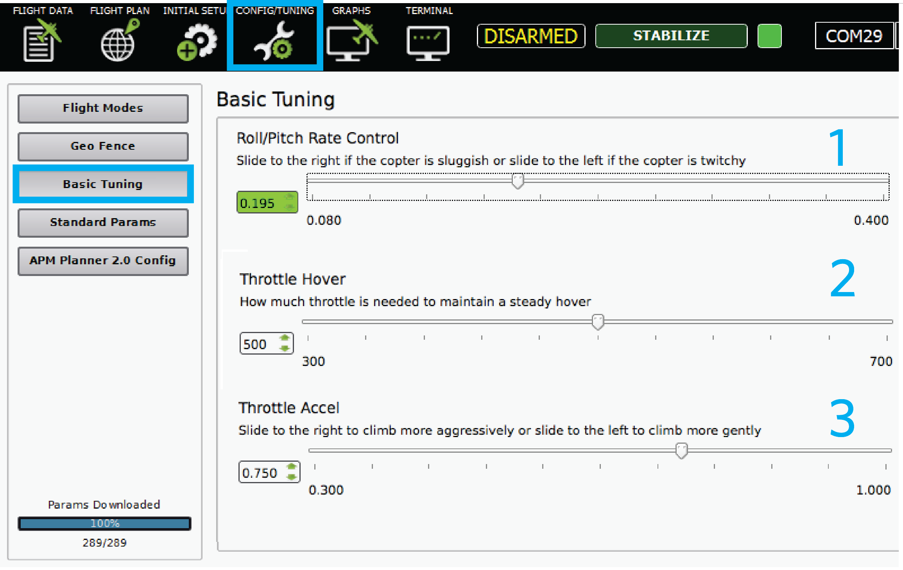

.. _basic-tuning:

============
Basic Tuning
============

This topic covers basic Roll and pitch and throttle tuning.

Overview
========

After your first flight, you may notice that you copter doesn't respond
to control inputs the way you want it to or you may have trouble
maintaining control of your copter. If you are familiar with PID
controllers, check out the :ref:`advanced tuning guide here <tuning>`. If
you are an experienced operator, try out :ref:`the autotune feature <autotune>`. This page will cover the basic tuning section of
Mission Planner and APM Planner that simplified the complex tuning
process into a few simple sliders. This is the best tuning method for
new operators.

Roll and pitch tuning
=====================

Tuning is easiest at the field using a :ref:`telemetry radio <common-telemetry-landingpage>`. Perform an initial flight with
the following questions in mind:

-  How does the copter respond to roll and pitch? Is the response more
   sluggish or twitchy than you want?
-  When the copter is hover, what level is the throttle set at? Does it
   hover at the middle position of the stick or is it above or below the
   center position?
-  When raising the throttle, what rate does the copter accelerate at?
   Does it gain altitude more slowly or more quickly than you want?

Connect the telemetry radio ground module to your ground station
computer and open either Mission Planner or APM Planner. Select the
correct COM port and select Connect. You should see live data on the
Flight Data screen. To begin tuning, select Config/Tuning and Basic
Tuning.

Start with the Roll/Pitch slider at the top of the page. If you observed
that your copter was too twitchy in response to roll and pitch controls,
move the slider one tick mark to the left, or, if you observed that your
copter was too sluggish, move the slider one tick mark to the right.
Repeat your flight to determine if the change was beneficial. Repeat the
process until you are satisfied with the way your copter responds to
roll and pitch.

Throttle tuning
===============

The bottom two sliders allows you to tune the throttle control. Adjust
the slider marked Throttle Hover until the copter hovers at the throttle
stick's middle position. If the copter hovers with the throttle stick
above middle position, move the slider to the left by one tick-mark
until it hovers at mid-stick, testing as you go. If the copter hovers
with the throttle stick below middle position, move the slider to the
right by single tick-mark increments until it does. Make sure to test
each set of tuning settings as you go.

Move the slider marked Throttle Accel or Climb Sensitivity to the right
to have the copter gain altitude more aggressively or to the left to
have the copter gain altitude more gently. Test each increment after
setting to evaluate the tune.
