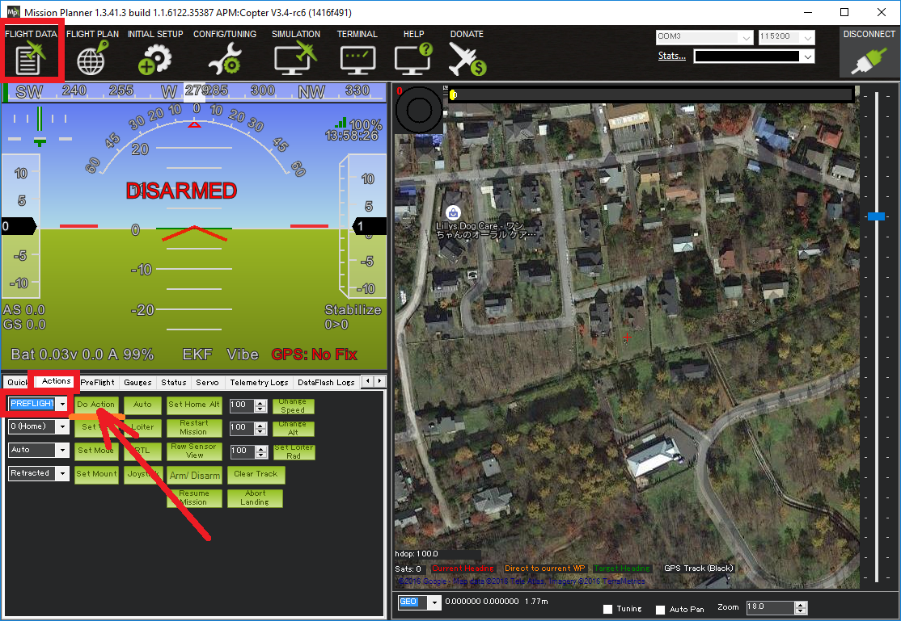

.. _boat-mode:

=========
Boat Mode
=========

Copter includes "boat mode" which allows taking off from a moving platform including boats.  It is not really a "mode" but rather a change to how the gyros are calibrated.

..  youtube:: wNlnwqC-bx4
    :width: 100%

Settings
========

In many cases Copter will be able to take off from a moving platform without any special parameter changes as long as the platform is not moving too rapidly during the gyro calibration which occurs a few seconds after startup (look for the LEDs flashing red and blue).

If the platform is moving too much however, the gyro calibration will fail after 30 seconds and gyro related warnings like "Bad Gyro Health" will appear on the HUD.  Despite this warning the vehicle may fly normally but having the warning is unnerving and may hide other errors.  In this case, it is best to disable the automatic gyro calibration by setting the :ref:`INS_GYR_CAL <INS_GYR_CAL>` parameter to "0".

Manually trigger gyro calibration
=================================

Note that even with automatic gyro calibration disabled, the gyros calibration can be triggered manually from the Mission Planner (and perhaps some other ground stations) using the Flight Data screen's Actions tab.  Select "PREFLIGHT_CALIBRATION" from the top-left drop-down and then press the "Do Action" button.

This is useful if for some reason a gyro calibration is required and the vehicle can be temporarily placed on a near non-moving platform.