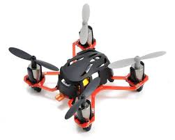
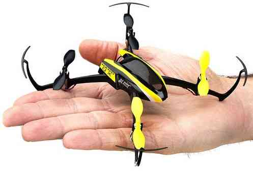

.. _build-your-own-multicopter:

====================================
Archived: Build Your Own Multicopter
====================================

There are Lots of Ways you Can Put Together a MultiCopter
=========================================================

#. Thoughtful, slow progression is better than jumping in with both
   feet, you can easily get discouraged by trying to do too much too
   fast.
#. You are likely to have a good experience if you start with a simple,
   small QuadCopter, either a Ready to Fly or an All Inclusive Kit.
#. For those with good DIY capabilities an Almost Ready To Fly build
   like the F450 FlameWheel described below can also work well.
#. For your first MultiCopter, DO NOT initially try to build a Photo /
   Video or First Person View copter, just build a good QuadCopter.
#. Even if you know that's what you really want to do, it will take you
   some time to come up to speed on our copters and autopilots.
#. If you just want to get a taste and have a lot of fun, try one of the
   little inexpensive, safe, sturdy, ready to use Micro-QuadCopters
   below.
#. If you know you're serious, try the **Flamewheel ARF Build** or if
   you just want to fly and can afford it get the high end \ **Iris**
   QuadCopter.
#. The Iris includes a top end \ **Pixhawk** autopilot and both
   the Iris and the Flamewheel can do **FPV** or **Video** when you are
   ready.
#. Don't start with a \ **Frame Up Build** unless you have a complete
   article on how to build a really good simple Quadcopter like the Flip
   Sport.
#. Absolutely do not start by trying to **Build Your Own Frame**, even
   among experienced builders there are more failures than successes.
#. It is very important to **NOT** start out with a big (dangerous)
   multicopter with a bunch of photo or video stuff on it, you will
   regret it.
#. A small, agile **QuadCopter** is always a lot more fun to fly than a
   big, ponderous and slow **Hex** or **OctoCopter** in any case.
#. Except for top end professional HD video or photography requiring big
   cameras you are always better off thinking small, light and agile.

.. warning::

   Safety is very important with multicopters, keep plenty of
   distance from living or expensive things and review our \ :ref:`Safety Page <safety-multicopter>`.

Chinese Imports Good Deal / Bad Deal?
=====================================

#. It is very tempting especially when just starting out to buy lots of
   Chinese direct import stuff because it is so much cheaper: Bad Idea!
#. As you gain experience, you will learn which import items are
   serviceable, if you try to do it at the beginning things will not go
   well.
#. I recommend you always get the main electronics (autopilot)
   from the primary source, in our case the Pixhawk from 3DRobotics.
#. You will also want to get the electronic accessories (GPS,
   magentometer, telemetry and OSD if used) from 3DRobotics as well.
#. If your going to do first person view, get a 3DRobotics FPV kit or a
   FatShark Attitude video goggle and transmitter.
#. As for cameras, the GoPro Hero 3 and especially the Black is the one
   to get, because it is what everybody uses and it works well.
#. The DJI Flamewheel ARF kit which is recommended is made in China but
   is a known quality setup, so where you get it is up to you.
#. The Traxxas, Hubsan and Helimax highly recommended starter
   micro-Quadcopters are also made in China but are still a great way to
   start.
#. Motors, Batteries, ESCs, frames and even FRSky or Turnigy RC
   transmitters and receivers can be very good deals direct from China.
#. A lot of items we buy domestically are actually made in China and of
   course, quality varies widely, regardless of country of origin.
#. A $25.00 RC-Timer motor is not likely to be of the same quality as
   the equivalent $100.00 Tiger-Motor, but hey, it's only $25.00.
#. Although direct Chinese imports generally have pretty reliable
   shipping, aftermarket support or returns are often very problematic.
#. If you build in a ten to twenty percent broken, damaged or not
   included expectation for Chinese imports you will not be
   disappointed.
#. In any case, start with two or three of the recommended "builds"
   below so that you can experience success and learn to fly first.

Inexpensive, Ready To Fly Nano, Micro or Small QuadCopter
=========================================================

.. tip::

   If you are new to MultiCopters, I very strongly suggest you start
   with one of these inexpensive Ready To Fly QuadCopters.

#. They come with everything you need including the radio and the
   battery, require no assembly, are very sturdy and are great for
   learning.
#. They are also a ton of fun, can easily and safely be used indoors and
   typically cost less than a hundred dollars.
#. Importantly you will get you a much better understanding of how they
   work and of what you really want to do next.
#. The `Traxxas QR1 QuadCopter <http://traxxas.com/products/models/heli/6208qr1>`__ is an
   inexpensive RTF Micro Quadcopter that is great for a first
   experience. (Left image below).
#. For $45.00 the `(Hubsan
   X4) <http://www.amazon.com/Hubsan-X4-H107-Copter-2-4GHZ/dp/B009M1PO7W>`__ is
   identical to the Traxxas and for $70.00 you can get it with a still
   photo and 720P HD video
   camera.\ `Husban <http://www.amazon.com/Hubsan-X4-H107-Copter-2-4GHZ/dp/B009M1PO7W>`__
#. For $200.00 there is even a really easy to fly **FPV** version of the
   `Hubsan <http://www.ebay.com/itm/like/171203630670?lpid=82">`__ that
   comes with a RC transmitter with an excellent LCD display.
#. Even the parts for the Hubsans are readily available: \ `Hobby Flip <http://hobbyflip.com/>`__
#. The \ `Helimax 1SQ <http://www.helimax-rc.com/helicopters/hmxe0834-1sq/index.html>`__ is
   another low cost palm sized micro QuadCopter.
#. Or even the really, really tiny $40.00 `Estes Proto X <http://www.amazon.com/Estes-4606-Proto-Nano-Quadcopter/dp/B00G924W98>`__ actually
   a Hubsan H111 which flies remarkably well (Middle and right images
   below).

-  Below left is a larger, but very durable copter, the $88.00 UDI U818A
   2.4GHz Quadcopter with Camera from Amazon Prime.
-  And a link to an important `Blog Article by RocklandUSA <https://diydrones.com/profiles/blogs/noob-quadcopter-training-thank-you-community>`__
   for all people considering their first Multicopter purchase.
-  The Blade Nano QX at $90.00 below right is also highly recommended,
   is very light and easy to fly and incredibly durable.

.. image:: ../images/SKU074490.14.jpg
    :target: ../_images/SKU074490.14.jpg

-  If you are just starting out: Get one of these inexpensive, small,
   durable Quadcopters and learn to fly it well, it will save you a lot
   of money.

All Inclusive Kit
=================

#. The easiest way to build is to buy a single kit that has all the parts
necessary in one box and a set of instructions for each step.

#. Outside of (Ready To Fly) a good all inclusive kit is the most reliable
and straightforward way to construct a quality MultiCopter.

#. Usually all of the components are well balanced with each other and the
entire craft can be expected to perform well.

#. For an all inclusive kit, assembly is just nuts and bolts and possibly
some soldering.

#. The assembly procedure is usually well explained in the supplied
instructions.

#. The downside is that often quality kits are a bit more expensive than
other alternatives and customization has to be added on.

#. If you are not already well qualified at Do It Yourself projects, A good
all inclusive kit is definitely the best place to start.

#. The innovative `Iris QuadCopter <https://www.amazon.com/3DRobotics-3DR0171-3DR-IRIS-Quadcopter/dp/B00NWXY076>`__ is
actually \ **Ready To Fly** and comes with the top of the line
**Pixhawk** autopilot. However, these are no longer produced/sold by 3DR.

    #. It is capable of fully autonomous flight and includes the RC
       transmitter, the battery and even telemetry, at $750.00 it is a real
       bargain.
    #. The Iris structurally strong and resilient and it is set up to
       support a GoPro camera or even FPV (First Person View) when you are
       ready.

       .. image:: ../images/AeduCopterAndIris.jpg
           :target: ../_images/AeduCopterAndIris.jpg

Almost Ready to Fly
===================

#. If you need everything and want the most versatile copter possible
   you can't beat the Iris above, it is simply a great deal.
#. If you already have a RC transmitter you can save some money and
   still build a really high quality autonomous QuadCopter.
#. Even if you are just starting there are a few really good choices.

   #. The **DJI F450 Flamewheel QuadCopter ARF Kit** may well be single
      the best choice at this time.
   #. This kit comes with frame with built in power distribution board,
      the 4 motors and the 4 Electronic Speed Controls and 8 Propellers.
   #. You need to add a :ref:`Pixhawk <common-pixhawk-overview>` Flight
      controller, A battery and your Radio Control Transmitter and
      Receiver.
   #. The supplied equipment in the kit is all first rate and the real
      DJI Flamewheel frame is very stiff and sturdy (a good thing).
   #. Cost: F450 ARF kit $180.00, Pixhawk with GPS/Compass $280.00 and a
      Battery $35.00 = ($495.00) plus a PPM-Sum receiver.

#. As an alternative, the smaller **DJI F330 Flamewheel Quadcopter** is
   also an excellent choice and can be better in smaller spaces.

   #. The :ref:`Wiki page on constructing the F330 <dji-f330-flamewheel>` is applicable to the **F450** as
      well.

#. Most ARF kits that are cheaper than this are not nearly as sturdy and
   the components generally fail much more frequently.
#. You can buy the `F450 ARF kit Here! <http://www.amainhobbies.com/product_info.php/cPath/2_382_2405_3233_3237/products_id/235232/n/DJI-Innovations-Flame-Wheel-F450-ARF-Quadcopter-Kit-w-Motors-ESC-Propellers>`__ This
   source has the **F350 ARF** kit also.
#. DO NOT get a clone kit that looks like it, the real DJI motors and
   ESCs are top quality and the frame is stiff and strong, the clones
   are not.
#. There are more expensive high quality ARF kits available but the
   FlameWheels will give great service and have very high performance.
#. If you want to keep initial cost to a bare minimum, start with
   a `Simple Flight Controller <http://www.hobbyking.com/hobbyking/store/__24723__Hobbyking_KK2_0_Multi_rotor_LCD_Flight_Control_Board.html>`__ then
   graduate to a
   `Pixhawk <https://store.3dr.com/products/3dr-pixhawk>`__ when
   you are ready
#. The F450 can also serve as a competent Gopro and Gimbal carrying
   photo and video copter or as an FPV platform.
#. The **DJI F550 ARF Hexacopter** is a good choice for more advanced
   uses, but it is not ideal as a first MultiCopter.

Frame Kit
=========

#. Once you get into building your own MultiCopter based on a frame kit
   you are getting into the big leagues, this is really not for
   beginners.
#. The exception is if you are carefully following a specific and highly
   detailed build.
#. I am working on 2 Frame Kit based builds at the moment, a Flip 380
   Sport QuadCopter and a Tarot 650 Carbon Fiber Quadcopter.
#. A little bit on the reasons for and methods used in each of the
   Builds.
#. The Hoverthings \ `Flip 380 Sport <http://www.hoverthings.com/the-flip-black>`__ Frame is billed
   as the most indestructible frame ever.

   #. It uses incredibly stiff and strong CNC machined 1/4" thick
      Fiberglass arms and G10 Fiberglass center plates.
   #. It can incorporate the same motors and ESCs as used in the DJI
      Flamewheel and can use up to 10" propellers.
   #. I purchased the Flip Sport Kit plus an extra pair of "tab" type
      center sections and extra 7/8" spacers.
   #. The extra center plates mount below the stock plates on 7/8"
      spacers to accommodate the battery and flight gear.
   #. I am using 4 of the stock DJI Flamewheel motors and a special `4 in 1 ESC <http://mymobilemms.com/OFFTHEGRIDWATER.CA/index.php?main_page=product_info&cPath=2_4&products_id=203>`__ placed
      between the center plates of the copter.

      .. image:: ../../../images/3281_dimg2.jpg
          :target: ../_images/3281_dimg2.jpg
      
   #. The 4 in 1 ESC produces much less RF and DC interference and is
      neater than 4 ESCs and a power distribution board.
   #. I am using `GemFan DJI hub compatible 10" carbon filled propellers <http://www.rcdude.com/servlet/the-2498/GemFan-DJI-Hub-10x4.5/Detail>`__ because
      they are very tough and very efficient.
   #. My goal is to build an even tougher and higher performance copter
      than the DJI F450 Flamewheel - inexpensively.
   #. Although it's a small copter the Flip is powerful and agile enough
      to use FPV video and/or a GoPro Camera and brushless gimbal.
   #. Here is a link to the :ref:`Hoverthings Flip Sport Quadcopter Wiki Build Page <hoverthings-flip-sport-quadcopter>` using a Pixhawk autopilot.

      .. image:: ../images/FlipPX41.jpg
          :target: ../_images/FlipPX41.jpg

#. The `Tarot 650 <http://www.ebay.com/itm/Tarot-Iron-Man-650-Foldable-3K-carbon-fiber-Quad-copter-Quadcopter-Frame-TL65B02-/151050276421>`__ is
   a carbon fiber frame that is quite large for a QuadCopter and it can
   incorporate up to 17" propellers.

   #. I am using 360kv slow speed, large diameter \ **Pancake Motors**
      designed to turn the more efficient large propellers at low
      speeds.
   #. I will be using a variety of 14" to 17" propellers to explore
      performance and efficiency at various propeller diameters.
   #. Although the Flip Sport build shown above could be appropriate for
      a first QuadCopter, this Tarot 650 build is definitely not.
   #. This quad is big enough to serve as a heavy lift or long endurance
      copter or to carry a big video or still camera, but:

      #. For lifting a 2KG payload with a quadcopter you need some
         serious motor and some serious prop.
      #. `Four Tigermotor MN4010 475 KV motors <http://www.rctigermotor.com/html/2013/Navigator_0910/38.html>`__ at
         $86.00 each, four 15 x 5 or 16 x 5 props and four high quality
         30 amp ESCs.
      #. It needs 10,000mah of 4 cell Lipo batteries (two 5000's) to
         achieve approximately ~10 minutes of flight time at 4KG total
         weight.
      #. It should be capable of lifting 4 KG total (including 2KG
         payload) and leave about 50% reserve thrust (minimum
         needed) (6kg total).
      #. You will need 16" x 5  props to achieve the thrust and
         efficiency necessary to lift 4KG total with reasonable flight
         times.
      #. That is why the bigger motors with the lower KV are required
         and they need to be high quality to withstand continuous high
         output.
      #. It is very highly recommended that you do not attempt to
         construct one of these for your first build.

#. A really handy link for quickly calculating performance requirements
   for various multicopters and
   components: `eCalc <http://www.ecalc.ch/indexcalc.htm>`__

**Or Perhaps a really tiny little `250 sized $10.00 frame <http://www.hobbyking.com/hobbyking/store/__47075__HobbyKing_FPV250_Quad_Copter_A_Mini_Sized_FPV_Multi_Rotor_kit_.html>`__
with FPV capability you can fly indoors or out.**

.. image:: ../images/fpv250_mini_quad_copter_frame.jpg
    :target: ../_images/fpv250_mini_quad_copter_frame.jpg

.. image:: ../images/fpv250_mini_quad_copter.jpg
    :target: ../_images/fpv250_mini_quad_copter.jpg

Scratch Built
=============

#. Although this is often attempted by those who have never used a
   multicopter, it very seldom turns out well.
#. At the simplest level a functioning QuadCopter can be built out of
   sticks or dowels and plywood that will fly.
#. But it is very unlikely to fly well or to be very serviceable or to
   well tolerate less than perfect "landings".
#. And this is no way to save money, RTF, Kits and ARF include high
   quality matched components and actually cost less.
#. Even if you are an experienced model builder, machinist or engineer,
   DO NOT START HERE!
#. Multicopters have their whole own set of flight dynamics and
   structural demands.
#. Until you have become experienced with them you stand virtually no
   chance of designing and making a worthwhile MultiCopter.
#. There is a really lovely QuadCopter design made by a newbie from bent
   sheet aluminum on our site right now.
#. Unfortunately sheet aluminum is soft, the copter is heavy and hard
   landings are common so a very bent copter is inevitable.
#. Even if you are very experienced, you will certainly need to make
   several copters before you achieve a worthwhile design.
#. I won't say Experts only, but you really need to go through at least
   3 or 4 commercial MultiCopters before you even think about doing
   this.
#. I have made over a dozen different CAD designs so far and have not
   yet built one, I will make one, but I'm not ready yet and I know it.

Brand Name Ready to Fly
=======================

A few words about the **Brand Name** Ready To Fly QuadCopters like the
**Parrot**, the **DJI Phantom** and the **Blade 350QX**.

#. Within the scope of their capabilities these are generally well made
   and often a reasonable bargain for what they do.
#. But they are also not easily modified or improved on and are not easy
   to upgrade to a more powerful autopilot like the Pixhawk.
#. So although they are a moderately capable one stop solution, they can
   also be a bit of a costly dead end.
#. You can put together a **Flamewheel ARF kit** with a top end
   **Pixhawk autopilot** for about the same money and be way
   ahead.

Which Approach is Right for You
===============================

#. It is very important to match your approach to your capability level,
   if you overreach you can end up with a negative experience.
#. It is also much more important to take a robust and conservative
   approach than to try to do everything the first time out.

   #. The simplest approach is to get a **Ready to Fly** system or an
      **All Inclusive Kit**.
   #. However, a good **Almost Ready To Fly** kit plus some carefully
      chosen components can also result in an outstanding copter.
   #. The ARF approach can often cost somewhat less and enable you to
      construct a copter that is specifically tailored to your needs.
   #. The **Frame Kit** approach presumes that you have sufficient
      knowledge to specify appropriate components that will work
      together.
   #. But it does let you put together a copter that is specifically
      optimized for your needs and desires.
   #. Unless you find and scrupulously follow a comprehensive article
      detailing a specific "build" a Frame Kit should not be your first
      copter.
   #. Clearly that goes double for **Scratch Built**. It isn't actually
      all that hard to build a MultiCopter frame.
   #. But the overall process and component matching to make it work
      well is really for the experienced MultiCopter operator / builder.

#. There are expensive, high end Multicopters, which are generally
   oriented to commercial photo or video use and outside our scope here.
#. All of the Copters I have and will be putting together incorporate
   a :ref:`Pixhawk <common-pixhawk-overview>` autopilot

   #. These are the best and most capable autopilots available
      and they have great **DIYDrones** community support.
   #. Beware of clones and counterfeits, they often have small
      differences that end up making them completely unusable.
   #. Don't say I didn't warn you: "Caveat Emptor" and "You get what you
      pay for".

      .. image:: ../../../images/PixhawkLabled.jpg
          :target: ../_images/PixhawkLabled.jpg
