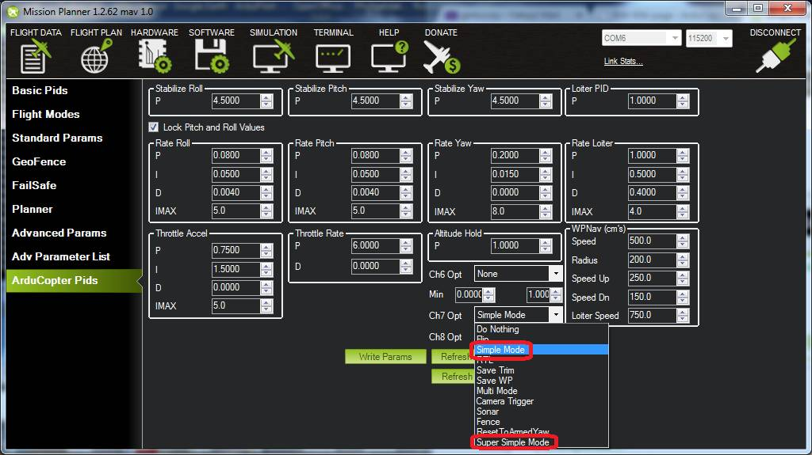

.. _channel-7-and-8-options:

=============================================
Auxiliary Function Switches (3.6 and earlier)
=============================================

This article shows how to set up which features are invoked from the transmitter's auxiliary function switches prior to Copter-4.0.

Configuration
=============

By default the auxiliary switches are disabled but you can assign
features using the *Mission Planner*'s **Config/Tuning \| Extended
Tuning** screen or by setting the CH7_OPT,  CH8_OPT, CH9_OPT,
CH10_OPT , CH11_OPT, or CH12_OPT parameters directly.

Here are the options:

.. raw:: html

   <table border="1" class="docutils">
   <tbody>
   <tr>
   <th>Option</th>
   <th>Description</th>
   </tr>
   <tr>
   <td><strong>Flip</strong></td>
   <td>Vehicle will flip on its roll or pitch axis depending upon the pilot's roll and pitch stick position.
   Vehicle will rise for 1 second and then rapidly flip. The vehicle will not flip again until the switch is
   brought low and back to high. Give yourself at least 10m of altitude before trying flip for the first time!
   </td>
   </tr>
   <tr>
   <td><strong>Simple Mode</strong></td>
   <td>
   
The copter moves left, right, forward and back as if it were facing in
the same direction as when it took off regardless of the copter's
heading. :ref:`See here for more details <simpleandsuper-simple-modes>`.

.. raw:: html

   </td>
   </tr>
   <tr>
   <td><strong>RTL</strong></td>
   <td>

Invokes the :ref:`Return-to-Launch <rtl-mode>` flight mode when switch is pulled high.
Bringing switch back to low will return the vehicle to the mode indicated by the ch5 flight mode switch.

.. raw:: html

   </td>
   </tr>
   <tr>
   <td><strong>Save Trim</strong></td>
   <td>

Adjust the vehicle level position using the current roll and pitch stick
inputs. See details `here <autotrim>`__.

.. raw:: html

   </td>
   </tr>
   <tr>
   <td><strong>Save WP</strong></td>
   <td>Save the current location (including altitude) as a waypoint in the
   mission. If in AUTO mode no waypoint will be saved, instead the vehicle will RTL</td>
   </tr>
   <tr>
   <td><strong>Camera Trigger</strong></td>
   <td>

Camera shutter will be activated. See more details
:ref:`here <common-camera-shutter-with-servo>`.

.. raw:: html

   </td>
   </tr>
   <tr>
   <td><strong>Range Finder</strong></td>
   <td>

:ref:`RangeFinder <common-rangefinder-landingpage>` is disabled when switch is in low position, enabled when in high position.

.. raw:: html

   </td>
   </tr>
   <tr>
   <td><strong>Fence</strong></td>
   <td>Fence is disabled when switch is in low position, enabled when it high position.</td>
   </tr>
   <tr>
   <td><strong>Super Simple Mode</strong></td>
   <td>

Similar to simple mode except controls are relative to the home
position. Move the pitch stick forward and the copter will fly away from
home, pull pitch back and it will return. Move roll stick left or right
and the copter to orbit home regardless of the copter's actual
heading. :ref:`See here for more details <simpleandsuper-simple-modes>`.

If mapped to a three-position switch then the function will allow
Super-Simple **and Simple** modes to be enabled using the high and
middle switch positions, respectively (a two-position switch will
enable/disable Super Simple mode only).

.. raw:: html

   </td>
   </tr>
   <tr>
   <td><strong>Acro Trainer</strong></td>
   <td>

Turn on automatic leveling in the :ref:`ACRO <acro-mode>` flight mode.

.. raw:: html

   </td>
   </tr>
   <tr>
   <td><strong>Sprayer</strong></td>
   <td>
   
Turn on the :ref:`crop sprayer <sprayer>` when switch is pulled high.

.. raw:: html

   </td>
   </tr>
   <tr>
   <td><strong>Auto</strong></td>
   <td>

Invokes the :ref:`Auto <auto-mode>` flight mode when switch is pulled high.
Bringing switch back to low will return the vehicle to the mode indicated by the ch5 flight mode switch.

.. raw:: html

   </td>
   </tr>
   <tr>
   <td><strong>AutoTune</strong></td>
   <td>

Invokes the :ref:`AutoTune <autotune>` flight mode when switch is pulled high.
Bringing switch back to low will return the vehicle to the mode indicated by the ch5 flight mode switch.

.. raw:: html

   </td>
   </tr>
   <tr>
   <td><strong>Land</strong></td>
   <td>

Invokes the :ref:`Land <land-mode>` flight mode when switch is pulled high.
Bringing switch back to low will return the vehicle to the mode indicated by the ch5 flight mode switch.

.. raw:: html

   </td>
   </tr>
   <tr>
   <td><strong>Gripper</strong></td>
   <td>

Operates the :ref:`gripper <common-gripper-landingpage>`.  Switch pulled low releases the gripper, high closes or grabs.

.. raw:: html

   </td>
   </tr>
   <tr>
   <td><strong>Parachute Enable</strong></td>
   <td>

Enables the automatic release of the :ref:`parachute <parachute>` (this does not immediately trigger the release).

.. raw:: html

   </td>
   </tr>
   <tr>
   <td><strong>Parachute Release</strong></td>
   <td>

Immediately triggers the release of the :ref:`parachute <parachute>` as long as the vehicle is not landed or too low.

.. raw:: html

   </td>
   </tr>
   <tr>
   <td><strong>Parachute 3Pos</strong></td>
   <td>

Switch pulled low disables the :ref:`parachute <parachute>`.  Switch in middle enables the parachute for automatic release.  Switch pulled high triggers release of the parachute as long as vehicle is not landed or too low.

.. raw:: html

   </td>
   </tr>
   <tr>
   <td><strong>Mission Reset</strong></td>
   <td>

Reset :ref:`Auto <auto-mode>` to run the first mission command in the command list.

.. raw:: html

   </td>
   </tr>
   <tr>
   <td><strong>AttCon Feed Forward</strong></td>
   <td>Turns on/off attitude controllers feed forward. For developers only.
   </td>
   </tr>
   <tr>
   <td><strong>AttCon Accel Limits</strong></td>
   <td>Turns on/off attitude controller acceleration limits. For developers only.
   </td>
   </tr>
   <tr>
   <td><strong>Retract Mount</strong></td>
   <td>

Move the :ref:`camera mount <common-cameras-and-gimbals>` to its retracted position.

.. raw:: html

   </td>
   </tr>
   <tr>
   <td><strong>Relay On/Off</strong></td>
   <td>

Switch pulled low turns off the first :ref:`relay <common-relay>`, pulled high turns on the first relay.

.. raw:: html

   </td>
   </tr>
   <tr>
   <td><strong>Relay2 On/Off</strong></td>
   <td>

Switch pulled low turns off the second :ref:`relay <common-relay>`, pulled high turns on the second relay.

.. raw:: html

   </td>
   </tr>
   <tr>
   <td><strong>Relay3 On/Off</strong></td>
   <td>

Switch pulled low turns off the third :ref:`relay <common-relay>`, pulled high turns on the third relay.

.. raw:: html

   </td>
   </tr>
   <tr>
   <td><strong>Relay4 On/Off</strong></td>
   <td>

Switch pulled low turns off the fourth :ref:`relay <common-relay>`, pulled high turns on the fourth relay.

.. raw:: html

   </td>
   </tr>
   <tr>
   <td>

:ref:`Landing Gear <landing-gear>`

.. raw:: html

   </td>
   <td>Retracts/Deploys landing gear. 
   </td>
   </tr>
   <tr>
   <td><strong>Lost Copter Alarm</strong></td>
   <td>

Plays the `lost copter alarm <https://download.ardupilot.org/downloads/wiki/pixhawk_sound_files/LostCopter.wav>`__
though the buzzer

.. raw:: html

   </td>
   </tr>
   <tr>
   <td><strong>Emergency Stop Motors</strong></td>
   <td>

Stops motors immediately
(`video <https://www.youtube.com/watch?v=-Db4u8LJE5w>`__).

.. raw:: html

   </td>
   </tr>
   <tr>
   <td><strong>Motor Interlock</strong></td>
   <td>

Opposite of Emergency stop (above) in that switch must be ON for motors
to spin (`video <https://youtu.be/-Db4u8LJE5w?t=51>`__).

.. raw:: html

   </td>
   </tr>
   <tr>
   <td><strong>Brake</strong></td>
   <td>

Invokes the :ref:`Brake flight mode <brake-mode>` when switch goes high.
Bringing switch back to low will return the vehicle to the mode
indicated by the ch5 flight mode switch.

.. raw:: html

   </td>
   </tr>
   <tr>
   <td><strong>Throw</strong></td>
   <td>

Invokes the :ref:`Throw flight mode <throw-mode>` when switch goes high.
Bringing switch back to low will return the vehicle to the mode
indicated by the ch5 flight mode switch.

.. raw:: html

   </td>
   </tr>
   <tr>
   <td><strong>ADSB-Avoidance</strong></td>
   <td>

When switch is high, :ref:`ADSB avoidance <common-ads-b-receiver>` (avoidance of manned aircraft) is enabled, when switch is low, disabled.

.. raw:: html

   </td>
   </tr>
   <tr>
   <td><strong>Precision Loiter</strong></td>
   <td>

Turns on/off :ref:`Precision Loiter <precision-landing-with-irlock>`.  I.e. holding position above a target in Loiter mode using IR-Lock sensor. 

.. raw:: html

   </td>
   </tr>
   <tr>
   <td><strong>Object Avoidance</strong></td>
   <td>

When switch is high, avoid objects using :ref:`Lightware SF40c <common-lightware-sf40c-objectavoidance>` or :ref:`TeraRanger Tower<common-teraranger-tower-objectavoidance>`.

.. raw:: html

   </td>
   </tr>
   <tr>
   <td><strong>Arm/Disarm</strong></td>
   <td>

Arms the vehicle if the switch goes high (subject to arming checks).
Disarms the vehicle if brought low.

.. raw:: html

   </td>
   </tr>
   </tbody>
   </table>

Check Ch7 & Ch8 PWM values reach 1800
=====================================

Your channel 7 and/or channel 8 pwm value must reach at least 1800 PWM
or the auxiliary function will not be activated. You can check that it
surpasses this threshold using the Mission Planner's radio config page.

.. image:: ../images/MPCH7checkPWMrange.jpg
    :target: ../_images/MPCH7checkPWMrange.jpg
