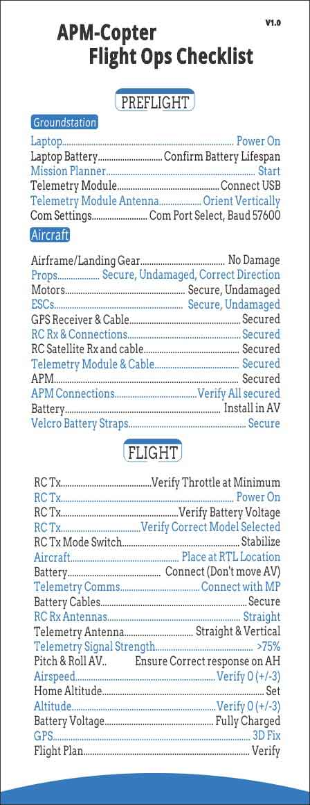

.. _checklist:

=============================
Pre-Flight Checklist (Copter)
=============================

This page is provides a list of things to check following configuration,
and before your first flight.

Summary Checklist
=================

Configuration
=============

-  Spin up the propellers on the ground and check they are all moving
   :ref:`in the correct orientation <connect-escs-and-motors_attach_propellers>`.
-  Check that your copter knows what level is. With the copter on a flat
   surface connect to Mission Planner and ensure the artificial horizon
   display shows level.
-  Check all failsafe settings are enabled. Instructions are here for
   :ref:`radio <radio-failsafe>`, :ref:`battery <failsafe-battery>`,
   and :ref:`ekf/gps <ekf-inav-failsafe>`.

Flying
======

-  Make sure you have a GPS lock before flying if you intend to use any
   auto modes. Even if you're only flying in Stabilized mode this is a
   good idea so you can invoke Return To Launch if you get into trouble.
-  Test RTL before sending your copter off on an auto waypoint flight.
   This is to check that the compass and GPS are working, and that it
   knows where home is before heading off on a more complex flight.
-  Ensure that flight in Stabilize works well before you attempt any
   more complex flight modes. Ensure loiter works before trying RTL.
   Ensure RTL works before trying auto.
-  Once armed stand 3m-6m away from the arming point as when in RTL the
   copter will be returning to this point.
-  When testing more complex flight modes, be ready to switch back to
   Stabilize mode at any moment if it does anything strange. Stabilize
   or Acro are the only modes which can save you from a problem with the
   software or sensors. RTL is a good mode to save you from human error,
   but relies on the copter being able to locate and fly itself, so this
   should not be used as an emergency mode if other auto flight modes go
   wrong.
-  Be sure you have a way of knowing when your battery is getting low,
   and land before you have used more than 80% of your battery capacity.
